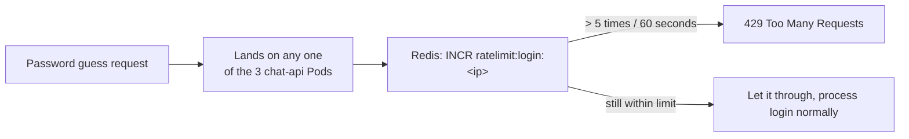

# Chapter 19 — Forgetting Is Fine

## A few days later

The last line in `notes-next.md` still says "not sure yet":

```
Multiple people using it at once — need rate limiting, some
kind of cache? Not sure yet, later.
```

"Not sure yet" doesn't mean ignore it. Curious, you write a small script, firing 20 wrong-password requests in a row at `/api/auth/login`, just to see how the system reacts.

```bash
for i in $(seq 1 20); do
  curl -s -o /dev/null -w "%{http_code}\n" -X POST http://localhost:8080/api/auth/login \
    -H "Content-Type: application/json" \
    -d '{"email":"you@ai-workspace.dev","password":"wrong-guess-'$i'"}'
done
```

```
401
401
401
401
...
401
```

Twenty `401` lines, nothing else. Nothing stops it at all — guess passwords freely, as many times as you want. Exactly what that "not sure yet" line was gesturing at, clear now: the number of attempts in a time window needs a limit.

### Where to count, with 3 Pods

The exact same lesson as the session problem from a few weeks back — a counter for "how many times has this IP tried" can't live in one specific Pod's RAM. Guess attempt #1 might land on Pod A, attempt #2 on Pod B — if each Pod counts independently, an attacker just needs to send fast enough to spread across all three, each Pod only seeing a few, none of them looking suspicious on its own.

Needs a **shared** counting place, separate from all three Pods — exactly where that "cache" mention in the notes finally makes sense: Redis.



### Redis needs no PVC — completely unlike Postgres

Write `redis.yaml`, just a Deployment + Service, no `volumes`/`volumeMounts` at all.

```yaml
apiVersion: apps/v1
kind: Deployment
metadata:
  name: redis
  namespace: ai-workspace
spec:
  replicas: 1
  selector:
    matchLabels:
      app: redis
  template:
    metadata:
      labels:
        app: redis
    spec:
      containers:
        - name: redis
          image: redis:7-alpine
          ports:
            - containerPort: 6379
          resources:
            requests:
              cpu: "50m"
              memory: "64Mi"
            limits:
              cpu: "100m"
              memory: "128Mi"

---
apiVersion: v1
kind: Service
metadata:
  name: redis
  namespace: ai-workspace
spec:
  selector:
    app: redis
  ports:
    - port: 6379
      targetPort: 6379
```

Remembering the painful lesson from a while back — losing Postgres's PVC meant losing real data, completely unacceptable. Redis this time is different: all it holds is one number, "how many times has this IP just tried." The `redis` Pod dies, a new one replaces it, the counter resets to 0. The only consequence: someone gets to start guessing over from scratch, nothing important lost. **Having state doesn't automatically mean needing a PVC — the question to ask first is "would losing this actually hurt."**

### Code: counting with `INCR` + `EXPIRE`

```js
export async function checkRateLimit(key, limit, windowSeconds) {
  const count = await redis.incr(key);
  if (count === 1) {
    await redis.expire(key, windowSeconds);
  }
  return count <= limit;
}
```

`INCR` on a key that doesn't exist yet creates it at `1` automatically — `EXPIRE` only gets set on that very first hit (`count === 1`), so every subsequent request doesn't keep pushing the deadline 60 seconds further out, which would turn a fixed window into an endlessly sliding one.

```js
app.post("/api/auth/login", async (c) => {
  const ip = c.req.header("x-forwarded-for") ?? "unknown";
  const allowed = await checkRateLimit(`ratelimit:login:${ip}`, 5, 60);
  if (!allowed) {
    return c.json({ error: "too many login attempts, try again in a minute" }, 429);
  }
  ...
});
```

Rebuild, deploy, run the exact same script again.

```bash
docker build -t ai-workspace/chat-api:dev ./chat-api
kind load docker-image ai-workspace/chat-api:dev --name ai-workspace
kubectl apply -f redis.yaml -f chat-api-deployment.yaml
kubectl delete pod -n ai-workspace -l app=chat-api
```

```bash
for i in $(seq 1 8); do
  curl -s -o /dev/null -w "%{http_code}\n" -X POST http://localhost:8080/api/auth/login \
    -H "Content-Type: application/json" \
    -d '{"email":"you@ai-workspace.dev","password":"wrong-guess-'$i'"}'
done
```

```
401
401
401
401
401
429
429
429
```

The first five are still `401` (wrong password, same as before) — but from the sixth attempt on, `429`, no matter which of the three `chat-api` replicas the request happens to land on, because all three now ask the exact same Redis.

Open `notes-next.md`, cross off the last line.

```
Multiple people using it at once — need rate limiting ✓ Redis,
shared counting via INCR/EXPIRE, no PVC needed because losing
the counter is fine — just resets, not real data.
```

Not a single line left in `notes-next.md`. Three weeks ago, that first nine-line list once looked like an incomprehensible wall. This second list was shorter, only three lines — but it's finished too, same as the first one.
