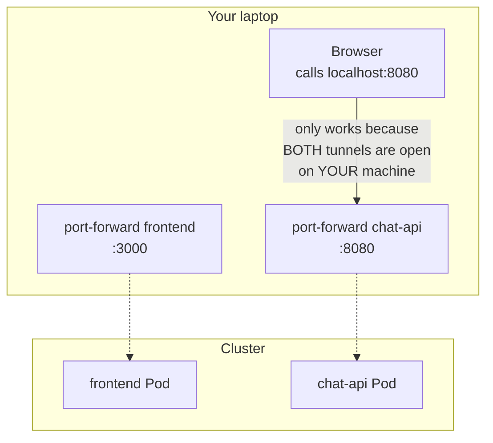

# Chapter 20 — Only You Can Open It

## The next day

`notes-next.md` is empty, nothing left to cross off. But something's been sitting untouched since day one: `frontend` — never once deployed to the cluster, only ever run through `docker-compose` those first few days. Three companies signed weeks ago, and they're definitely not going to use `curl` to chat with the AI.

Same routine as `chat-api` before — build, load into `kind`, write a Deployment.

```bash
docker build -t ai-workspace/frontend:dev ./frontend
kind load docker-image ai-workspace/frontend:dev --name ai-workspace
```

```yaml
apiVersion: apps/v1
kind: Deployment
metadata:
  name: frontend
  namespace: ai-workspace
spec:
  replicas: 2
  selector:
    matchLabels:
      app: frontend
  template:
    metadata:
      labels:
        app: frontend
    spec:
      containers:
        - name: frontend
          image: ai-workspace/frontend:dev
          ports:
            - containerPort: 3000
          readinessProbe:
            httpGet:
              path: /
              port: 3000
          resources:
            requests:
              cpu: "50m"
              memory: "64Mi"
            limits:
              cpu: "100m"
              memory: "128Mi"

---
apiVersion: v1
kind: Service
metadata:
  name: frontend
  namespace: ai-workspace
spec:
  selector:
    app: frontend
  ports:
    - port: 3000
      targetPort: 3000
```

Nothing new about the probe/resources part — the exact formula learned a few weeks back, just applied to a different component.

```bash
kubectl apply -f frontend-deployment.yaml
kubectl get pods -n ai-workspace -l app=frontend
```

```
NAME                        READY   STATUS    RESTARTS   AGE
frontend-5d8f6b9c7-h2n4x    1/1     Running   0          12s
frontend-5d8f6b9c7-w9k3p    1/1     Running   0          12s
```

Both `Running`. Curious to see it, you open one more `port-forward`, alongside the one already forwarding `chat-api`.

```bash
kubectl port-forward deployment/frontend 3000:3000 -n ai-workspace
```

Open a browser to `localhost:3000` — the AI Workspace UI shows up, exactly like running it through `docker compose` that first week. Type a question. It answers. For a second, it feels done.

Then it stops you. This works because there are **two** `port-forward`s running at once, on your own machine — one for `frontend` (port 3000), one for `chat-api` (port 8080, opened last night, still alive). The code in `App.jsx` calls `http://localhost:8080` directly — on your browser, on your machine, `localhost:8080` really is the exact port `chat-api` is being forwarded to. But `localhost` only ever means something to the machine actually running that browser.



One of the three companies that just signed, sitting in their own office, has no `kubectl` access to this cluster at all, let alone the ability to open their own `port-forward`. To them, `localhost:8080` points nowhere — not an error, just nothing running on that port in their own browser. What just "worked" only worked because you're the one person with two tunnels already open on the exact machine running the browser.

`frontend` runs inside the **end user's own browser** — not one Pod calling another inside the cluster. The internal Service name (`chat-api:8080`) only resolves from inside the cluster; a customer's browser sits entirely outside it, can't read that internal DNS, has no concept of the `ai-workspace` namespace existing at all.

You open a new note, short:

```
frontend + chat-api are running in the cluster now, but only
I can open them, through port-forward. Need a way for someone
OUTSIDE the cluster to reach in, without kubectl, without
even knowing the cluster exists. No idea how yet — tomorrow.
```

You close the laptop, no disappointment like that time before — just a clear question with no answer yet, the exact same feeling as that first night finishing the nine-line `Need...` list.
