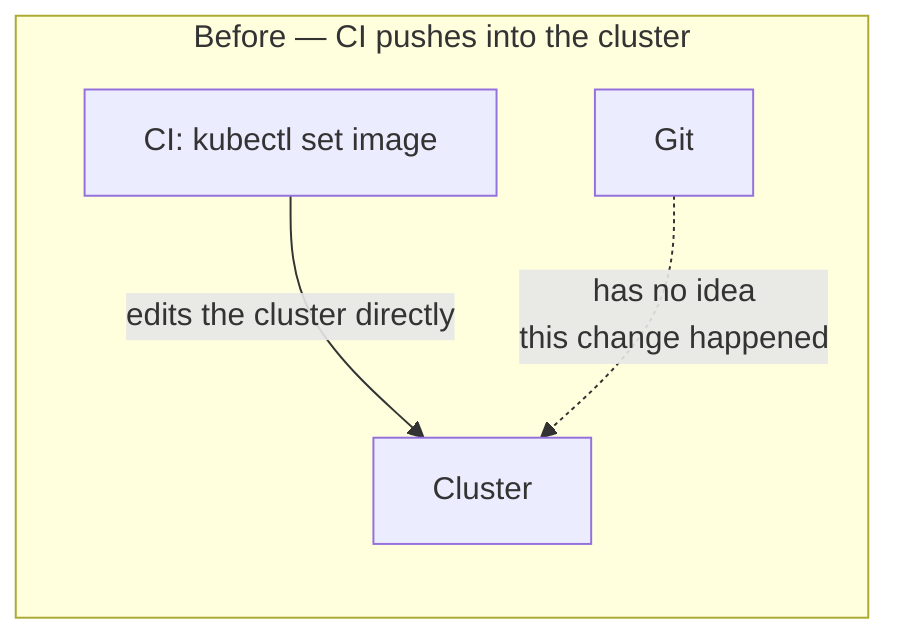
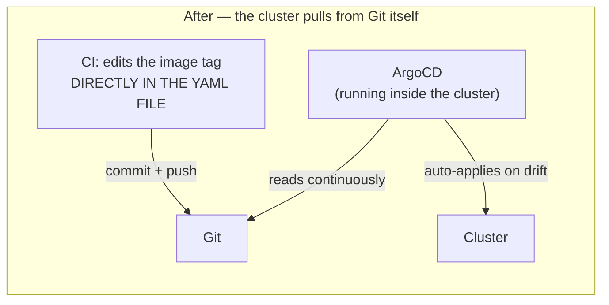

# Chapter 28 — Counting the YAML Too

## A few days later

Exactly what got noted a week ago actually happened. Change `chat-api`'s `resources.limits` in the file, `kubectl apply -f chat-api-deployment.yaml` — the Pod restarts, but checking again, `image` has reverted right back to the manually-built tag from weeks ago, not the latest one CI just deployed through `kubectl set image`. The file in Git never knew CI had quietly changed `image` on the cluster — reapplying the old file, as if nothing had happened.

### The problem isn't "CI did something wrong" — it's the wrong direction entirely



CI has been going in exactly one direction: from CI straight into the cluster, bypassing Git entirely. Git — meant to be the "single source of truth" since way back when YAML files first got written — only really holds that meaning for fields CI never quietly touches. For Git to actually be the one source of truth, the direction has to flip: CI only ever edits Git, and getting that into the cluster becomes someone else's job — something standing inside the cluster itself, continuously comparing.



### Installing ArgoCD

```bash
kubectl create namespace argocd
kubectl apply -n argocd -f https://raw.githubusercontent.com/argoproj/argo-cd/stable/manifests/install.yaml
```

```
namespace/argocd created
deployment.apps/argocd-server created
deployment.apps/argocd-repo-server created
deployment.apps/argocd-application-controller created
...
```

`argocd-application-controller` — a name that already feels familiar from `kube-controller-manager` (way back when the cluster was first set up) or the ReplicaSet controller (way back at the start): a loop that runs forever, continuously comparing real state against desired state, fixing drift on its own. The only difference: `kube-controller-manager` compares `etcd` against the cluster; `argocd-application-controller` compares **Git** against the cluster.

Declare an `Application` — describing "which repo to watch, which folder, which namespace to apply into."

```yaml
apiVersion: argoproj.io/v1alpha1
kind: Application
metadata:
  name: ai-workspace
  namespace: argocd
spec:
  project: default
  source:
    repoURL: https://github.com/<you>/kubernetes-odyssey
    targetRevision: main
    path: project/infs
  destination:
    server: https://kubernetes.default.svc
    namespace: ai-workspace
  syncPolicy:
    automated:
      selfHeal: true
```

`selfHeal: true` — the most important line here. Without it, ArgoCD only reports "drifted," waiting for someone to click "Sync" by hand. With it, ArgoCD re-`apply`s the moment it detects the cluster diverging from Git, with nobody needing to press anything at all.

### Changing CI: stop touching the cluster, only touch Git

```yaml
  deploy:
    needs: build-and-push
    runs-on: ubuntu-latest
    steps:
      - uses: actions/checkout@v4
      - name: Bump image tag in manifest
        run: |
          sed -i "s|image: ghcr.io/.*/chat-api:.*|image: ghcr.io/${{ github.repository }}/chat-api:${{ github.sha }}|" project/infs/chat-api-deployment.yaml
          git config user.name "chat-api-ci"
          git config user.email "ci@ai-workspace.dev"
          git add project/infs/chat-api-deployment.yaml
          git commit -m "deploy chat-api ${{ github.sha }}"
          git push
```

The `deploy` job now runs on plain `ubuntu-latest` again — no longer needs to be self-hosted, since it never touches the cluster at all anymore, just edits one file and `git push`es. The self-hosted runner from last week is still there, but now only ArgoCD (already running inside the cluster) actually talks to the cluster.

### Testing self-heal for real

Push a small fix, wait for CI to run, a new commit shows up on its own in `chat-api-deployment.yaml`. A few seconds later, the ArgoCD UI (`kubectl port-forward svc/argocd-server -n argocd 8080:443`) flips from `OutOfSync` to `Synced`, a new Pod comes up running exactly the image just built.

Now the part actually worth seeing: break it by hand, the exact same habit from way back at the start.

```bash
kubectl set image deployment/chat-api chat-api=ghcr.io/<you>/chat-api:some-old-tag -n ai-workspace
```

```bash
kubectl get pods -n ai-workspace -w
```

Seconds, not minutes — the Pod restarts on its own back to exactly the image Git declares, without anyone running `apply`. ArgoCD noticed the drift, corrected it back to match Git, exactly what `selfHeal: true` promised.

Open the notes from last week, cross off the line still hanging about CD.

```
CD via kubectl set image ✓✓ replaced with ArgoCD — CI only
touches Git now, never the cluster. selfHeal tested for real:
manually editing the cluster gets reverted by ArgoCD within
seconds, proving Git is the one source of truth, not the
cluster.

running somewhere other than this laptop — still open, the
last line left.
```

Exactly one line left, same as last week. But the way the note itself gets written has changed too — no longer "what needs doing," just "where it needs to run."
