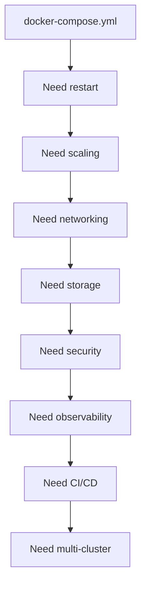
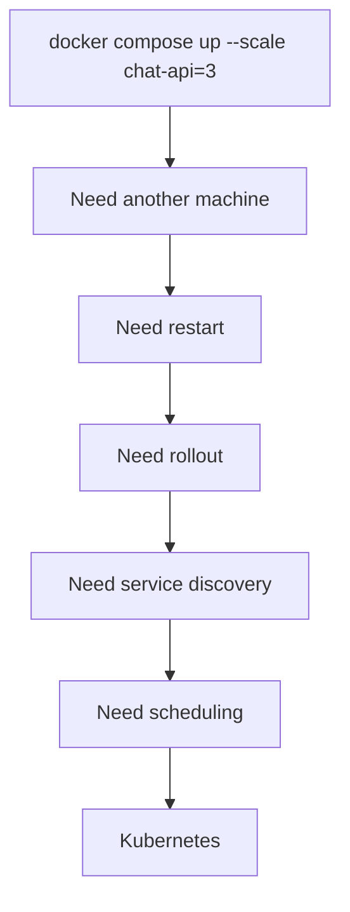
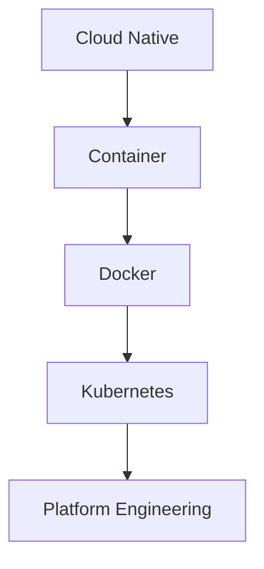

# Chapter 1 — The Big Picture

**Part I — Foundation**

**Tier:** Foundation (pure theory, no hands-on — see design §2)

**Touches `project/` code:** No — pure theory, no hands-on (see [design §2](../../outline.md#2-chapter-structure-the-first-23-chapters-are-pure-theory-then-project-heavy)).

---

## Theory

### Day one

You just joined a small startup as an engineer. The product is **AI Workspace** — people chat with an AI and get answers grounded in their own documents. It's early: a handful of users, one small team, no dedicated ops person. Your onboarding doc has exactly one useful line:

> Clone the repo, run `docker compose up`, you're good to go.

You do. Three containers start: `frontend`, `chat-api`, `postgres`. You open the browser, type a message, get an answer back. It works. Before writing any code yourself, you open `docker-compose.yml` to see what you're actually looking at.

```yaml
services:
  frontend:
    build: ./frontend
    ports: ["3000:3000"]
  chat-api:
    build: ./chat-api
    ports: ["8080:8080"]
  postgres:
    image: postgres:16
```

Three blocks, three running things. `frontend` and `chat-api` get *built* from a folder in the repo; `postgres` just gets pulled — `image: postgres:16` — from somewhere else entirely, no build step at all. That difference is your first real question: what is an "image," and why does the team's own code need "building" into one, while Postgres apparently already comes as one, ready-made?

Pulling on that thread leads to the answer this whole book is going to keep circling back to: a **container** packages an application together with everything it needs to run — its dependencies, its runtime, its configuration — into one portable unit, so it behaves identically whether it's running on your laptop, a teammate's laptop, or a server neither of you has touched. `docker compose up` didn't install Node.js or Postgres on your machine at all; it downloaded or built self-contained images and ran each one in isolation. That's the entire reason the onboarding doc could be one line — nobody had to tell you which Postgres version to install, or resolve a dependency conflict with something else already on your laptop. The image already decided all of that, once, for everyone.

**Docker** is the tool that made this practical. The underlying idea — isolated processes, namespaced from the rest of the machine — existed in Linux before Docker did, but it was genuinely hard to use directly. Docker turned it into `docker build`, `docker run`, and a file called `docker-compose.yml` describing several containers as one system. That's why "Docker" and "container" get used almost interchangeably today, even though Docker is one implementation of the idea, not the idea itself.

And that's the moment it clicks: **Docker isn't your application. Docker is just a better way to package it.** `chat-api` is still your code, your bug, your bill to pay when it breaks — Docker just made sure it runs the same way everywhere. Chapter 2 goes hands-on with exactly this.

You don't know it yet, but every chapter in this book starts because something in this one file eventually stops being enough:



This whole book is that chain, one link — one Part — at a time.

### Three weeks later

The product gets traction. Traffic goes up. In standup, you make the obvious suggestion: "Why don't we just start three more `chat-api` containers?" Everyone nods — sounds right, more copies should mean more capacity. You try it.

```bash
docker compose up --scale chat-api=3
```

Three `chat-api` containers, running. You did it. Except — which one actually answers the next request that hits port `8080`? Compose can't publish the same host port from three containers at once, so this doesn't even start cleanly, and even patched around, a deeper question is sitting right underneath it, one `--scale` never answers:

**Who sends traffic to these three containers?**

Nobody. There's no piece of software watching all three, deciding which one is free, routing a request to it. You'd have to build that yourself. And once you start pulling on *that* thread, more of the same shape show up, one after another:

- You need **another machine**, because three containers plus everything else won't fit on one forever.
- You need something to **restart** a container that dies silently at 3am, because right now, nothing does.
- You need a way to **roll out a new version** without stopping all three at once.
- You need **service discovery** — some way for `frontend` to find "a healthy `chat-api`" without hardcoding which of the three.
- You need something to decide **which machine** a new container should even run on, as the fleet grows.



Chapter 3 lives inside this exact moment and works through each one in full. For now, just notice the shape: every single item on that list is Docker Compose being asked a question it was never designed to answer, because it was built for one machine, not a fleet.

**Kubernetes** is the answer to the whole list at once — software whose entire job is running many containers, across many machines, continuously checking that what's actually running matches what's supposed to be running, and fixing the difference without a human watching. It isn't a bigger, fancier Docker Compose. It exists because the list above is real, and somebody has to run it, permanently, for you.

### Years later

Skip ahead. AI Workspace is a real product now, running across dozens of services, on Kubernetes, with a real platform team — and you're on it. One day, a new engineer joins. Onboarding used to be a page of setup instructions; now you hand them one URL. They click a button. A few minutes later, their own environment — namespace, database, ingress, monitoring, all of it — is simply *there*, ready. They never had to learn what a Pod is to ship their first feature.

At that point, without necessarily noticing it happen, you've become a **Platform Engineer** — building internal tools on top of Kubernetes so the rest of the company doesn't have to become Kubernetes experts, the same way `docker compose up` once let *you* start on day one without knowing what was underneath it. This book ends there, in Part IX, and it's worth remembering this paragraph when you arrive: the story closes exactly where it opened, just from the other side of the command.



Every layer in that chain exists because the one below it ran out of answers to a question the team actually had — which is exactly how you just arrived at it yourself, by reading one `docker-compose.yml` file.

### Notes from the investigation

A few words you'll see constantly starting in Part II, once AI Workspace moves onto a real cluster. You don't need to understand them yet — just recognize them by name, the way you'd recognize a new coworker's face before knowing their job title:

| Term | One-line meaning |
|---|---|
| **Node** | A machine (physical or virtual) that's part of the cluster and actually runs your containers. |
| **Pod** | The smallest deployable unit in Kubernetes — one or more containers that always run together on the same Node. |
| **Deployment** | A description of how many copies of a Pod should be running, and how to update them safely. |
| **Service** | A stable network address that lets other things find your Pods, even as individual Pods come and go. |
| **Ingress** | The entry point that routes outside traffic (like a browser request) into the right Service inside the cluster. |
| **Volume** | A way to give a container storage that survives even if the container restarts. |
| **Namespace** | A way to divide one cluster into separate, named areas — so different teams or environments don't collide. |

Every one of these gets its own real chapter, with AI Workspace as the example, starting in Part II.

### What's next

Chapter 2 goes back to that `docker-compose.yml` file and actually works with it — a fast, practical Docker refresher assuming you can already run `docker compose up`, just making sure "image," "container," and "volume" mean the same thing to you that they're about to mean to the rest of this book. Chapter 3 is the traffic spike, in full — every item on the "Need..." list above, worked through one at a time, until Kubernetes stops being an abstract next step.
