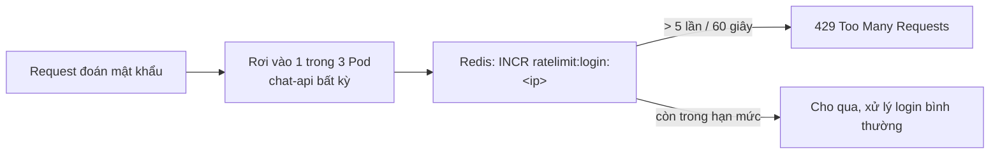

# Chương 19 — Quên cũng không sao

## Vài ngày sau

Dòng cuối cùng trong `notes-next.md` vẫn ghi "chưa rõ":

```
Nhiều người cùng dùng cùng lúc — có cần giới hạn tốc độ, cache
gì không? Chưa rõ, để sau.
```

"Chưa rõ" không có nghĩa là bỏ qua. Tò mò, bạn viết một đoạn script nhỏ, gửi liên tiếp 20 request sai mật khẩu vào `/api/auth/login`, chỉ để xem hệ thống phản ứng ra sao.

```bash
for i in $(seq 1 20); do
  curl -s -o /dev/null -w "%{http_code}\n" -X POST http://localhost:8080/api/auth/login \
    -H "Content-Type: application/json" \
    -d '{"email":"you@ai-workspace.dev","password":"wrong-guess-'$i'"}'
done
```

```
401
401
401
401
...
401
```

Hai mươi dòng `401`, không dòng nào khác. Không ai chặn lại cả — cứ đoán mật khẩu thoải mái, bao nhiêu lần cũng được. Đúng thứ dòng ghi chú "chưa rõ" đang ám chỉ, giờ đã rõ: cần giới hạn số lần thử trong một khoảng thời gian.

### Đếm ở đâu, khi có 3 Pod

Y hệt bài học session hồi trước — bộ đếm "IP này thử bao nhiêu lần rồi" không thể nằm trong RAM của một Pod cụ thể. Request đoán mật khẩu lần 1 có thể rơi vào Pod A, lần 2 rơi vào Pod B — nếu mỗi Pod tự đếm riêng, kẻ tấn công chỉ cần gửi đủ nhanh để trải đều qua cả ba Pod, mỗi Pod chỉ thấy vài lần, không Pod nào tưởng là bất thường.

Cần một nơi đếm **chung**, tách khỏi cả ba Pod — đúng lúc dòng ghi chú nhắc tới "cache" trở nên có nghĩa: Redis.



### Redis không cần PVC — khác hẳn Postgres

Viết `redis.yaml`, chỉ Deployment + Service, không có `volumes`/`volumeMounts` nào cả.

```yaml
apiVersion: apps/v1
kind: Deployment
metadata:
  name: redis
  namespace: ai-workspace
spec:
  replicas: 1
  selector:
    matchLabels:
      app: redis
  template:
    metadata:
      labels:
        app: redis
    spec:
      containers:
        - name: redis
          image: redis:7-alpine
          ports:
            - containerPort: 6379
          resources:
            requests:
              cpu: "50m"
              memory: "64Mi"
            limits:
              cpu: "100m"
              memory: "128Mi"

---
apiVersion: v1
kind: Service
metadata:
  name: redis
  namespace: ai-workspace
spec:
  selector:
    app: redis
  ports:
    - port: 6379
      targetPort: 6379
```

Nhớ lại bài học đau hồi trước — Postgres mất PVC là mất sạch dữ liệu thật, không thể chấp nhận được. Redis lần này khác hẳn: nó chỉ giữ đúng một con số "IP này vừa thử mấy lần" — Pod `redis` chết, Pod mới thay vào, bộ đếm về lại 0. Hậu quả duy nhất: ai đó được thử lại từ đầu, không mất mát gì quan trọng. **Không phải cứ có state là phải có PVC — phải hỏi "mất cái này có thật sự đau không" trước.**

### Code: đếm bằng `INCR` + `EXPIRE`

```js
export async function checkRateLimit(key, limit, windowSeconds) {
  const count = await redis.incr(key);
  if (count === 1) {
    await redis.expire(key, windowSeconds);
  }
  return count <= limit;
}
```

`INCR` trên một key chưa tồn tại tự tạo key đó với giá trị `1` — chỉ đặt `EXPIRE` đúng lần đầu tiên (`count === 1`), tránh mỗi request lại dời hạn thêm 60 giây, biến cửa sổ đếm thành trượt vô tận thay vì cố định.

```js
app.post("/api/auth/login", async (c) => {
  const ip = c.req.header("x-forwarded-for") ?? "unknown";
  const allowed = await checkRateLimit(`ratelimit:login:${ip}`, 5, 60);
  if (!allowed) {
    return c.json({ error: "too many login attempts, try again in a minute" }, 429);
  }
  ...
});
```

Build lại, deploy, chạy lại đúng script vừa nãy.

```bash
docker build -t ai-workspace/chat-api:dev ./chat-api
kind load docker-image ai-workspace/chat-api:dev --name ai-workspace
kubectl apply -f redis.yaml -f chat-api-deployment.yaml
kubectl delete pod -n ai-workspace -l app=chat-api
```

```bash
for i in $(seq 1 8); do
  curl -s -o /dev/null -w "%{http_code}\n" -X POST http://localhost:8080/api/auth/login \
    -H "Content-Type: application/json" \
    -d '{"email":"you@ai-workspace.dev","password":"wrong-guess-'$i'"}'
done
```

```
401
401
401
401
401
429
429
429
```

Năm lần đầu vẫn `401` (sai mật khẩu, đúng như trước) — nhưng từ lần thứ sáu trở đi, `429`, dù request rơi vào Pod nào trong ba bản `chat-api` cũng như nhau, vì cả ba giờ cùng hỏi chung một Redis.

Mở `notes-next.md`, gạch dòng cuối cùng.

```
Nhiều người cùng dùng cùng lúc — cần giới hạn tốc độ ✓ Redis,
đếm chung qua INCR/EXPIRE, không cần PVC vì mất bộ đếm không
sao — chỉ cần reset lại, không phải dữ liệu thật.
```

Không còn dòng nào trong `notes-next.md` nữa. Đúng ba tuần trước, chín dòng đầu tiên từng trông như một bức tường không hiểu nổi. Danh sách thứ hai này ngắn hơn, chỉ ba dòng — nhưng cũng đã hết, y hệt lần trước.
