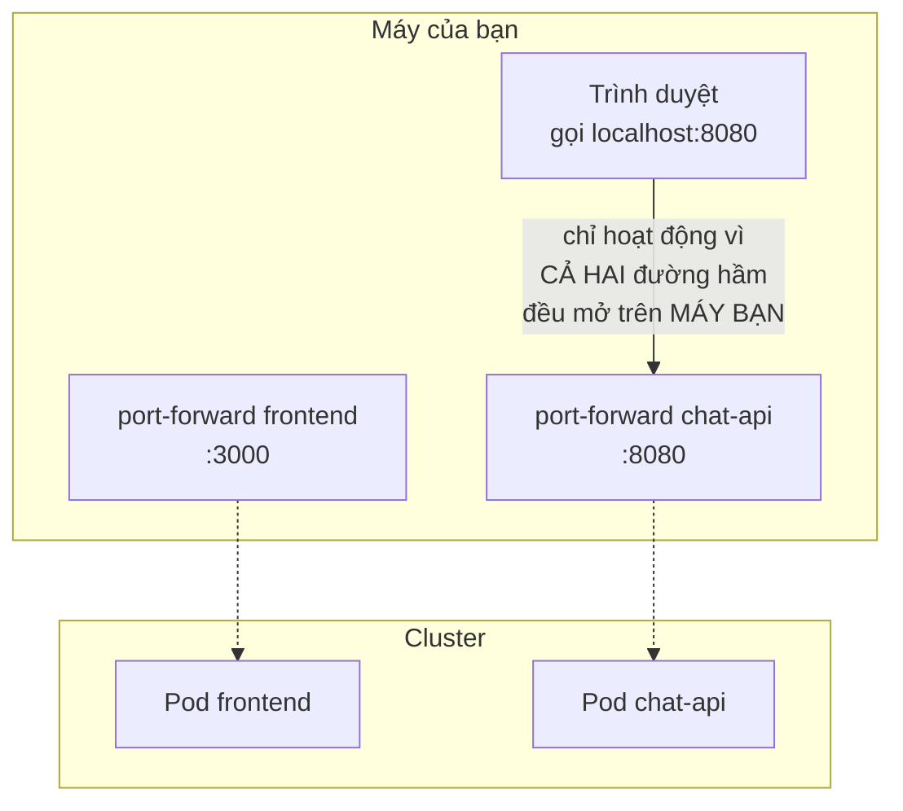

# Chương 20 — Chỉ mình bạn mở được

## Hôm sau

`notes-next.md` trống trơn, không còn dòng nào để gạch. Nhưng có một thứ vẫn nằm im từ ngày đầu tiên: `frontend` — chưa bao giờ được đưa lên cluster, chỉ mới chạy qua `docker-compose` những ngày đầu tiên. Ba công ty đã ký hợp đồng từ mấy tuần trước, và họ chắc chắn không dùng `curl` để chat với AI.

Làm y hệt bài cũ với `chat-api` — build, load vào `kind`, viết Deployment.

```bash
docker build -t ai-workspace/frontend:dev ./frontend
kind load docker-image ai-workspace/frontend:dev --name ai-workspace
```

```yaml
apiVersion: apps/v1
kind: Deployment
metadata:
  name: frontend
  namespace: ai-workspace
spec:
  replicas: 2
  selector:
    matchLabels:
      app: frontend
  template:
    metadata:
      labels:
        app: frontend
    spec:
      containers:
        - name: frontend
          image: ai-workspace/frontend:dev
          ports:
            - containerPort: 3000
          readinessProbe:
            httpGet:
              path: /
              port: 3000
          resources:
            requests:
              cpu: "50m"
              memory: "64Mi"
            limits:
              cpu: "100m"
              memory: "128Mi"

---
apiVersion: v1
kind: Service
metadata:
  name: frontend
  namespace: ai-workspace
spec:
  selector:
    app: frontend
  ports:
    - port: 3000
      targetPort: 3000
```

Không có gì mới ở phần probe/resources — đúng công thức học được mấy tuần trước, chỉ áp lại cho một component khác.

```bash
kubectl apply -f frontend-deployment.yaml
kubectl get pods -n ai-workspace -l app=frontend
```

```
NAME                        READY   STATUS    RESTARTS   AGE
frontend-5d8f6b9c7-h2n4x    1/1     Running   0          12s
frontend-5d8f6b9c7-w9k3p    1/1     Running   0          12s
```

`Running` cả hai. Muốn xem thử, mở thêm một `port-forward` nữa, song song với cái đang forward `chat-api`.

```bash
kubectl port-forward deployment/frontend 3000:3000 -n ai-workspace
```

Mở trình duyệt vào `localhost:3000` — giao diện AI Workspace hiện ra, y hệt hồi chạy bằng `docker compose` tuần đầu tiên. Gõ thử một câu hỏi. Có trả lời. Trong một giây, thấy như đã xong.

Rồi khựng lại. Cái này chạy được là vì đang có **hai** `port-forward` cùng lúc trên chính máy bạn — một cho `frontend` (cổng 3000), một cho `chat-api` (cổng 8080, mở từ tối qua vẫn còn sống). Code trong `App.jsx` gọi thẳng `http://localhost:8080` — với trình duyệt trên máy bạn, `localhost:8080` đúng là cái cổng đang được `chat-api` forward tới. Nhưng `localhost` chỉ có nghĩa với chính máy đang chạy trình duyệt đó.



Một trong ba công ty vừa ký hợp đồng, ngồi ở văn phòng của họ, không hề có quyền `kubectl` vào cluster này, càng không thể tự mở `port-forward`. Với họ, `localhost:8080` không trỏ đi đâu cả — không phải lỗi, chỉ đơn giản là trình duyệt của họ không có gì đang chạy ở cổng đó. Cái vừa "chạy được" chỉ chạy được vì bạn là người duy nhất có hai đường hầm mở sẵn trên đúng máy đang gõ trình duyệt.

`frontend` chạy trong trình duyệt của **người dùng cuối** — không phải một Pod gọi Pod khác bên trong cluster. Tên Service nội bộ (`chat-api:8080`) chỉ phân giải được từ bên trong cluster; trình duyệt của khách hàng đứng hoàn toàn bên ngoài, không đọc được DNS nội bộ đó, không có khái niệm gì về `ai-workspace` namespace cả.

Bạn mở một ghi chú mới, ngắn gọn:

```
frontend + chat-api giờ đã chạy trong cluster, nhưng chỉ
mình mình mở được qua port-forward. Cần một cách để người
NGOÀI cluster gọi vào được, không cần kubectl, không cần
biết cluster tồn tại. Chưa biết cách nào — để mai.
```

Đóng laptop, không có cảm giác thất vọng như hồi trước — chỉ là một câu hỏi rõ ràng, chưa có câu trả lời, giống hệt cảm giác đêm đầu tiên đọc xong chín dòng `Need...`.
