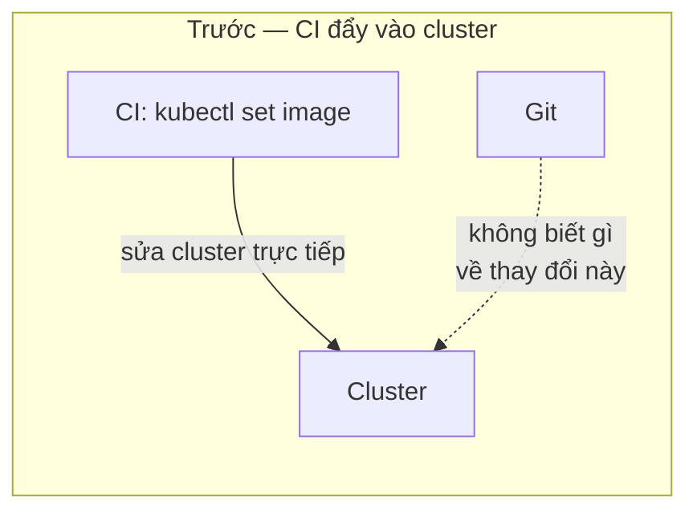
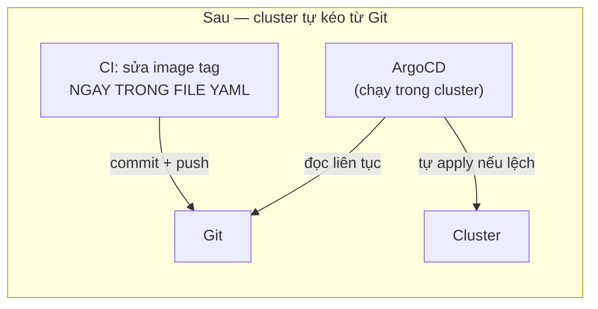

# Chương 28 — Đếm luôn cả YAML

## Vài ngày sau

Đúng điều đã ghi chú tuần trước xảy ra thật. Sửa `resources.limits` của `chat-api` trong file, `kubectl apply -f chat-api-deployment.yaml` — Pod restart, nhưng khi kiểm tra lại, `image` đã quay về đúng tag build thủ công từ mấy tuần trước, không phải bản mới nhất CI vừa deploy qua `kubectl set image`. File trên Git chưa từng biết CI đã tự ý đổi `image` trên cluster — `apply` lại file cũ, coi như chưa có chuyện gì xảy ra.

### Vấn đề không phải "CI làm sai" — là hướng đi sai



CI đang đi đúng một hướng: từ CI thẳng vào cluster, không qua Git. Git — nơi lẽ ra phải là "sự thật duy nhất" từ hồi mới học viết YAML — chỉ còn đúng nghĩa cho những field không bị CI tự ý sửa. Muốn Git thật sự là một nguồn duy nhất, hướng đi phải đảo ngược: CI chỉ được sửa Git, còn việc đưa vào cluster để một thứ khác lo, đứng trong chính cluster, tự so sánh liên tục.



### Cài ArgoCD

```bash
kubectl create namespace argocd
kubectl apply -n argocd -f https://raw.githubusercontent.com/argoproj/argo-cd/stable/manifests/install.yaml
```

```
namespace/argocd created
deployment.apps/argocd-server created
deployment.apps/argocd-repo-server created
deployment.apps/argocd-application-controller created
...
```

`argocd-application-controller` — đúng cái tên đã quen thuộc từ `kube-controller-manager` (hồi mới dựng cluster) hay ReplicaSet controller (hồi mới học): một vòng lặp chạy mãi, liên tục so sánh trạng thái thật với trạng thái mong muốn, tự sửa nếu lệch. Chỉ khác ở chỗ: `kube-controller-manager` so `etcd` với cluster; `argocd-application-controller` so **Git** với cluster.

Khai một `Application` — mô tả "theo dõi repo nào, thư mục nào, apply vào namespace nào".

```yaml
apiVersion: argoproj.io/v1alpha1
kind: Application
metadata:
  name: ai-workspace
  namespace: argocd
spec:
  project: default
  source:
    repoURL: https://github.com/<bạn>/kubernetes-odyssey
    targetRevision: main
    path: project/infs
  destination:
    server: https://kubernetes.default.svc
    namespace: ai-workspace
  syncPolicy:
    automated:
      selfHeal: true
```

`selfHeal: true` — dòng quan trọng nhất. Không có nó, ArgoCD chỉ báo "đang lệch", chờ người bấm nút "Sync" tay. Có nó, ArgoCD tự `apply` lại ngay khi phát hiện cluster khác Git, không cần ai đứng ra bấm gì cả.

### Đổi CI: không sửa cluster nữa, chỉ sửa Git

```yaml
  deploy:
    needs: build-and-push
    runs-on: ubuntu-latest
    steps:
      - uses: actions/checkout@v4
      - name: Bump image tag in manifest
        run: |
          sed -i "s|image: ghcr.io/.*/chat-api:.*|image: ghcr.io/${{ github.repository }}/chat-api:${{ github.sha }}|" project/infs/chat-api-deployment.yaml
          git config user.name "chat-api-ci"
          git config user.email "ci@ai-workspace.dev"
          git add project/infs/chat-api-deployment.yaml
          git commit -m "deploy chat-api ${{ github.sha }}"
          git push
```

Job `deploy` giờ chạy trên `ubuntu-latest` bình thường — không cần self-hosted nữa, vì nó không hề chạm tới cluster, chỉ sửa một file rồi `git push`. Runner tự host từ tuần trước vẫn còn đó, nhưng giờ chỉ ArgoCD (đang chạy sẵn trong cluster) mới thật sự nói chuyện với cluster.

### Thử self-heal thật

Push một sửa nhỏ, đợi CI chạy, commit mới tự xuất hiện trong `chat-api-deployment.yaml`. Vài giây sau, ArgoCD UI (`kubectl port-forward svc/argocd-server -n argocd 8080:443`) chuyển từ `OutOfSync` sang `Synced`, Pod mới lên đúng image vừa build.

Giờ mới tới phần muốn thấy: tự tay phá, y hệt thói quen từ hồi mới học.

```bash
kubectl set image deployment/chat-api chat-api=ghcr.io/<bạn>/chat-api:some-old-tag -n ai-workspace
```

```bash
kubectl get pods -n ai-workspace -w
```

Vài giây, không phải vài phút — Pod tự restart lại đúng image mà Git đang khai, không đợi ai chạy `apply` cả. ArgoCD phát hiện lệch, tự sửa ngược lại theo đúng Git, đúng như dòng `selfHeal: true` đã hứa.

Mở lại ghi chú từ tuần trước, gạch dòng còn treo về CD.

```
CD qua kubectl set image ✓✓ thay bằng ArgoCD — CI chỉ sửa
Git, không đụng cluster nữa. selfHeal thật: sửa tay cluster
bị ArgoCD tự đổi ngược lại trong vài giây, chứng minh Git mới
là nguồn duy nhất, không phải cluster.

chạy được ở đâu đó ngoài laptop này — vẫn treo, dòng cuối cùng.
```

Đúng một dòng còn lại, y hệt tuần trước. Nhưng lần này, cách viết ghi chú cũng đổi khác — không còn "cần làm gì" nữa, chỉ còn "cần ở đâu".
