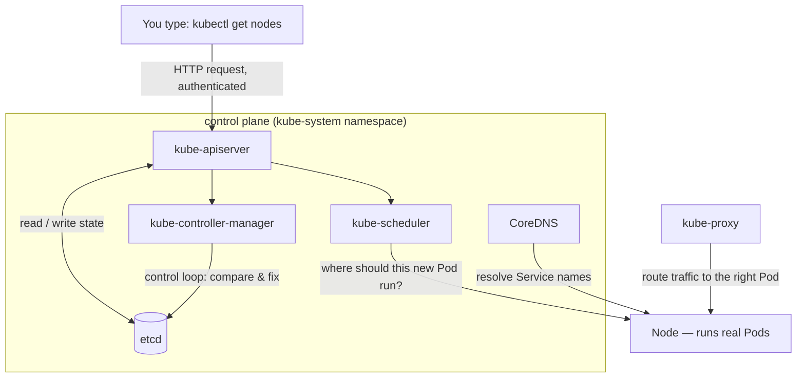
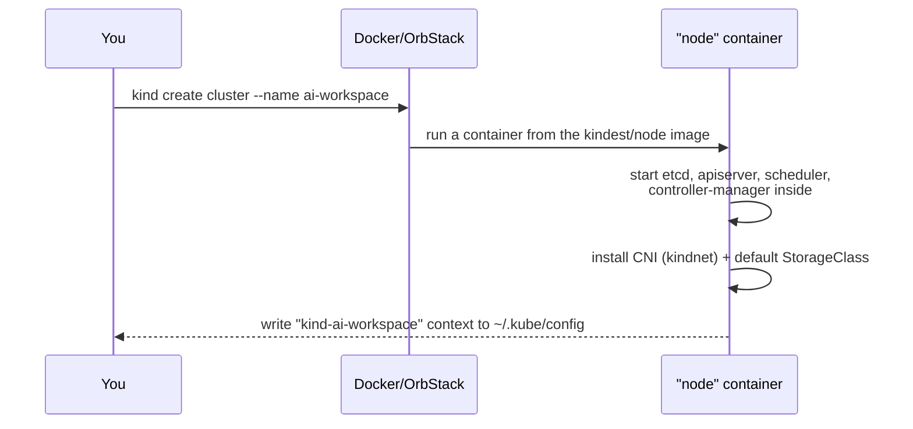

# Chapter 4 — Not Just a Concept Anymore: Knowledge Notes

> Read the story first: [Chapter 4 — Not Just a Concept Anymore](../../handbook/en/part-02-first-cluster/ch04-not-just-a-concept-anymore.md)

This document doesn't replace the story — it just goes deeper on the technical parts the narrative doesn't have room to fully explain, with diagrams and exercises to reinforce it.

---

## 1. Overview diagram: where a `kubectl` request actually goes



**How to read this:** everything you type through `kubectl` only ever talks to one door — `kube-apiserver`. No command "skips ahead" straight into `etcd` or straight into a Node. Even `kube-scheduler` and `kube-controller-manager` don't read/write `etcd` directly — they still go through `kube-apiserver`, the diagram above is just simplified for clarity. This is the single most important thing in the whole chapter: **the control plane isn't a fuzzy blob, it's 5-6 concrete processes, each with one job, all revolving around a single door.**

---

## 2. `kind create cluster` — what actually happens

`kind` (Kubernetes IN Docker) spins up a **real** Kubernetes cluster — the same API server/scheduler/controller-manager/kubelet binaries as production — except each "node" is a Docker container, not a separate physical machine or VM.



Breaking down the real log lines seen in the story:

| Log line | What it means |
|---|---|
| `Ensuring node image (kindest/node:vX.Y.Z)` | Pulls (or reuses a local cache of) the `kindest/node` image — a Docker image with the entire Kubernetes binary set baked in, including `containerd` as that "node"'s own internal container runtime. |
| `Preparing nodes` | Starts the container(s) acting as nodes — for a single-node cluster, that's exactly one container, playing both control-plane and Pod-hosting roles at once. |
| `Writing configuration` | Generates a kubeadm config file inside the container, used to bootstrap the control plane. |
| `Starting control-plane` | Runs `etcd`, `kube-apiserver`, `kube-scheduler`, `kube-controller-manager` as static Pods inside the node container. |
| `Installing CNI` | Installs a network plugin (`kindnet` by default) — without this step, Pods have no IP and can't reach each other. |
| `Installing StorageClass` | Installs a StorageClass named `standard`, backed by the `rancher.io/local-path` provisioner — sits untouched until Chapter 11, when a PersistentVolumeClaim finally needs it. |

> **Note — why `ErrImagePull` happens in Chapter 6:** `kind` has its own **separate** container runtime (`containerd`, inside the node container), isolated from Docker Desktop/OrbStack running on the host machine. Building an image with `docker build` doesn't mean the `kind` node can see it — the two container runtimes don't share an image store automatically. `kind load docker-image` is needed to manually copy the image in.

**Not for production** — `kind` is for development/learning/CI only (testing a manifest before applying it to a real cluster is a very common use case for it). Production uses real multi-node clusters, one machine/VM per node (cloud-managed like EKS/GKE/AKS, or self-operated with kubeadm).

---

## 3. The control plane components, one by one

| Component | Role | How to check it yourself | If it dies |
|---|---|---|---|
| `etcd` | A key-value database holding the **entire desired state** — every Pod/Deployment/Service is a record here, stored hierarchically (`/registry/pods/ai-workspace/chat-api-...`). The single source of truth; every other component only ever reads/writes it through the apiserver. | `kubectl get pods -n kube-system -l component=etcd` | The cluster loses its memory — the apiserver can't read/write state anymore, every `kubectl` command starts timing out. This is why regular `etcd` backups matter so much in production — losing `etcd` is close to losing the whole cluster. |
| `kube-apiserver` | The **only** door into the cluster. Every `kubectl` call is a REST HTTP request to it (`GET /api/v1/nodes`, for instance), passed through authentication + authorization (RBAC) + admission control (validates, can even mutate the request) before ever touching `etcd`. This is also exactly where `kubectl apply` gets blocked when `requests > limits` (seen in Chapter 14). | `kubectl get --raw /healthz` | No one can control the cluster through `kubectl` anymore, though Pods already running keep running on their nodes fine (kubelet doesn't depend on the apiserver to keep a container alive — it just can't take new instructions). |
| `kube-scheduler` | Decides which node a new Pod runs on — two steps: **filtering** (which nodes have enough capacity per `resources.requests`, seen again in Chapter 14), then **scoring** (which of the remaining nodes fits "best"). On a single-node cluster like `kind`, the scoring step is basically moot — there's only one choice. | `kubectl get events -n ai-workspace --field-selector reason=Scheduled` | New Pods get stuck `Pending` forever, nothing assigns them to a node — `kubectl describe pod` won't show a `Scheduled` event. |
| `kube-controller-manager` | One process, but running dozens of **control loops** inside it (ReplicaSet controller, Deployment controller, Node controller...) — each one constantly comparing real state against `etcd`, fixing drift on its own. The ReplicaSet controller is the one seen in action in Chapter 7. | `kubectl logs -n kube-system <controller-manager-pod>` | Dead Pods stop getting replaced — losing exactly the "self-healing" behavior learned in Chapters 6-7, even though the Deployment/ReplicaSet objects themselves are still sitting in `etcd` unchanged. |
| `kube-proxy` | Runs on **every** node (as a DaemonSet), sets up network rules (`iptables` or `ipvs`, depending on mode) so traffic sent to a Service's ClusterIP gets routed to one of the backing Pods matching its `selector` (Chapter 8). | `kubectl get pods -n kube-system -l k8s-app=kube-proxy` | A Service stops routing traffic even though its `Endpoints` are still correct, even though the backing Pods are still `Running` fine — because the network rules stop getting refreshed. |
| `CoreDNS` | Cluster-internal DNS — runs as a Deployment (usually 2 replicas) inside `kube-system`. Lets Pods call each other by Service name (`postgres`) instead of memorizing a ClusterIP (Chapter 8). Every Pod's `/etc/resolv.conf` points at CoreDNS's ClusterIP. | `kubectl get pods -n kube-system -l k8s-app=kube-dns` | A name like `postgres` stops resolving — `ENOTFOUND`, exactly the error hit in Chapter 6 back when the `postgres` Service had never existed at all. |

> **Note:** a `kind` node is one machine playing both `control-plane` and Pod-hosting roles at once. The `ROLES` column in `kubectl get nodes` only shows `control-plane` — no separate `worker` role like production usually shows, because the default taint that normally keeps regular Pods off control-plane nodes has been removed in `kind`'s default config.

### Reading `kubectl get nodes` output

```
NAME                         STATUS   ROLES           AGE   VERSION
ai-workspace-control-plane   Ready    control-plane   52s   v1.31.0
```

| Column | Meaning |
|---|---|
| `STATUS` | `Ready` = the kubelet on that node has reported in to the apiserver and is eligible to receive new Pods. `NotReady` is usually a lost kubelet connection, or CNI not finished installing. |
| `ROLES` | Assigned via `node-role.kubernetes.io/*` labels. Blank means a plain "worker" node, no special role. |
| `AGE` | Time since the node registered with the cluster — **not** how long the machine has been powered on. |
| `VERSION` | The `kubelet` version on that node — needs to match (or be within a few minor versions of) the control plane's version. |

---

## 4. `kubectl logs --tail` — familiar, but not quite Docker

```bash
docker logs --tail 5 <container>       # Docker
kubectl logs --tail 5 <pod> -n <ns>    # Kubernetes
```

The syntax matches on purpose — designed to feel familiar to anyone who's already used the Docker CLI. Differences worth remembering:

- `kubectl logs` **needs** `-n <namespace>` if the Pod isn't in `default`.
- A Pod can hold **more than one** container (a sidecar, for instance) — `kubectl logs <pod>` will then error out asking which one, needing `-c <container-name>`.
- `-f` follows logs in real time (like `docker logs -f`), Ctrl+C to stop, doesn't kill the Pod.
- `--previous` (or `-p`) — shows logs from the **previous** run, extremely useful when debugging `CrashLoopBackOff` (Chapter 6): the current container might not have logged anything yet before dying, but the previous run did.
- `--since 10m` — only the last 10 minutes of logs, useful when logs run long.
- `kubectl logs` also works against a Deployment instead of typing an exact Pod name: `kubectl logs deployment/chat-api` — Kubernetes picks an arbitrary matching Pod for you.

---

## 5. `-n` / `--namespace` / `-A` — and which resources don't need them

Most `kubectl` commands operate on exactly **one** namespace at a time — `default` if nothing's specified.

| Want | Type |
|---|---|
| One specific namespace | `-n <name>` or `--namespace <name>` |
| **Every** namespace at once | `-A` or `--all-namespaces` |
| Nothing at all | Implicitly `default` |

**Easy to miss:** not every resource "belongs to" a namespace. Kubernetes has two kinds:

- **Namespaced** — Pod, Deployment, Service, Secret... — must belong to exactly one namespace, `-n` has an effect.
- **Cluster-scoped** — Node, Namespace (itself), PersistentVolume, StorageClass... — exist independently, belong to no namespace at all. Passing `-n` to these either gets ignored or errors out.

Check which group something falls into with:

```bash
kubectl api-resources --namespaced=true    # resources that need -n
kubectl api-resources --namespaced=false   # cluster-scoped resources
```

---

## 6. Practice

**Concept questions** (answer without opening a terminal):

1. If you manually delete the `kube-apiserver` Pod, are other application Pods (`chat-api`, `postgres`) affected immediately? Why or why not?
2. What's the difference in role between `etcd` and `kube-controller-manager` — which one "remembers," which one "fixes"?
3. Why does a `kind` node still show `ROLES: control-plane` even while it's also running your application Pods?
4. Is `Node` a namespaced resource? Guess first, then check with `kubectl api-resources`.

**Hands-on** (open a terminal, use your actual cluster):

5. Run `kubectl get pods -n kube-system -o wide`, check the `NODE` column — are all control-plane Pods on the same node? How many nodes does your cluster have?
6. Run `kubectl logs -n kube-system <your-kube-apiserver-pod> --tail 10` — try to read what kind of requests it's logging.
7. Try `kubectl create namespace scratch-test` then `kubectl delete namespace scratch-test` — watch `kubectl get namespaces` while it's in the `Terminating` state. Which component from the table in section 3 do you think is handling that deletion?
8. Run `kubectl get --raw /healthz` — what comes back? Turn off Wi-Fi/networking for a second and run it again, notice the difference.

> Stuck? Go back to section 3 — every hands-on question maps directly to one row in that table.
