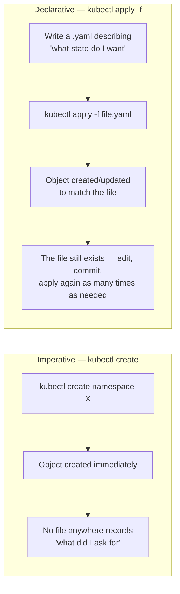
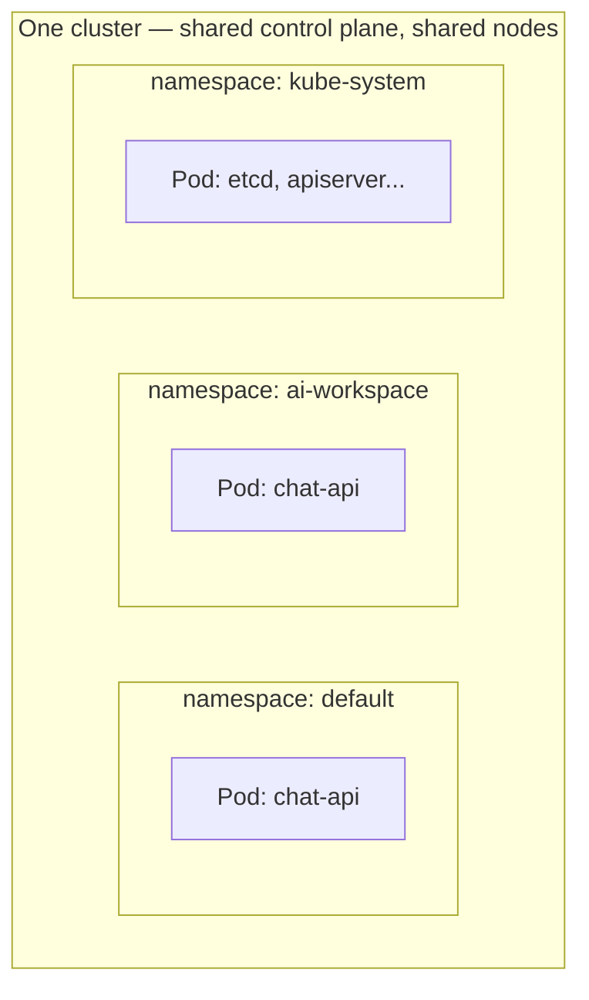
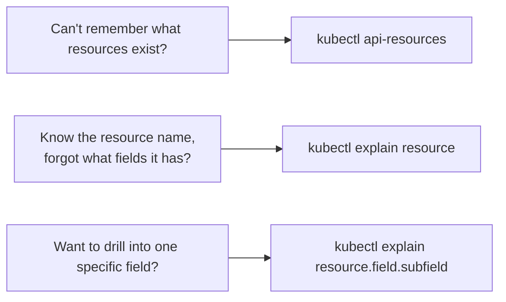

# Chapter 5 — Before Dumping Everything On It: Knowledge Notes

> Read the story first: [Chapter 5 — Before Dumping Everything On It](../../handbook/en/part-02-first-cluster/ch05-kubectl.md)

---

## 1. Overview diagram: declarative vs imperative

**How to read this:** both approaches produce the exact same object on the cluster — the only real difference is whether **a description survives the command**. `kubectl create` and it's done; `kubectl apply -f` leaves behind a file you can reopen, edit, and put into Git.

---

## 2. Namespace — a "drawer," not a separate cluster

`kubectl create namespace ai-workspace` doesn't create a new cluster or physically isolate any resources — it just attaches a partitioning label so objects don't collide on name.

Two Pods both named `chat-api` in two different namespaces are **completely independent objects** — no conflict, no overwriting each other. A namespace is just a naming scheme, not a real isolation layer for CPU/RAM/network (real network isolation needs a `NetworkPolicy`, resource isolation needs a `ResourceQuota` — neither has shown up in the story yet by this chapter).

> **Note:** not every resource belongs to a namespace — see section 5 of the Chapter 4 notes (cluster-scoped vs. namespaced).

---

## 3. `kubectl api-resources` and `kubectl explain` — two self-service lookup commands

| Command | Answers what question |
|---|---|
| `kubectl api-resources` | "What **kinds** of objects does Kubernetes know how to create?" — lists resource names (`pods`, `deployments`, `services`...), short names (`po`, `deploy`, `svc`), whether they're namespaced, which API group they belong to. |
| `kubectl explain <resource>` | "What **fields** does this kind of object have, and what do they mean?" — official documentation, pulled straight from the OpenAPI schema of the **exact cluster version currently running**, not a static doc page that can go stale. |
| `kubectl explain <resource>.<field>` | Drills one level deeper — e.g. `kubectl explain pod.spec.containers` to see `containers`'s own subfields. |

> **Note:** `kubectl explain` is the fastest way to look up a forgotten field name — faster than opening a browser to search docs, and always matches the version of the cluster actually running (online docs might be describing a different version).

---

## 4. What a `Pod` actually is, by the official definition

From `kubectl explain pod`: **"Pod is a collection of containers that can run on a host."**

Three things worth pulling out of that short definition:

1. **"collection"** — plural. A Pod can hold multiple containers, even though most real-world cases (including `chat-api` in the story) only ever have exactly one.
2. **"that can run on a host"** — containers inside the SAME Pod always run on the SAME node, share a network namespace (one shared IP), and can share volumes with each other.
3. A Pod is the smallest **deployable** unit in Kubernetes — there's no such thing as "half a Pod," and you can't scale one container inside a Pod independently of the others. To scale, you scale the whole Pod (via ReplicaSet/Deployment — Chapter 7).

---

## 5. Quick mapping against `docker-compose.yml`

| Docker Compose | Kubernetes | Note |
|---|---|---|
| `services.chat-api.image` | `pod.spec.containers[].image` | Identical meaning |
| `services.chat-api.ports` | `pod.spec.containers[].ports` | Compose exposes a port straight to the host; a Pod only declares what port the container listens on — actually exposing it is a Service's job (Chapter 8) |
| `services.chat-api.environment` | `pod.spec.containers[].env` | Identical meaning |
| `docker-compose up` | `kubectl apply -f file.yaml` | Both read a description file and create/update to match it — Compose has no concept of continuous reconciliation the way Kubernetes does |

---

## 6. Practice

**Concept questions:**

1. Is it valid to create two Pods both named `worker` in two different namespaces? What about two Pods both named `worker` in the SAME namespace?
2. `kubectl create namespace test` versus writing a `namespace.yaml` file and running `kubectl apply -f namespace.yaml` — both create an identical namespace on the cluster. So where does the real difference actually live?
3. Can a Pod with 2 containers inside have 2 different IP addresses? Why or why not?

**Hands-on:**

4. Run `kubectl api-resources | grep -i secret` — is the `secrets` resource namespaced?
5. Run `kubectl explain deployment.spec.replicas` — what's this field's data type? Compare it against `kubectl explain deployment.spec.template`.
6. Create a namespace with `kubectl create namespace scratch`, then `kubectl get namespace scratch -o yaml` — find the `metadata.creationTimestamp` field. Now write your own YAML file describing that exact namespace and `kubectl apply -f` it — does it error, or say `unchanged`? Why?
