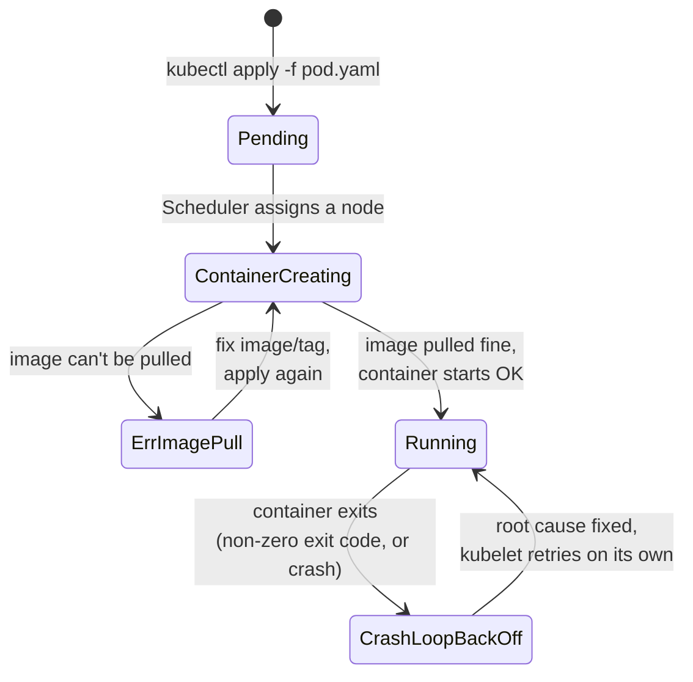
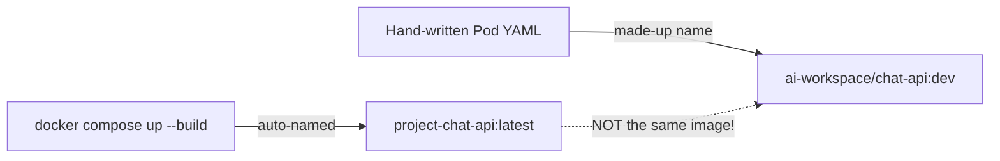
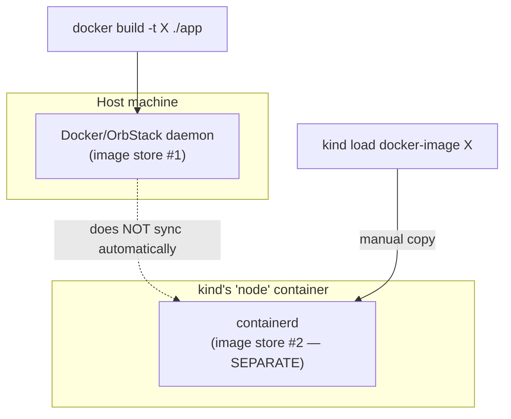
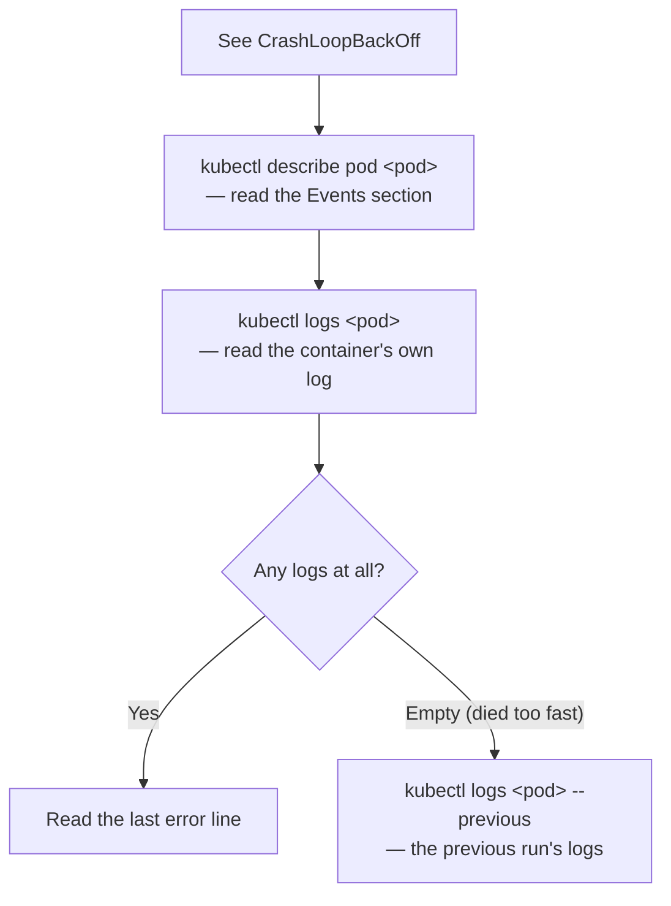
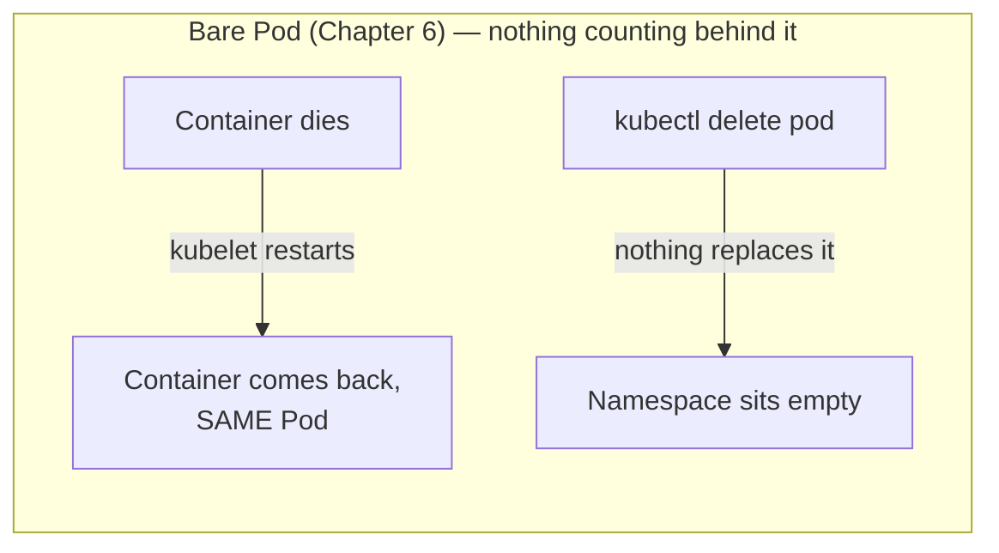

# Chapter 6 — Ran For 12 Seconds: Knowledge Notes

> Read the story first: [Chapter 6 — Ran For 12 Seconds](../../handbook/en/part-02-first-cluster/ch06-first-pod.md)

---

## 1. Overview diagram: a Pod's journey from `apply` to `Running`



**How to read this:** neither `ErrImagePull` nor `CrashLoopBackOff` is a "permanently dead" state — both are temporary, with kubelet still retrying automatically behind the scenes. The problem is retrying with the exact same root cause fails the exact same way forever, until someone actually fixes it.

---

## 2. `ErrImagePull` — the "right name" that isn't the image you think it is

The root cause in the story: Docker Compose auto-names images using `<project-folder-name>-<service-name>` when built via `docker compose up --build`, **completely unrelated** to whatever you typed into the Pod YAML's `image:` field.



| Command to check | Answers what |
|---|---|
| `docker images \| grep chat-api` | What the real image is actually named on the host machine |
| `kubectl describe pod <pod>` → the `Events` section | What image name kubelet is trying to pull, and the exact error |

**The correct routine to avoid name mismatches** (used from this chapter onward):

```bash
docker build -t ai-workspace/chat-api:dev ./chat-api   # 1. name it explicitly, don't let Compose auto-name it
kind load docker-image ai-workspace/chat-api:dev --name ai-workspace   # 2. load it into the kind node
```

> **Note:** `docker.io` shows up in the error message (`failed to resolve reference: docker.io/ai-workspace/chat-api:dev`) because Docker/Kubernetes implicitly assumes any image without an explicit registry lives on Docker Hub (`docker.io`). There's no registry named `ai-workspace` — kubelet is looking in the wrong place entirely.

---

## 3. Why `kind` doesn't automatically see images built with `docker build`



`kind` runs its own container runtime (`containerd`) inside the container acting as a node — completely separate from the Docker daemon running on the host machine, even though both are "Docker" in some loose sense. `docker compose up` can see the image because Compose talks directly to the Docker daemon; `kind`/`kubectl` don't.

---

## 4. `CrashLoopBackOff` — the standard debugging routine



In the story: the logs showed `Error: getaddrinfo ENOTFOUND postgres` — not a code bug, but DNS failing to resolve the name `postgres` at all (because the `postgres` Service didn't exist yet — solved in Chapter 8).

> **Note — `ENOTFOUND` vs. `ECONNREFUSED`:**
> - `ENOTFOUND` — DNS can't find where this **name** even points. Nothing's listening "somewhere" because "somewhere" was never defined in the first place.
> - `ECONNREFUSED` — DNS resolved the name to an IP fine, connected to that exact IP, but got turned away (nothing listening on that port, or a firewall blocking it).
>
> Telling these two apart narrows down the problem fast: `ENOTFOUND` → check DNS/Service; `ECONNREFUSED` → check whether the target process is actually running on the right port.

---

## 5. kubelet restarting a container ≠ something recreating the Pod

This is the easiest thing in the whole chapter to mix up — two mechanisms that sound similar but operate at completely different scope:

| | kubelet | ReplicaSet/Deployment |
|---|---|---|
| Watches | The container **inside** one specific Pod | The whole Pod, counted |
| Action on failure | Restarts **that exact container**, inside **that exact Pod** | If the Pod disappears, **creates a brand new Pod** to replace it |
| Scope | Runs per-node, only cares about Pods assigned to that node | Runs in the control plane, doesn't care which node a Pod is on |
| If the whole Pod gets deleted (not just the container) | Nothing left to restart | Notices the shortfall, creates a replacement (but only if a ReplicaSet/Deployment is behind it — a bare Pod has none) |



The experiment done in the story — deleting the Pod outright with `kubectl delete pod` and finding the namespace empty — is direct proof: a bare Pod has nothing behind it guaranteeing its **existence**, only kubelet guaranteeing the container inside stays restarted **as long as that Pod still exists**. Two different layers of protection, one can't be inferred from the other.

---

## 6. Practice

**Concept questions:**

1. An image named `myapp:latest` built with `docker build`, and `docker run myapp:latest` works fine on the host machine. Is it guaranteed to work if you apply `myapp:latest` in a Pod YAML on a `kind` cluster? Why or why not?
2. What's the actual difference between `ENOTFOUND postgres` and `ECONNREFUSED` — does debugging them look the same?
3. A bare Pod (no Deployment/ReplicaSet) has its container `OOMKilled` (out of memory). What happens next?

**Hands-on:**

4. Build any image with `docker build -t test:local .`, then try `kubectl run test --image=test:local` on your `kind` cluster (without `kind load` first) — watch the error, then fix it with `kind load docker-image`.
5. Create a bare Pod running the `busybox` image with a command that fails instantly (e.g. `command: ["false"]`). Watch `RESTARTS` climb over time — is the gap between restarts fixed, or does it stretch out?
6. For the Pod from exercise 5, run `kubectl logs <pod> --previous` — any logs? Try to explain why, or why not.
