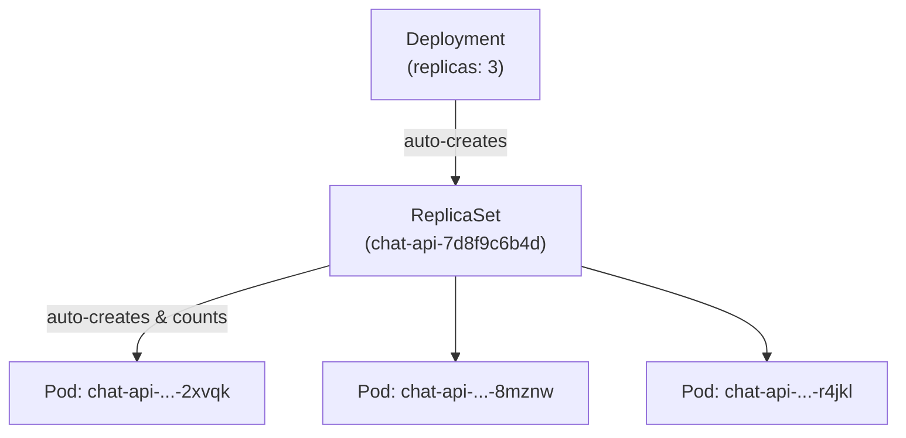
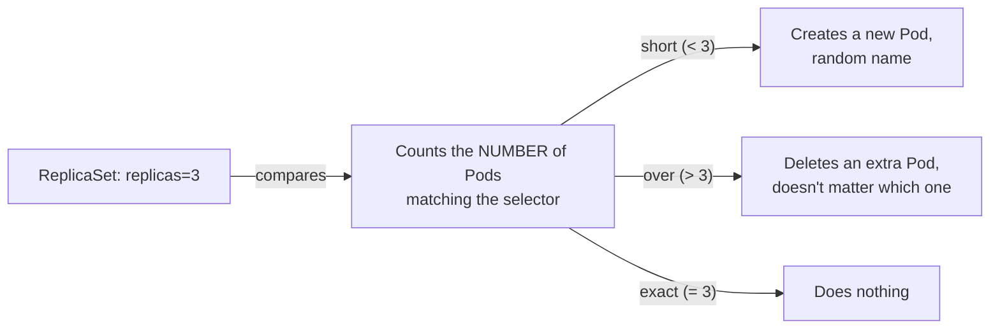

# Chapter 7 — Someone's Finally Counting: Knowledge Notes

> Read the story first: [Chapter 7 — Someone's Finally Counting](../../handbook/en/part-02-first-cluster/ch07-someone-finally-counting.md)

---

## 1. Overview diagram: three layers of objects, who creates whom



You write **one** YAML file (`kind: Deployment`), `apply` it **once** — Kubernetes generates all three layers on its own, top-down. Nobody hand-writes a ReplicaSet.

**Why three layers instead of one combined object:** each layer has exactly one job.

| Layer | Handles |
|---|---|
| Deployment | **Versioning** — rolling updates, rollbacks, keeping history of old ReplicaSets when the image changes |
| ReplicaSet | **Count** — ensures exactly N Pods exist, doesn't care about version |
| Pod | The actual running unit — one or more containers |

---

## 2. What a ReplicaSet counts, and what it doesn't



Direct proof from the story: deleting one specific Pod (`...-2xvqk`), the ReplicaSet creates a replacement with a **completely different name** (`...-x9wtp`) — not a "resurrection" of the exact old one. `kubectl describe replicaset | grep -A2 "Pods Status"` only prints a single number, no list of specific Pod names anywhere in that status block.

> **Note:** this is exactly why you should never write logic that depends on a **specific Pod name** (hardcoding a Pod name in a script, for instance) — that name can change any time the ReplicaSet needs to recreate it.

---

## 3. `matchLabels` — the one matching mechanism, reused everywhere

```yaml
spec:
  replicas: 3
  selector:
    matchLabels:
      app: chat-api          # (1) the ReplicaSet looks for Pods with this label
  template:
    metadata:
      labels:
        app: chat-api        # (2) Pods it creates carry exactly this label
```

`(1)` and `(2)` **must match** — this isn't Kubernetes inferring anything, it's the person writing the YAML making sure both spots say the same thing. If they drift apart: the ReplicaSet sees 0 matching Pods, keeps creating new ones indefinitely until some limit stops it, while the old (mislabeled) Pod sits abandoned, managed by nothing.

> **Note:** this exact `matchLabels` mechanism shows up again with Service (Chapter 8) — a Service also matches Pods by label, with zero knowledge of whatever Deployment/ReplicaSet is behind them. This is a thread running through the whole system: **Kubernetes has no direct name/ID references between objects — every link is just matching labels.**

---

## 4. Syntax for listing multiple resources at once

```bash
kubectl get deployments,replicasets,pods -n ai-workspace
```

A comma, no space — lists several resource types in one command, each printed as its own table. Useful for seeing every layer (Deployment → ReplicaSet → Pod) in one glance instead of three separate commands.

---

## 5. Summary table: what `replicas` actually changes

| replicas | What happens |
|---|---|
| `1` | Looks identical to a bare Pod in that "only 1 copy runs," but differs in that **a ReplicaSet stands behind it** — a dead Pod gets recreated. |
| `3` (like `chat-api`) | Three independent Pods, same image, same config — but for a stateful workload (like Postgres), three copies would mean three separate, unsynced sets of data (why `postgres` stays at `replicas: 1` — see Chapter 11). |
| `0` | The Deployment still exists, but with zero Pods — a way to "pause" a workload without deleting its configuration. |

---

## 6. Practice

**Concept questions:**

1. Delete the `ReplicaSet` object directly (not the Deployment) — what happens to the Pods it was managing? What happens to the Deployment sitting above it?
2. If you change `matchLabels` on an existing Deployment to a different value, but do NOT change `template.metadata.labels` to match, what's the consequence?
3. Does `replicas: 3` mean "exactly 3 Pods always exist" or "at most 3 Pods"? Is there any meaningful difference between these two readings during the moments Pods are actively being created/deleted?

**Hands-on:**

4. Create a Deployment with `replicas: 2`, then delete BOTH Pods at once with `kubectl delete pod -l app=<name>`. Watch `kubectl get pods -w` — do the two new Pods appear simultaneously, or one after another?
5. Scale from 3 down to 1 with `kubectl scale deployment <name> --replicas=1`, check `kubectl get replicaset` — does the old ReplicaSet get deleted, or does it just change how many Pods it manages?
6. Run `kubectl describe replicaset <name>`, find the `Selector` line — compare it against `matchLabels` in the original YAML file, confirm they match.
