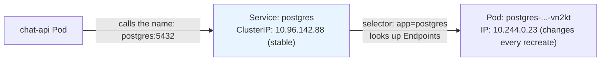
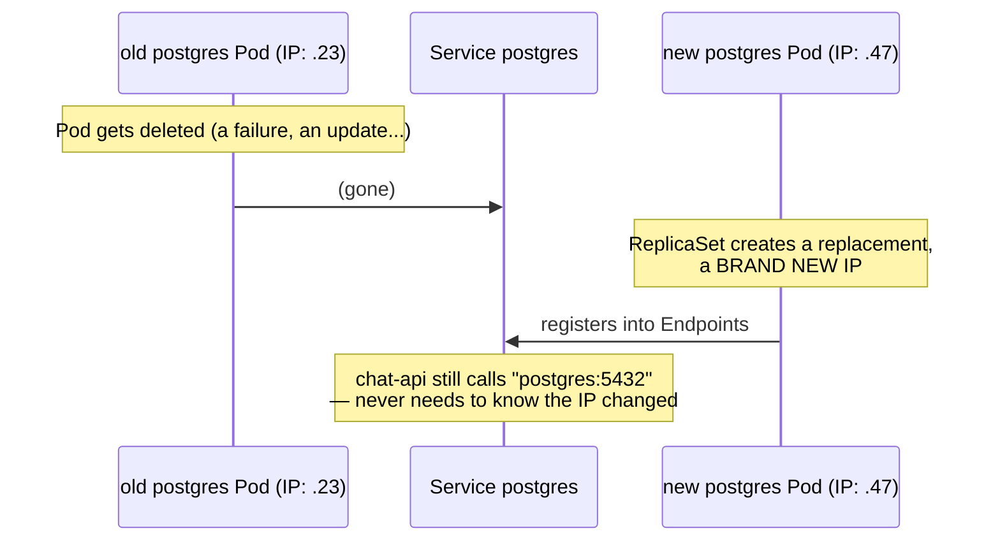
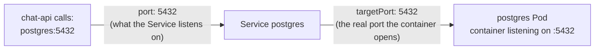

# Chapter 8 — A Name That Doesn't Change: Knowledge Notes

> Read the story first: [Chapter 8 — A Name That Doesn't Change](../../handbook/en/part-02-first-cluster/ch08-a-name-that-doesnt-change.md)

---

## 1. Overview diagram: the Service sits in the middle, nobody calls a Pod directly



**How to read this:** `chat-api` never knows the real IP of the `postgres` Pod — it only knows one stable name. The Service sits in the middle, keeping track of which Pod that name currently points to.

---

## 2. Why a Service is needed — the problem it solves



Without a Service: every time the `postgres` Pod dies and gets recreated, its IP changes, breaking every client that hardcoded the old one. With a Service: clients only need to remember **one name**, which never changes.

---

## 3. `kubectl explain service` — the official definition

> "Service is a **named abstraction** of software service ... consisting of local port ... that the proxy listens on, and the **selector** that determines which pods will answer requests."

The two most important words in that definition:

- **named abstraction** — a name standing in for a whole group of Pods, not one specific Pod.
- **selector** — the mechanism that decides who's in that "group," the exact same `matchLabels` idea already seen on ReplicaSet (Chapter 7).

---

## 4. `port` vs `targetPort` — two concepts easy to mistake for one



| Field | Meaning | Who uses this number |
|---|---|---|
| `port` | The main port the Service listens on/exposes | Clients calling in (`postgres:5432`) |
| `targetPort` | The real port the container inside the Pod has open | The Service, to forward the request to the Pod |

The two numbers **can be completely different** — e.g. `port: 80` with `targetPort: 8080` if you want clients to hit the "standard" port 80 while the real app runs on 8080. In the story they happen to match (5432/5432) purely because Postgres listens on its default port anyway.

---

## 5. `Endpoints` — where the Service "remembers" which Pods are actually behind it

```bash
kubectl describe svc postgres -n ai-workspace
```

```
Selector:    app=postgres
Endpoints:   10.244.0.23:5432
```

`Endpoints` is a **separate** object, automatically generated and continuously updated by a controller in the control plane — it scans the whole namespace for Pods matching the `selector`, writes their real IPs in here. The Service itself doesn't "remember" anything — it just reads `Endpoints` on every incoming request.

> **Important note — a thread running through everything:** the Service has **no idea** the `postgres` Deployment even exists. It just scans Pods by label, doesn't care whether that Pod came from a Deployment, a StatefulSet, or a bare Pod applied by hand. The match between the Service and the Deployment only exists because whoever wrote the YAML set the same label in both places — Kubernetes never infers this link on its own. This is how everything in Kubernetes connects: **through matching labels, never through direct name/ID references.**

---

## 6. Internal DNS — why typing plain `postgres` (not an FQDN) still resolves

Every Pod has `/etc/resolv.conf` with a list of `search` domains, by default:

```
<namespace>.svc.cluster.local
svc.cluster.local
cluster.local
```

Type `postgres` (the short name), and the resolver tries each search domain in order until one resolves — within the same `ai-workspace` namespace, `postgres` matches `postgres.ai-workspace.svc.cluster.local` on the very first try. To reach a Service in a DIFFERENT namespace, you need `<service-name>.<namespace>` or the full FQDN.

---

## 7. Practice

**Concept questions:**

1. Delete the `postgres` Service (not the Deployment/Pod) — is the `postgres` Pod itself affected at all? What about `chat-api`?
2. Can two different Services point at the same group of Pods (same `selector`)? What would actually differ between them?
3. Does a Service's `ClusterIP` change when its backing Pod gets deleted/recreated? What about `Endpoints`?

**Hands-on:**

4. Create two Pods with the same label `app: demo`, then a Service with `selector: app: demo` — run `kubectl get endpoints demo`, confirm both Pod IPs show up.
5. Delete one of the two Pods from exercise 4, watch `kubectl get endpoints demo -w` — roughly how long does `Endpoints` take to update?
6. From any Pod in the `ai-workspace` namespace, run `cat /etc/resolv.conf` — confirm the `search` domain list matches what's described in section 6.
7. Try reaching a Service in the `kube-system` namespace (e.g. `kube-dns`) from a Pod in `ai-workspace` using the short name `kube-dns` — does it resolve? Try again with `kube-dns.kube-system`.
