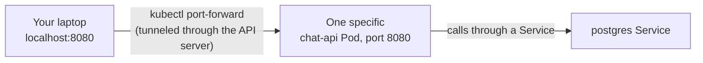

# Chapter 9 — One Question, One Answer: Knowledge Notes

> Read the story first: [Chapter 9 — One Question, One Answer](../../handbook/en/part-02-first-cluster/ch09-one-question-one-answer.md)

This chapter is light on new concepts — mostly an end-to-end test. Notes focus on the main tool: `port-forward`.

---

## 1. Diagram: where `port-forward` sits in the request flow



**The core difference from a Service:** `port-forward` connects your machine straight to **one specific Pod**, bypassing the entire Service/Endpoints/load-balancing mechanism. Not meant for real traffic — only for personal debugging/testing from outside the cluster.

---

## 2. What kinds of resources `port-forward` works against

```bash
kubectl port-forward pod/<pod-name> 8080:8080         # connects straight to one specific Pod
kubectl port-forward deployment/<name> 8080:8080       # kubectl picks an arbitrary Pod matching the Deployment
kubectl port-forward svc/<name> 8080:8080              # forwards through a Service, still only ever one Pod at a time
```

> **Note:** whether forwarding through `deployment/` or `svc/`, `port-forward` does **not** load-balance across multiple Pods — it picks one Pod at the moment the command runs and keeps that connection until you stop the command (Ctrl+C) or that Pod dies.

---

## 3. Why `port-forward` is needed here but not for `postgres`

| | `postgres` | `chat-api` |
|---|---|---|
| Who calls it | Only other Pods **inside** the cluster (`chat-api`) | You, **from outside** the cluster (laptop) |
| Needs a Service? | Yes — so `chat-api` can call it by name | Not needed just to test with `port-forward` (though a real production setup would still want a Service + Ingress) |
| How to reach it from outside | Not needed, shouldn't be done | `port-forward` (personal testing) or Ingress (real traffic) |

---

## 4. Practice

**Concept questions:**

1. While running `kubectl port-forward deployment/chat-api 8080:8080`, one of the three `chat-api` replicas gets deleted mid-session (not the one being forwarded to) — is the `port-forward` connection affected?
2. If the Pod currently being forwarded to gets deleted, what happens to the running `port-forward`?
3. Is `port-forward` how production exposes a service to the internet? If not, which part of this book (check the Roadmap) is likely to introduce the real way?

**Hands-on:**

4. Open a `port-forward` to `deployment/chat-api`, use `kubectl get pods -o wide -n ai-workspace` to figure out which exact Pod it's actually connected to (hint: curl `/health` a few times, compare logs per Pod with `kubectl logs`).
5. Try `kubectl port-forward svc/postgres 5432:5432 -n ai-workspace`, then connect to `localhost:5432` with any local Postgres client (`psql`) — confirm you can see the `aiworkspace` database.
