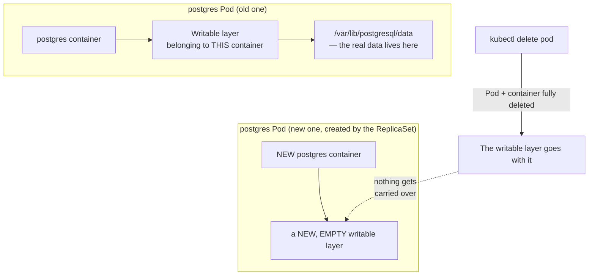
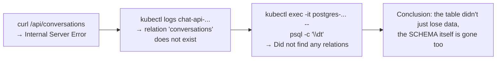

# Chapter 10 — The New One Remembers Nothing: Knowledge Notes

> Read the story first: [Chapter 10 — The New One Remembers Nothing](../../handbook/en/part-02-first-cluster/ch10-the-new-one-remembers-nothing.md)

---

## 1. Overview diagram: where data lives before there's a Volume



**How to read this:** without a Volume attached, Postgres's data directory is just part of that one container's own writable layer. The container disappears, the writable layer disappears with it — there's no "data handoff" step between the old copy and the new one, because the new one is a completely different container, started fresh from the original image.

---

## 2. What a ReplicaSet guarantees, what it doesn't — the direct opposite of Chapter 7

| A ReplicaSet guarantees | A ReplicaSet does NOT guarantee |
|---|---|
| Exactly N Pods named `postgres` (or matching whatever label) are always `Running` | What's actually **inside** that Pod |
| The declared port always has something listening | Whether previously written data still exists |
| A Service (if any) always has a valid Endpoint to point at | Whether that Endpoint "remembers" anything, or is brand new |

> **Note — contrasting two lessons:** Chapter 7 taught "delete a Pod, another one replaces it instantly, no harm done" — true for `chat-api` because it **holds no state at all**. This chapter teaches that doing the exact same thing to `postgres` is a disaster, because `postgres` **is the thing holding state**. The exact same action (`kubectl delete pod`) has completely different consequences depending on whether the workload is stateful.

---

## 3. How this got caught — the debugging chain



`\dt` (short for "describe tables") is a `psql` command listing every table in the current database — a quick way to confirm "am I even talking to the right database, does anything exist here" before digging into individual rows.

---

## 4. `kubectl exec` — a direct carryover from Docker habits

```bash
docker exec -it <container> psql -U postgres            # Docker
kubectl exec -it <pod> -n <ns> -- psql -U postgres       # Kubernetes
```

The one syntax difference worth noting: `kubectl exec` needs a `--` to separate "flags meant for `kubectl` itself" from "the command to run inside the container" — without that `--`, `kubectl` can misread a subcommand's own flag (`-U`, for instance) as one of its own.

---

## 5. Practice

**Concept questions:**

1. If `postgres` runs `replicas: 1` but the Pod is never deleted — just the container inside gets OOMKilled and kubelet restarts it on its own — does the data survive? Compare that against an outright `kubectl delete pod`.
2. Why does "deleting a Pod is fine, another one replaces it" hold true for `chat-api` but not for `postgres`? What's the deciding factor?
3. Does `frontend` (React, serving static files) need to worry about the exact same problem as this chapter? Why or why not?

**Hands-on:**

4. Create a `postgres` Pod with no Volume attached, create a test table, insert a few rows, then `kubectl delete pod` — confirm exactly this happens: the table is gone completely.
5. Run `kubectl exec -it <postgres-pod> -- psql -U postgres -d aiworkspace -c "\dt"` on your current Pod (if you're past Chapter 11, with the PVC in place) — confirm the table is still there.
6. Try `kubectl exec -it <pod> sh` (no `--` before `sh`) — watch what error happens, explain why.
