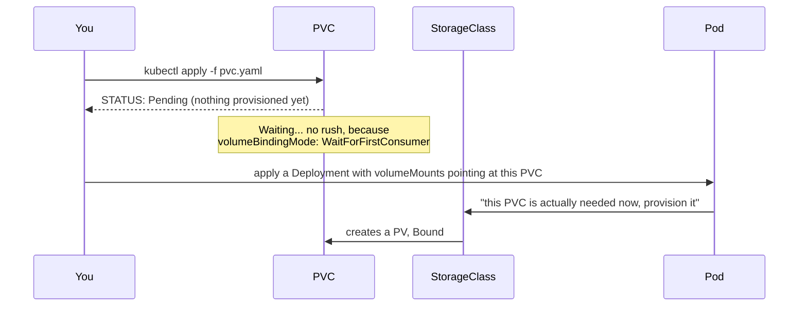

# Chapter 11 — Attached From the Outside: Knowledge Notes

> Read the story first: [Chapter 11 — Attached From the Outside](../../handbook/en/part-02-first-cluster/ch11-attached-from-the-outside.md)

---

## 1. Overview diagram: PVC, PV, StorageClass — who asks, who grants, who stands behind it


**Three objects, three roles:**

| Object | Role | Created by |
|---|---|---|
| `StorageClass` | The "recipe" for provisioning disks — which provisioner to use, how it's configured | The cluster admin (already there by default with `kind create cluster`) |
| `PersistentVolumeClaim` (PVC) | A **request** for a disk — "I need 1Gi, ReadWriteOnce" | You, writing the application YAML |
| `PersistentVolume` (PV) | The **actual** provisioned disk | Auto-generated by the provisioner, matched to the PVC |

---

## 2. `WaitForFirstConsumer` — why the PVC just sits at `Pending`



Two `volumeBindingMode` options exist:

| Mode | When the disk gets provisioned |
|---|---|
| `Immediate` (default for some StorageClasses) | Provisioned right when the PVC is created, regardless of whether any Pod uses it yet |
| `WaitForFirstConsumer` (default for `local-path` on `kind`) | Waits until a Pod **actually** needs that volume before provisioning — because local storage (tied to exactly one node) needs to know which node the Pod will land on before deciding where to provision the disk |

> **Note:** this isn't a bug or a stuck PVC — check the `VOLUMEBINDINGMODE` column in `kubectl get storageclass` to know the expected behavior before panicking.

---

## 3. `volumes` + `volumeMounts` — names have to match, nothing else does

```yaml
spec:
  containers:
    - name: postgres
      volumeMounts:
        - name: postgres-data          # (A)
          mountPath: /var/lib/postgresql/data
  volumes:
    - name: postgres-data              # (A) — MUST match (A) above
      persistentVolumeClaim:
        claimName: postgres-data       # the real PVC name, a different field entirely
```

- `volumes[].name` and `volumeMounts[].name` are an **internal naming pair**, only meaningful inside this one YAML file — used to connect "which volume is declared" with "where that volume gets mounted inside the container."
- `volumes[].persistentVolumeClaim.claimName` is the **real** PVC name on the cluster, which needs to match the `metadata.name` of an actual PVC object that exists.
- The easiest mistake: renaming the real PVC (`claimName`) without updating it everywhere, or mismatching the internal `name` between the two spots — both cause the Pod to fail mounting the volume, usually with a clear error at `apply`/`describe` time.

---

## 4. `accessModes` — who can read/write at the same time

| accessMode | Meaning |
|---|---|
| `ReadWriteOnce` (RWO) | Only **one node** can mount it for writing at a time (multiple Pods on the SAME node can still share the mount) |
| `ReadOnlyMany` (ROX) | Multiple nodes can mount it, read-only |
| `ReadWriteMany` (RWX) | Multiple nodes can mount it, writable — needs storage that supports it (NFS, cloud file storage...); `local-path` on `kind` does **not** support RWX |

`postgres` uses `RWO` because it's a single replica — if `replicas` were later bumped to 2 while still sharing one RWO PVC, the second Pod would get stuck `Pending`, unable to mount at the same time as the first.

---

## 5. Practice

**Concept questions:**

1. Delete the PVC (not the PV) — does the PV get deleted too? What field decides that?
2. If the StorageClass used `volumeBindingMode: Immediate` instead of `WaitForFirstConsumer`, what would `kubectl get pvc` show right after creation?
3. `postgres` is currently RWO, 1 replica. To scale to 3 replicas while still having all three write to one shared storage location, what needs to change?

**Hands-on:**

4. Run `kubectl get storageclass` — confirm the `PROVISIONER` and `VOLUMEBINDINGMODE` on your cluster match what's described in section 2.
5. Create a new PVC without attaching it to any Pod — use `kubectl get pvc` to watch it sit at `Pending` indefinitely (the exact `WaitForFirstConsumer` behavior).
6. Run `kubectl get pv` — find the PV created for the `postgres-data` PVC, check its `RECLAIM POLICY` field (related hint: if the PVC gets deleted, this value decides whether the PV gets deleted too or kept around).
