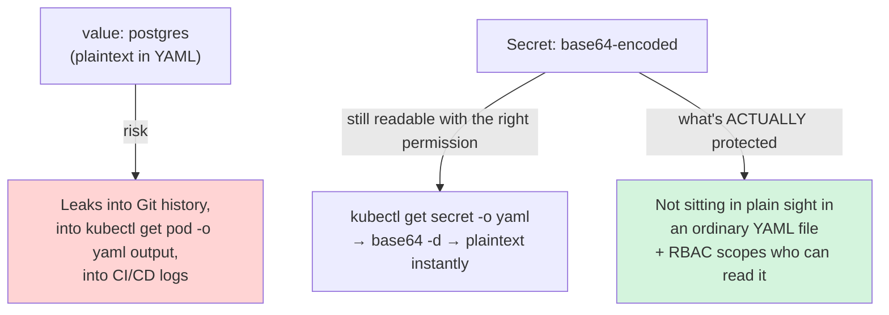
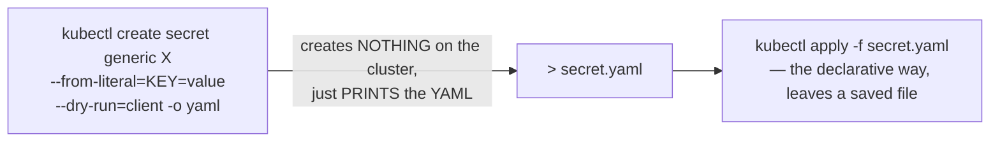

# Chapter 12 — Not Much of a Secret: Knowledge Notes

> Read the story first: [Chapter 12 — Not Much of a Secret](../../handbook/en/part-02-first-cluster/ch12-not-much-of-a-secret.md)

---

## 1. Overview diagram: what a Secret actually "protects"



**Core takeaway:** a Secret doesn't encrypt data. What it actually changes is **where the data lives** (a separate object, not mixed into ordinary manifests) and **who controls read access** (via RBAC) — not whether the data is locked away.

---

## 2. What base64 is — and why it isn't encryption

| | base64 (encoding) | Real encryption |
|---|---|---|
| Needs a key to read? | No — anyone can decode it, one command | Yes — needs the right key to read |
| Purpose | Turns arbitrary/binary data into safe text for embedding in YAML/JSON | Hides content from anyone without permission |
| Reversing it | `base64 -d` — instant | Needs the key + a decryption algorithm |

```bash
echo "cG9zdGdyZXM=" | base64 -d
# postgres
```

> **Note:** for a Secret to actually be "safer" in the encryption sense, the cluster needs **encryption at rest** enabled for `etcd` (a separate configuration at the API server layer, not on by default) — `kind` does NOT enable this by default.

---

## 3. `kubectl create secret generic --dry-run=client -o yaml` — writing a file from an imperative command



`--dry-run=client` simulates the command entirely on the client side, never sending a real request to the API server — combined with `-o yaml`, it prints the equivalent YAML instead of having to hand-write the `data`/`type` structure yourself (and manually base64-encoding values).

---

## 4. `secretKeyRef` — pointing at one specific key inside a Secret

```yaml
env:
  - name: POSTGRES_PASSWORD
    valueFrom:
      secretKeyRef:
        name: postgres-secret     # the Secret object's name
        key: POSTGRES_PASSWORD    # the name of the key INSIDE that Secret
```

A Secret can hold **multiple keys** (`data:` is a map) — `secretKeyRef` always needs both: the Secret's name AND the specific key inside it. Nearly identical to `configMapKeyRef` (used for ConfigMaps), differing only in field names, the mechanism is exactly the same.

> **Important limit learned in this chapter:** `secretKeyRef` replaces the **entire value** of an environment variable, not a fragment sitting in the middle of a string (like a password buried inside `DATABASE_URL`). To use a Secret for part of a string, that string has to be split into separate variables — a direct consequence being that application code has to change too (`chat-api/src/db.js`), not just YAML.

---

## 5. Practice

**Concept questions:**

1. A Secret and a ConfigMap holding the exact same value (say `ENV=production`) — security-wise, what's actually different between the two, or are they functionally identical?
2. `kubectl get secret postgres-secret -o jsonpath='{.data.POSTGRES_PASSWORD}'` prints a base64 string — what extra step gets you the real password?
3. If `--dry-run=client` is left off when running `kubectl create secret generic`, what happens differently?

**Hands-on:**

4. Create a Secret with 2 different keys in one command (`--from-literal=A=1 --from-literal=B=2`), check `kubectl get secret <name> -o yaml` — confirm both keys are base64-encoded separately.
5. Try `kubectl describe secret <name>` (not `-o yaml`) — does the real value show up? Compare the difference between `describe` and `get -o yaml` for a Secret.
6. Write a Deployment using `envFrom.secretRef` (instead of `env[].valueFrom.secretKeyRef` per variable) — look up this field via `kubectl explain deployment.spec.template.spec.containers.envFrom`, try loading EVERY key in a Secret as environment variables at once.
