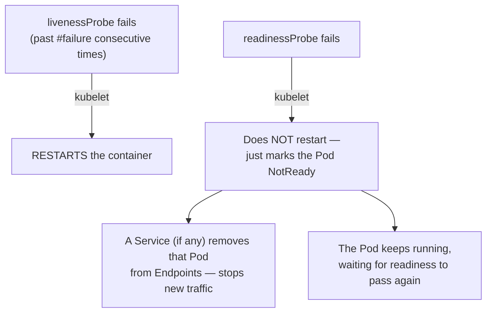
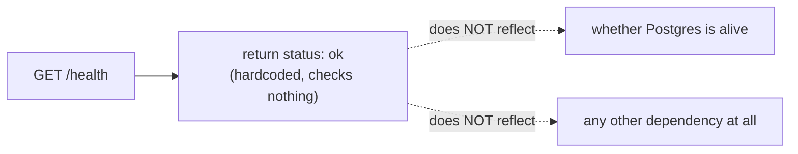

# Chapter 13 — Running Doesn't Mean Fine: Knowledge Notes

> Read the story first: [Chapter 13 — Running Doesn't Mean Fine](../../handbook/en/part-02-first-cluster/ch13-running-doesnt-mean-fine.md)

---

## 1. Overview diagram: two kinds of probes, two very different consequences



**Core difference:** `liveness` answers "does this container need restarting" — the action is a **restart**, a heavy move, only worth taking when truly needed. `readiness` answers "should this Pod receive new traffic right now" — the action is **temporarily hiding it from the Service**, much gentler, doesn't touch the running process at all.

---

## 2. Three probe types — not just `httpGet`

| Type | How it checks | When to use it |
|---|---|---|
| `httpGet` | HTTP GET to a path + port, 2xx/3xx counts as success | An app with an existing HTTP server (like `chat-api`) |
| `exec` | Runs a command inside the container, exit code 0 = success | An app with no HTTP server, or needing a deeper check (e.g. `pg_isready` for Postgres) |
| `tcpSocket` | Just tries opening a TCP connection to the port, doesn't care about the response content | An app that only needs "is something listening on this port," with no dedicated HTTP health endpoint |

> **Note:** `postgres` in the story has no probes at all yet — if added, the right type would be `exec` running `pg_isready`, not `httpGet` (Postgres doesn't speak HTTP).

---

## 3. Timing fields — reading them correctly

```yaml
livenessProbe:
  httpGet:
    path: /health
    port: 8080
  initialDelaySeconds: 5   # (1)
  periodSeconds: 10        # (2)
```

From `kubectl describe pod` output:
```
Liveness: http-get http://:8080/health delay=5s timeout=1s period=10s #success=1 #failure=3
```

| Field | Meaning | Default if not set |
|---|---|---|
| `initialDelaySeconds` | How long to wait after container start before the first probe | `0` |
| `periodSeconds` | Gap between probes | `10` |
| `timeoutSeconds` | How long each probe waits for a response before counting as failed | `1` |
| `failureThreshold` (`#failure`) | How many CONSECUTIVE failures before it's actually considered broken | `3` |
| `successThreshold` (`#success`) | How many consecutive successes before it's considered healthy again (only meaningfully different for readiness) | `1` |

---

## 4. The real limit of a shallow health check — the chapter's main lesson



A "shallow" health check (only answers whether the process is running and listening on HTTP) versus a "deep" one (actually queries the database, calls a dependency) are two different philosophies, each with its own risk:

| | Upside | Risk |
|---|---|---|
| Shallow (used in this chapter) | Simple, adds no extra load on dependencies, no cascade risk | Doesn't catch an app that's "alive but useless" (a dead dependency while the process keeps running) |
| Deep (checking the DB inside `/health` itself) | Catches real dependency trouble earlier | If the dependency is merely slow (not fully dead), EVERY Pod can get marked down/restarted at once — turning a small hiccup into a full outage |

---

## 5. Practice

**Concept questions:**

1. A Pod's `readinessProbe` fails but `livenessProbe` still passes — does that Pod get restarted? Is it still `Running`? What does `READY` show in `kubectl get pods`?
2. If NO `readinessProbe` is declared, only a `livenessProbe`, when does Kubernetes consider the Pod "ready"?
3. Why does `initialDelaySeconds` matter for an app with a slow startup (say, loading a heavy AI model)? What happens if `initialDelaySeconds: 0` is left on an app like that?

**Hands-on:**

4. Temporarily change the `/health` route to always return an error (status 500), re-apply the Deployment, watch `kubectl get pods -w` — what does `READY` change to? Does `RESTARTS` climb?
5. Temporarily change the `livenessProbe`'s path to something that doesn't exist (`/does-not-exist`), watch `kubectl describe pod` a few minutes later — find the Events line reporting the liveness failure, count exactly how many failures it took before the container got restarted.
6. Try adding a `startupProbe` (a third probe type, distinct from `liveness`/`readiness`) — look up `kubectl explain deployment.spec.template.spec.containers.startupProbe`, figure out what problem it solves that `initialDelaySeconds` alone doesn't fully cover.
