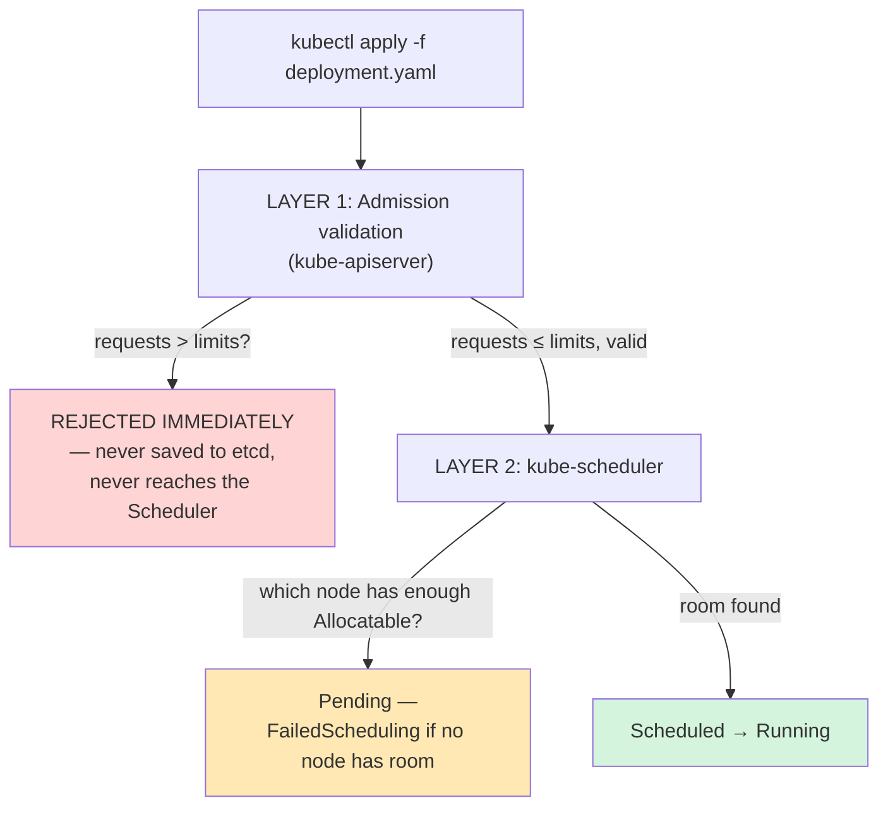
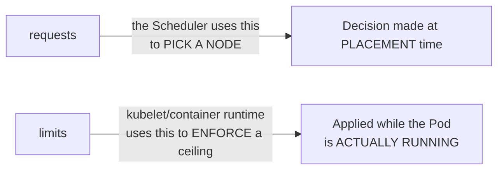

# Chapter 14 — Not Enough Room: Knowledge Notes

> Read the story first: [Chapter 14 — Not Enough Room](../../handbook/en/part-02-first-cluster/ch14-not-enough-room.md)

---

## 1. Overview diagram: two separate checks for `requests`/`limits`



**The chapter's most important lesson:** these two checks are **independent**, happen in different places, with different kinds of failures:
- Layer 1 (validation): compares `requests` against that **same container's own** `limits` — fails instantly, `kubectl apply` gets rejected outright, nothing is created or modified at all.
- Layer 2 (scheduling): compares `requests` against a **node's Allocatable** capacity — not an error, the Pod still gets created, just stuck `Pending` waiting for a node with room.

---

## 2. `requests` vs `limits` — a clear recap



| | `requests` | `limits` |
|---|---|---|
| What it's for | The Scheduler uses it to find a node with enough room | The ceiling a container can't cross while running |
| What happens on violation (CPU) | — | The container gets **throttled** (slowed down), never killed |
| What happens on violation (Memory) | — | The container gets **OOMKilled** instantly |
| Constraint between the two | `requests ≤ limits` — mandatory, validated the moment you `apply` | — |

> **Note — why CPU and memory behave differently past the limit:** CPU is a "compressible" resource — going over just means throttling, running slower, never dying. Memory is "incompressible" — there's no way to "slow down" RAM usage, so going over means an instant kill (`OOMKilled`), a completely different behavior from CPU.

---

## 3. Reading a Node's `Allocatable` correctly

```bash
kubectl describe node <node-name> | grep -A6 "Allocatable:"
```

```
Allocatable:
  cpu:                6
  ephemeral-storage:  253725Mi
  memory:             7841234Ki
  pods:               110
```

> **Note:** `Allocatable` is NOT the same as `Capacity` (the node's total physical resources) — `Allocatable` already subtracts what's reserved for `kubelet`/the OS (`kube-reserved`, `system-reserved`). When the Scheduler checks "does this node have room," it always compares against `Allocatable`, never `Capacity`.

`pods: 110` — the **maximum number of Pods** allowed on that node, independent of how much CPU/memory is free. Plenty of resources left but already at 110 Pods, and Pod #111 still stays `Pending`.

---

## 4. Reading a `FailedScheduling` event

```
Warning  FailedScheduling  10s  default-scheduler  0/1 nodes are
available: 1 Insufficient memory. preemption: 0/1 nodes are
available: 1 No preemption victims found for incoming pod.
```

| Part | Meaning |
|---|---|
| `0/1 nodes are available` | 0 out of 1 total node qualifies — that first number climbs on a bigger cluster where some nodes do have room |
| `1 Insufficient memory` | The specific reason it got ruled out — could also be `Insufficient cpu`, `node(s) had taint...`, depending on the situation |
| `preemption: ... No preemption victims found` | Kubernetes has a "preemption" mechanism — evicting a lower-priority Pod to make room for a higher-priority one (`PriorityClass`, hasn't shown up in the story yet) — here, nothing qualified to be evicted to make room |

---

## 5. Practice

**Concept questions:**

1. A container exceeding `limits.cpu` gets throttled; exceeding `limits.memory` gets `OOMKilled`. Why does Kubernetes treat these two resources so differently?
2. `requests.memory: 200Mi` and `limits.memory: 100Mi` (requests LARGER than limits) — how does `kubectl apply` react?
3. A node has `Allocatable.pods: 110`, currently running exactly 110 small Pods (each using very little CPU/RAM). Pod #111 asks for tiny `requests` — does it get Scheduled? Why or why not?

**Hands-on:**

4. Run `kubectl top nodes` (with `metrics-server` installed — see Chapter 15) alongside `kubectl describe node | grep -A6 Allocatable` — compare actual usage against what's currently `request`ed by existing Pods.
5. Create a Pod requesting `limits.memory: 50Mi` but running a process that deliberately uses more than 50Mi (e.g. `stress --vm 1 --vm-bytes 100M`) — watch `kubectl get pods`, find `OOMKilled` in `kubectl describe pod`.
6. Try creating two Pods, each requesting `requests.cpu: 4`, on a node with only `Allocatable.cpu: 6` — does the second Pod get Scheduled? Explain it using the exact mechanism from section 1.
