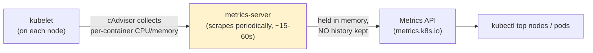
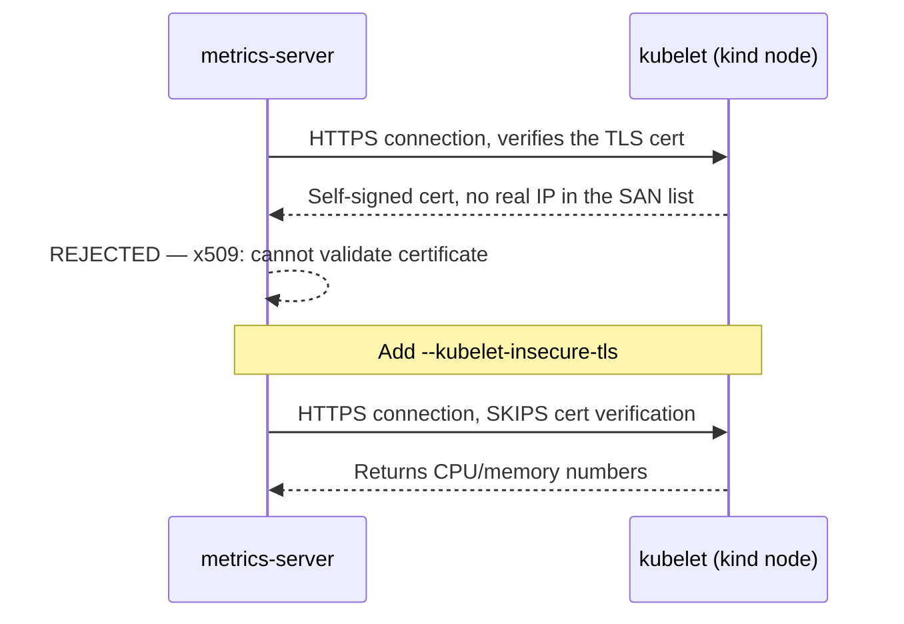
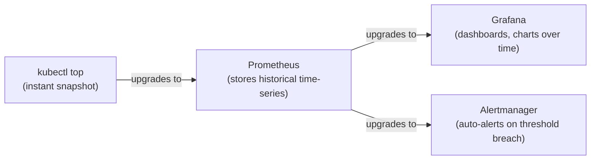

# Chapter 15 — No More Guessing: Knowledge Notes

> Read the story first: [Chapter 15 — No More Guessing](../../handbook/en/part-02-first-cluster/ch15-no-more-guessing.md)

---

## 1. Overview diagram: where `kubectl top`'s numbers actually come from



**The most important point:** `metrics-server` isn't a mandatory part of Kubernetes — it's a **separate add-on**, has to be installed on purpose. And it only holds **current** numbers, no history — turn `metrics-server` off and it's gone, nothing to query for "what was RAM usage 10 minutes ago."

---

## 2. Why `--kubelet-insecure-tls` is needed on `kind`



`kind` self-generates a TLS certificate for the kubelet, without the container's real IP in a valid SAN (Subject Alternative Name) list — normally on cloud/production, the kubelet has a properly issued certificate from the cluster's own CA. `--kubelet-insecure-tls` skips that verification step entirely — **fine on a local cluster for learning/testing, not a setting to bring to production** (production should fix the actual certificate, not disable verification).

---

## 3. Reading `kubectl top` output correctly

```
NAME                         CPU(cores)   CPU%   MEMORY(bytes)   MEMORY%
ai-workspace-control-plane   324m         4%     1051Mi          13%
```

| Column | Meaning | Computed from |
|---|---|---|
| `CPU(cores)` | CPU cores in use, in `m` (millicores) — `324m` = 0.324 cores | Actual measurement at scrape time |
| `CPU%` | Percentage against that node's `Allocatable.cpu` | `used / Allocatable * 100` |
| `MEMORY(bytes)` | Actual RAM in use | Actual measurement at scrape time |
| `MEMORY%` | Percentage against `Allocatable.memory` | `used / Allocatable * 100` |

> **Note:** the two `%` columns aren't independent numbers — they're exactly the same division learned in Chapter 14 (`Allocatable`), just shown a different way. Understanding one column is understanding the other.

---

## 4. `kubectl top` is only the first step — the bigger picture



| Tool | Solves what the previous one didn't |
|---|---|
| `metrics-server` | **Current** numbers, used internally by `kubectl top` and by the HPA (Horizontal Pod Autoscaler — hasn't shown up in the story yet) for auto-scaling |
| Prometheus | Stores **history** over time (a time-series database), can answer "what was usage 1 hour ago" |
| Grafana | **Visualizes** Prometheus data as charts, dashboards |
| Alertmanager | **Proactively notifies** when a threshold is crossed, instead of having to open a dashboard to check |

---

## 5. Practice

**Concept questions:**

1. Delete the `metrics-server` Pod — is `kubectl get pods`/`kubectl get deployments` affected at all? Which specific command breaks?
2. Does `kubectl top pods` show numbers for a Pod deleted 5 minutes ago? Why or why not?
3. Why is `--kubelet-insecure-tls` acceptable on `kind` but not something to use on a real production cluster?

**Hands-on:**

4. Run `kubectl get apiservice v1beta1.metrics.k8s.io` — does the `AVAILABLE` column say `True` or `False`? If `False`, check the `MESSAGE` column for why.
5. Compare `kubectl top pods -n ai-workspace` against the `resources.requests` declared back in Chapter 14 for each Pod — which one is running closest to its requested amount?
6. Turn `metrics-server` off entirely (`kubectl delete deployment metrics-server -n kube-system`), try `kubectl top nodes` — read the error message carefully, compare it against the original error before `metrics-server` was installed, see if they match.
