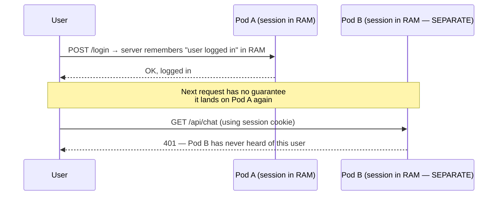
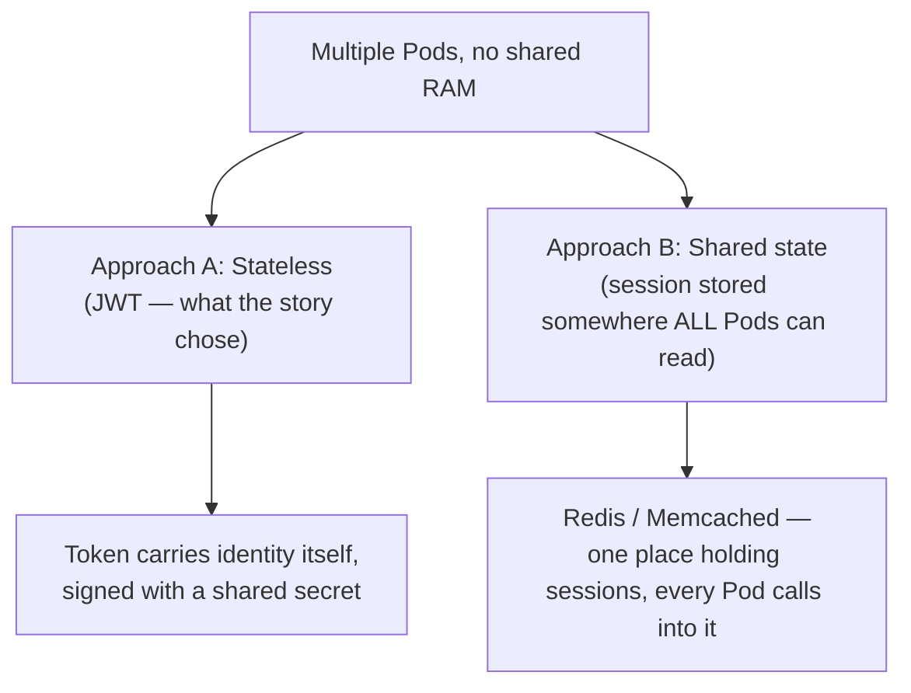
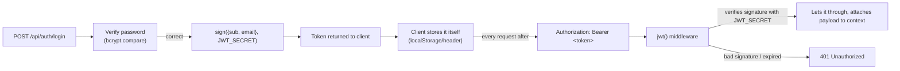
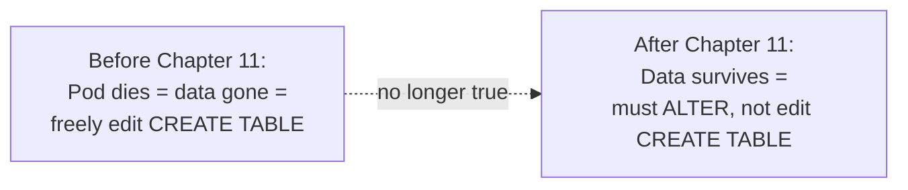

# Chapter 17 — No Pod Remembers Anyone: Knowledge Notes

> Read the story first: [Chapter 17 — No Pod Remembers Anyone](../../handbook/en/part-02-first-cluster/ch17-no-pod-remembers-anyone.md)

This is the first chapter where the problem **isn't** in YAML/kubectl, but in how an application needs to be designed to work correctly across multiple replicas. These notes focus on that architectural point, since it applies to ANY system running multiple instances, not just Kubernetes.

---

## 1. Overview diagram: why in-memory sessions break with multiple Pods

**The core problem:** one process's RAM is **not shared** with another process, even if they're 3 identical replicas of the same Deployment. This isn't a Kubernetes limitation — it's a physical limit of running multiple independent processes on (potentially) multiple different machines.

---

## 2. Two ways to solve it — JWT isn't the only option

| | JWT (stateless) | Session + Redis (shared state) |
|---|---|---|
| Does the server need to "remember" anything | No — just verifies the signature | Yes — Redis acts as "shared memory" |
| Logging out before token expiry | Hard — the token stays valid until it expires, unless a blacklist mechanism is added | Easy — deleting the session from Redis logs out instantly |
| Extra infrastructure | None needed | Needs Redis (exactly the "cache" line still sitting open in `notes-next.md`) |
| Leaked token | Dangerous until expiry (not easily revocable) | Revocable instantly |

> **Note:** the line "multiple people using it at once — need rate limiting, some kind of cache?" left in `notes-next.md` back in Chapter 16 will very likely lead to Redis in a later chapter — not because JWT was the wrong choice, but because JWT doesn't solve "revoke this token right now" or "rate-limit per user."

---

## 3. `hono/jwt` — how JWT actually works, independent of any framework

A JWT has 3 parts separated by dots: `header.payload.signature`. The first two are just base64 (readable, NOT secret — don't put sensitive data in `payload`), the third (`signature`) is what actually proves the token hasn't been tampered with, computed from `header + payload + JWT_SECRET`.

> **Important note:** anyone holding `JWT_SECRET` can sign a valid token for ANY user — this is exactly why this chapter stresses generating a real random secret (`openssl rand -hex 32`), not typing something off the top of your head like the Postgres password back in Chapter 12.

---

## 4. `ALTER TABLE ... ADD COLUMN IF NOT EXISTS` — not a Kubernetes problem, but "caused" by Kubernetes work

Because `postgres` now has a real PVC (Chapter 11), data **survives** across deploys — a big shift from the early stage where every dead Pod meant total data loss. The consequence: schema changes can no longer be treated as "the database is always empty, just create fresh" — backward-compatible migrations are needed, even if it's as simple as one `ALTER TABLE` line.

> **Note:** this is a small-scale version of "database migration" — a much bigger topic in real systems (usually handled by dedicated tools like Drizzle Kit, Prisma Migrate, Flyway...), demonstrated here with one manual SQL line given the small scale.

---

## 5. Practice

**Concept questions:**

1. If `chat-api` only ran `replicas: 1` (not 3), would the "session doesn't share across Pods" problem still exist?
2. Someone gets hold of a valid JWT token (not `JWT_SECRET`, just ONE token belonging to one user) — can they forge a token for a different user? Why or why not?
3. A JWT expires after 1 hour (assuming `exp` is set). A user gets banned right now — how long does their old token stay usable?

**Hands-on:**

4. Decode a real JWT token (no secret needed) by splitting the string on dots, base64-decoding the `payload` part (the middle one) — confirm you can see `sub`/`email` in plaintext, proving JWT doesn't encrypt the payload.
5. Call `/api/chat` with a token where you've changed one character anywhere in the `signature` part — confirm you get `401`, explain why even though the `payload` is unchanged.
6. Try creating 2 users via `/api/auth/signup`, log both in, use user A's token to call `/api/conversations` — confirm you only see A's conversations, not B's (thanks to filtering by `userId` in the query).
