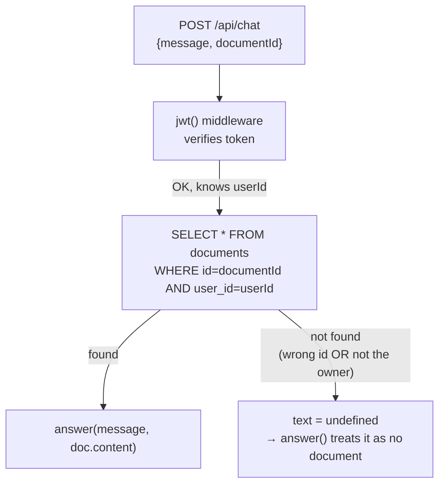
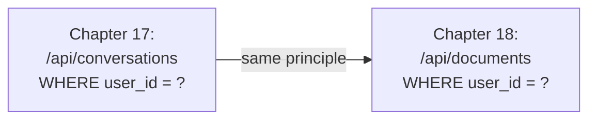
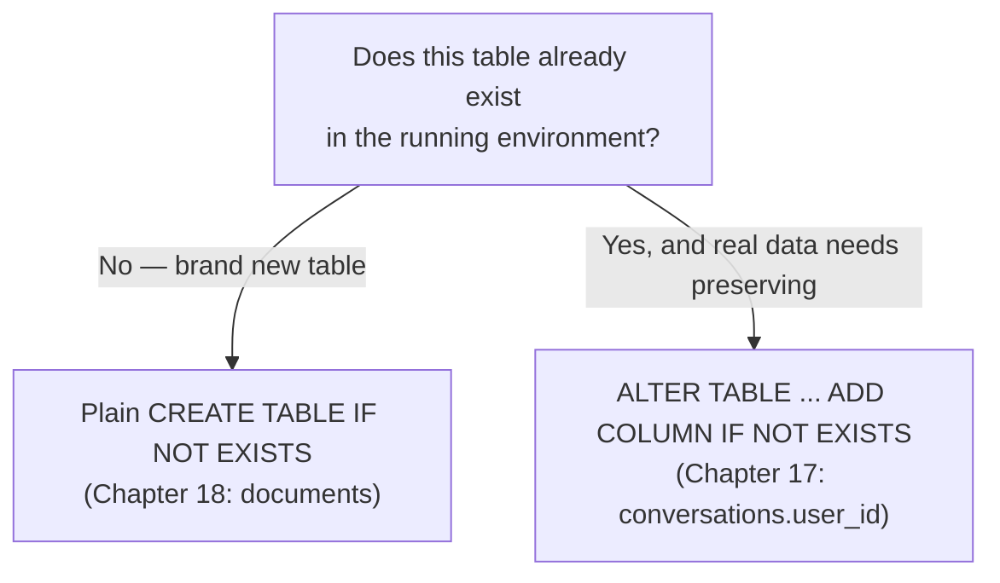

# Chapter 18 — No More Pasting: Knowledge Notes

> Read the story first: [Chapter 18 — No More Pasting](../../handbook/en/part-02-first-cluster/ch18-no-more-pasting.md)

This chapter is almost entirely application code — no new Kubernetes objects. These notes focus on a recurring security principle (ownership checks) and an infrastructure angle that's easy to forget (a PVC's limit is real).

---

## 1. Overview diagram: the flow of a `/api/chat` request with a `documentId`



**The key point:** the query always has TWO conditions — the right `id` AND the right `userId`. Drop the second one, and the system still "works" (no error, no crash) but leaks other people's data — the most dangerous kind of bug because it's silent, nothing alerts anyone until it's discovered or exploited.

---

## 2. Ownership checks — a recurring principle, not unique to this chapter



| Endpoint | Filter condition | Consequence if missing |
|---|---|---|
| `GET /api/conversations` | `WHERE user_id = <caller>` | Sees every user's conversations, not just their own |
| `POST/GET /api/documents` | `WHERE user_id = <caller>` | Can read/create documents attached to the wrong owner, or guess an ID to read someone else's document |

> **Note:** this is NOT a Kubernetes concept — it's a basic application security principle (sometimes called "IDOR" — Insecure Direct Object Reference, when a system allows access to an object by ID without checking ownership). It keeps showing up in this chapter because it applies to EVERY table with a concept of "belongs to someone."

---

## 3. Plain `CREATE TABLE` vs. needing `ALTER` — knowing which one applies



The difference isn't about SQL syntax being hard or easy — it's about **whether real data already exists**. `documents` is a brand new table so nothing to worry about; `conversations` already had data surviving through the PVC since Chapter 11, so it needed more care.

---

## 4. A PVC isn't "unlimited" — checking real usage from inside the Pod

```bash
kubectl exec -it <postgres-pod> -n ai-workspace -- df -h /var/lib/postgresql/data
```

```
Filesystem                Size  Used Avail Use%
/dev/vda1                 1.0G   45M  980M   5%
```

`df -h` is a standard Linux command (not Kubernetes-specific) — runs inside any container with a shell, reports the real capacity of whatever filesystem is mounted at that exact path. For a Pod with a PersistentVolumeClaim, the `Size` shown here is exactly the amount requested in `resources.requests.storage` when the PVC was created (`1Gi` — Chapter 11).

> **Note — why this is worth watching, not an emergency:** a PVC doesn't automatically "grow" with demand — run out of room, and Postgres starts erroring on writes (`No space left on device`), and the app above it (`chat-api`) gets an error trying to write new data. Two paths exist when it's actually needed: expanding the existing PVC (if the StorageClass supports `allowVolumeExpansion: true`) or moving to a storage type better suited for large data (object storage like S3/MinIO for files, instead of stuffing everything into a Postgres `TEXT` column).

---

## 5. Practice

**Concept questions:**

1. If `eq(documents.userId, userId)` gets removed from the query in `/api/chat`, but `eq(documents.id, documentId)` stays — what's the exact consequence? Write out a simple attack scenario.
2. `documents.content` is currently an unbounded `TEXT` column in Postgres. If a user uploads a 500MB text file, what breaks first — the application layer, the database layer, or the PVC layer?
3. Does the current StorageClass (`standard`, `rancher.io/local-path` on `kind`) support expanding a PVC after it's created? Which field would confirm that?

**Hands-on:**

4. Run `kubectl exec -it <postgres-pod> -n ai-workspace -- df -h /var/lib/postgresql/data` on your cluster — compare `Used`/`Avail` against the numbers in this chapter, see how much it's grown since the PVC was first attached.
5. Create 2 accounts via `/api/auth/signup`, have account A upload a document, then try using account B's token to either fetch that document directly (if a single-document route exists) or pass A's `documentId` into `/api/chat` with B's token — confirm it gets blocked as expected.
6. Find the `allowVolumeExpansion` field in `kubectl get storageclass standard -o yaml` — if it's `false`, think through (no need to actually do it) what steps would be needed to "expand" a PVC that doesn't support expansion (hint: usually means creating a new PVC and copying data over manually).
