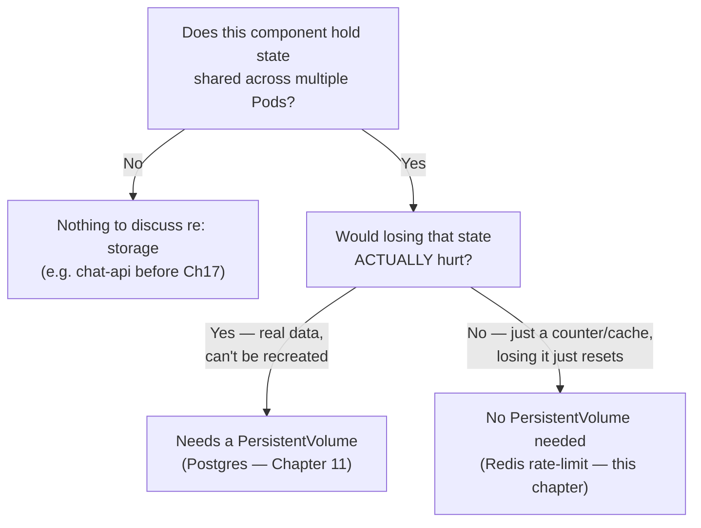
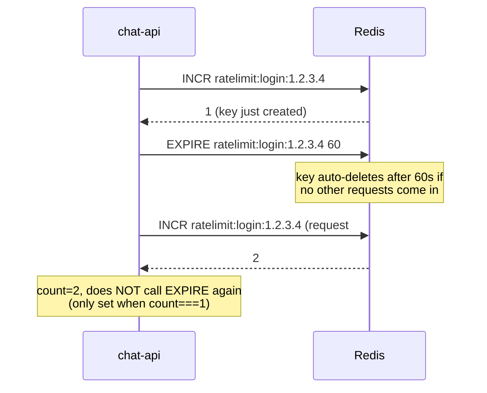

# Chapter 19 — Forgetting Is Fine: Knowledge Notes

> Read the story first: [Chapter 19 — Forgetting Is Fine](../../handbook/en/part-02-first-cluster/ch19-forgetting-is-fine.md)

---

## 1. Overview diagram: "needs shared state" doesn't automatically mean "needs a PVC"



**The core lesson:** two chapters, back to back (11 and 19), both hit "need shared state," but land on completely different storage conclusions — because the deciding question isn't "is there state," it's "how much would losing this state actually cost."

---

## 2. The Redis Deployment — nothing new about the YAML, but a deliberate absence

```yaml
apiVersion: apps/v1
kind: Deployment
metadata:
  name: redis
spec:
  replicas: 1
  template:
    spec:
      containers:
        - name: redis
          image: redis:7-alpine
          # NO volumeMounts/volumes — deliberate, not an oversight
```

Compared to `postgres.yaml` (Chapter 11), the only difference worth noting is what's **NOT there**: no `PersistentVolumeClaim`, no `volumeMounts`. Not a thing forgotten — a considered decision, based on the question in section 1.

---

## 3. A fixed-window counter — `INCR` + `EXPIRE`, not two unrelated commands



> **Note — a common bug when writing a rate limiter yourself:** if `EXPIRE` gets called on EVERY request (not just the first), the counting window keeps getting pushed further out with each new request — turning "at most 5 in a fixed 60-second window" into "at most 5, as long as you don't stop for more than 60 seconds" — two very different behaviors. This is an unintentional **sliding window**, easy to end up with if the `count === 1` condition gets missed.

---

## 4. Why count by IP, not by user — and the limits of that

| Counted by | Upside | Downside |
|---|---|---|
| IP (`x-forwarded-for`) | Blocks abuse even before knowing who's logging in (the `/login` endpoint hasn't authenticated anyone yet) | Multiple users sharing a NAT/office network can get lumped under one IP, risking accidental blocking |
| User ID | More precise for behavior AFTER a JWT already exists | Can't be used for `/login` itself — at that point `userId` isn't known yet (that's exactly what's being authenticated) |

> **Note:** `x-forwarded-for` is a header set by a reverse proxy/load balancer — if a request goes straight through with no proxy in front (like testing directly via `port-forward`), this header can be empty or trivially spoofed. In real production, it's important to only trust this header when it's written by a trusted proxy (an Ingress Controller — coming up later in Networking), not something a client gets to set itself.

---

## 5. Practice

**Concept questions:**

1. Delete the `redis` Pod while an IP is mid-rate-limit (count already at 6/5) — once the new Pod comes up, is that IP still blocked?
2. If `chat-api` runs 3 replicas but `redis` only runs 1 — does Redis become a "single point of failure"? What happens if Redis dies outright (not just a quick restart)?
3. Why not just use Postgres itself to store the rate-limit counter, instead of adding Redis entirely?

**Hands-on:**

4. Re-run the exact rate-limit script from this chapter, but change the limit to `checkRateLimit(key, 3, 30)` (3 attempts / 30 seconds) — confirm the behavior changes to match the new parameters.
5. Use `kubectl exec -it <redis-pod> -n ai-workspace -- redis-cli` to run `GET ratelimit:login:<ip>` and `TTL ratelimit:login:<ip>` yourself — confirm the TTL is counting down as expected.
6. Try manually deleting the rate-limit key mid-test: `kubectl exec -it <redis-pod> -- redis-cli DEL ratelimit:login:<ip>` — call the API again right after, confirm you're allowed to start over from scratch.
