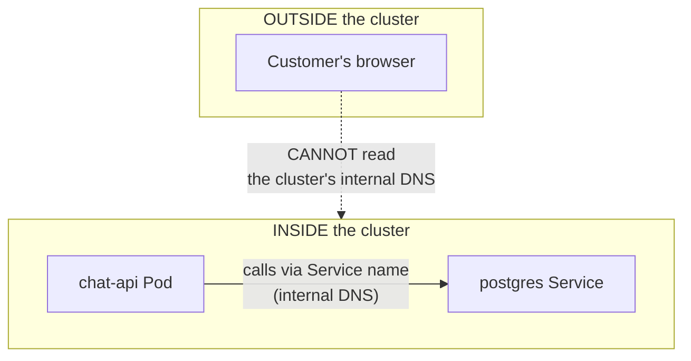
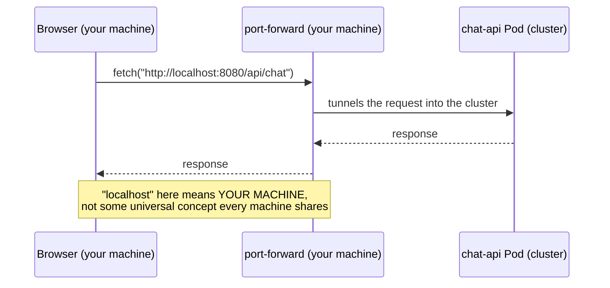

# Chapter 20 — Only You Can Open It: Knowledge Notes

> Read the story first: [Chapter 20 — Only You Can Open It](../../handbook/en/part-02-first-cluster/ch20-only-you-can-open-it.md)

---

## 1. Overview diagram: two completely different kinds of "client"



**The core distinction:** `chat-api` calling `postgres` is **Pod calling Pod**, both living inside the cluster, both sharing the same internal DNS (CoreDNS — Chapter 8). `frontend` is completely different — its JavaScript code doesn't run in a Pod at all, it gets **downloaded and run in the end user's own browser**, a machine that's a total stranger to the cluster, with zero access to its internal DNS.

> **Note:** this is why the Chapter 8 lessons (Service/internal DNS) don't apply to the "expose it externally" problem — a Service only solves inside-cluster-calling-inside-cluster, not outside-cluster-calling-into-cluster.

---

## 2. Why `localhost:8080` "working" is actually a trap



`localhost` (or `127.0.0.1`) always means "this exact machine running the process" — no exceptions, no configuration changes that meaning. When YOUR browser calls `localhost:8080`, it looks on YOUR machine, and happens to find something because `port-forward` is tunneling exactly that port. A different user's browser calling `localhost:8080` looks on THEIR machine — nothing there at all, unless they also have their own `port-forward` open (which they can't, having no `kubectl` access).

---

## 3. `readinessProbe` for a static file server — still works, means something slightly different

```yaml
readinessProbe:
  httpGet:
    path: /
    port: 3000
```

`frontend` has no dedicated `/health` route like `chat-api` does — it just uses `/` (the default route serving `index.html`). For a static file server (nginx serving a pre-built bundle), returning `200` at `/` is basically equivalent to "nginx is alive, the build is intact" — no need for a dedicated health route, since the content being served is simple enough that answering at all is proof enough of "healthy."

---

## 4. An open gap: `App.jsx` doesn't know JWT exists yet

Worth flagging (not the chapter's focus, but a real gap): `frontend` still calls `/api/chat` and `/api/conversations` with no `Authorization` header at all — both routes have been locked behind `jwt()` since Chapter 17. Meaning even once the "expose it externally" problem gets solved (Chapter 21), the UI would immediately get `401` on every API call, since there's no login screen, nowhere to store a token yet.

> **Note:** this is a completely different problem — frontend UI/state management (where to store the token, how to attach it to every request), not a Kubernetes problem. Deliberately left unsolved in this chapter to keep the focus on networking, not frontend engineering.

---

## 5. Practice

**Concept questions:**

1. If `API_URL` in `App.jsx` were changed from `http://localhost:8080` to `http://chat-api:8080` and the image rebuilt — would your browser (open via `port-forward frontend`) be able to call it? Why or why not?
2. `frontend` runs 2 Pods (`replicas: 2`) — does that help at all with the "outsiders can't open it" problem?
3. Why doesn't `frontend`'s Service (ClusterIP) automatically solve the "expose to the internet" problem, even though it's a Service just like `postgres`/`redis`?

**Hands-on:**

4. Open `port-forward` for both `frontend` (3000) and `chat-api` (8080) at once, confirm the UI works — then kill just the `chat-api` port-forward, leave `frontend`'s running, try sending a message again — watch the error in the browser console (F12).
5. From a DIFFERENT machine on the same LAN (if available), try accessing `http://<your-machine-IP>:3000` while `port-forward` is running — does it work? Compare that against a customer somewhere far away with zero network connection to your machine at all.
6. Check `kubectl get svc frontend -n ai-workspace` — what does the `TYPE` column show? Look up `kubectl explain service.spec.type` to see what other values exist besides `ClusterIP`, note their names down for the next chapter.
