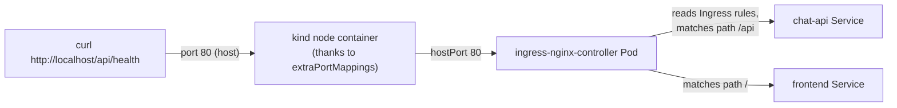
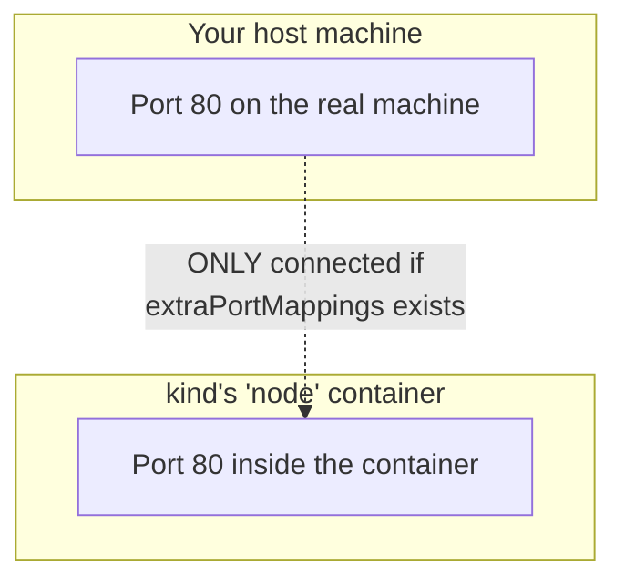
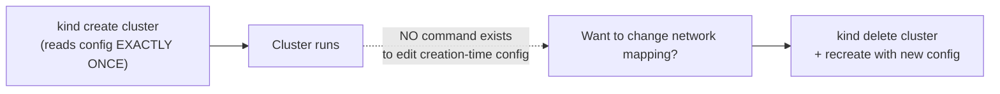
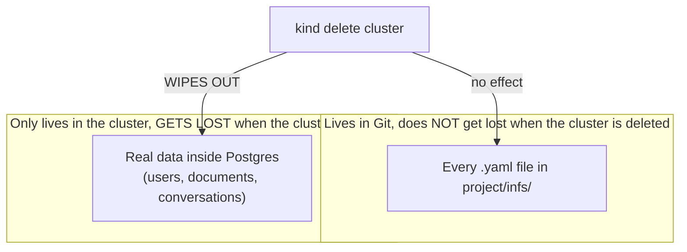

# Chapter 21 — Rebuilt From Scratch: Knowledge Notes

> Read the story first: [Chapter 21 — Rebuilt From Scratch](../../handbook/en/part-02-first-cluster/ch21-rebuilt-from-scratch.md)

---

## 1. Overview diagram: where Ingress sits in the request flow



**Three layers, not one:** `Ingress` (the object declaring rules) → `Ingress Controller` (the real Pod enforcing those rules) → `Service` (the final destination receiving traffic). The `Ingress` object itself doesn't listen on any port at all — it's just configuration data the Controller reads and acts on.

> **Important note:** an `Ingress`'s `backend.service` **must** point at a Service, never directly at a Deployment or Pod. This is exactly why this chapter has to add a Service for `chat-api` — it only ever used `port-forward` straight into the Deployment before, never needing a Service, so when the Ingress needed a name to point at, nothing existed yet. Without that Service, `kubectl get endpoints <name>` reports `NotFound`, and the Ingress returns `503 Service Temporarily Unavailable` — not a bug in the Ingress itself, just nothing for it to point at.

---

## 2. Why `kind` needs `extraPortMappings` — something Service/Ingress can't fix on their own



`kind` is a Docker container playing the role of a node — fundamentally, a port inside that container is NOT automatically exposed to the host machine, the exact same principle as `docker run` needing `-p` to map a port. `extraPortMappings` in a `kind` config is the equivalent of `-p 80:80` for that node container. No matter how correctly the Ingress Controller is configured, if port 80 on the node container was never mapped to the host, the host machine still can't reach in.

> **Note:** this is a `kind`/local-dev-specific gotcha — on a real cloud (EKS/GKE/AKS), an Ingress Controller usually pairs with a `LoadBalancer` Service, and the cloud provider assigns a real public IP automatically, with no "map a port to the host" concept the way a personal machine needs.

---

## 3. Why the whole cluster had to be deleted — there's no way to "add" config afterward



Unlike most Kubernetes resources (edit the YAML, `apply` again, done), the **creation-time** config of a `kind` cluster (network mapping, node count...) only ever gets read once. This isn't a general Kubernetes limitation — it's specific to how `kind` simulates a cluster using a Docker container, and a Docker container can't have a port mapping "added" to it while running either (a new container has to be created).

---

## 4. Declarative config survives, state doesn't — the chapter's most important boundary



| | Survives cluster deletion? | Why |
|---|---|---|
| YAML files (`project/infs/*.yaml`) | Yes | Live on your disk / in Git, completely independent of the cluster |
| Objects in the cluster (Pod, Service, Deployment...) | No, but instantly recreatable | Just `kubectl apply -f` the same files that already exist |
| Data inside the PVC (actual Postgres rows) | No, and CANNOT recreate itself | No YAML object describes the "content" of a data row — only the structure/schema |

> **Note — this is exactly why "declarative" (Chapter 5) is as powerful as it is:** knowing in advance that data does NOT live in YAML means backing it up by hand (`pg_dump`) before doing anything that might delete the cluster. Kubernetes doesn't remind you of this on its own — it's an operational discipline, not a built-in feature.

---

## 5. `pathType: Prefix` and match ordering in an Ingress

```yaml
rules:
  - http:
      paths:
        - path: /api
          pathType: Prefix
          ...
        - path: /
          pathType: Prefix
          ...
```

| `pathType` | Meaning |
|---|---|
| `Exact` | Must match the path character-for-character |
| `Prefix` | Matches if the request starts with this string (matched by `/`-separated segments, not raw character prefix) |
| `ImplementationSpecific` | Left up to the Ingress Controller to interpret (not recommended unless truly needed) |

> **Note:** `Ingress` forwards the **original path** of the request to the backend unchanged, it doesn't automatically strip off the matched portion (unless a `rewrite-target` is explicitly configured). `chat-api`'s `/health` route was never prefixed with `/api`, so it needs its own `pathType: Exact` rule for the literal `/health` path — folding it into the `/api` (Prefix) rule would forward `/api/health` to the app verbatim, but the app only knows `/health`, resulting in a `404` even though the Service/Endpoints are perfectly healthy.

> **Note:** with `ingress-nginx`, when multiple `Prefix` rules all match a request, the rule with the **longer/more specific** path always wins — regardless of the order written in the file. Listing `/api` before `/` is purely for human readability, not a technical requirement.

---

## 6. Practice

**Concept questions:**

1. If the `Ingress` object gets deleted (not the Ingress Controller) — does `chat-api`/`frontend` still work inside the cluster? Can they still be reached from `http://localhost/`?
2. Should `pg_dump` backups only ever run once before deleting a cluster, or should this be a recurring practice? Why?
3. How is `http://localhost/` after this chapter fundamentally different from `kubectl port-forward` back in Chapter 9? What's exactly the same, and what's exactly different?

**Hands-on:**

4. Run `kubectl get pods -n ingress-nginx` — find the `ingress-nginx-controller` Pod, check whether its `kubectl describe pod` output has any field related to `hostPort`.
5. Try deleting the Ingress object with `kubectl delete -f ingress.yaml`, then `curl http://localhost/api/health` — watch the error returned, compare it against the error when the `chat-api` Pod is dead outright (which layer is actually broken in each case).
6. Add another `path: /admin` pointing at a Service that doesn't exist — apply it, see how `ingress-nginx` reacts when the backend has no Endpoints at all (hint: usually a `503`, not an error at `apply` time).
