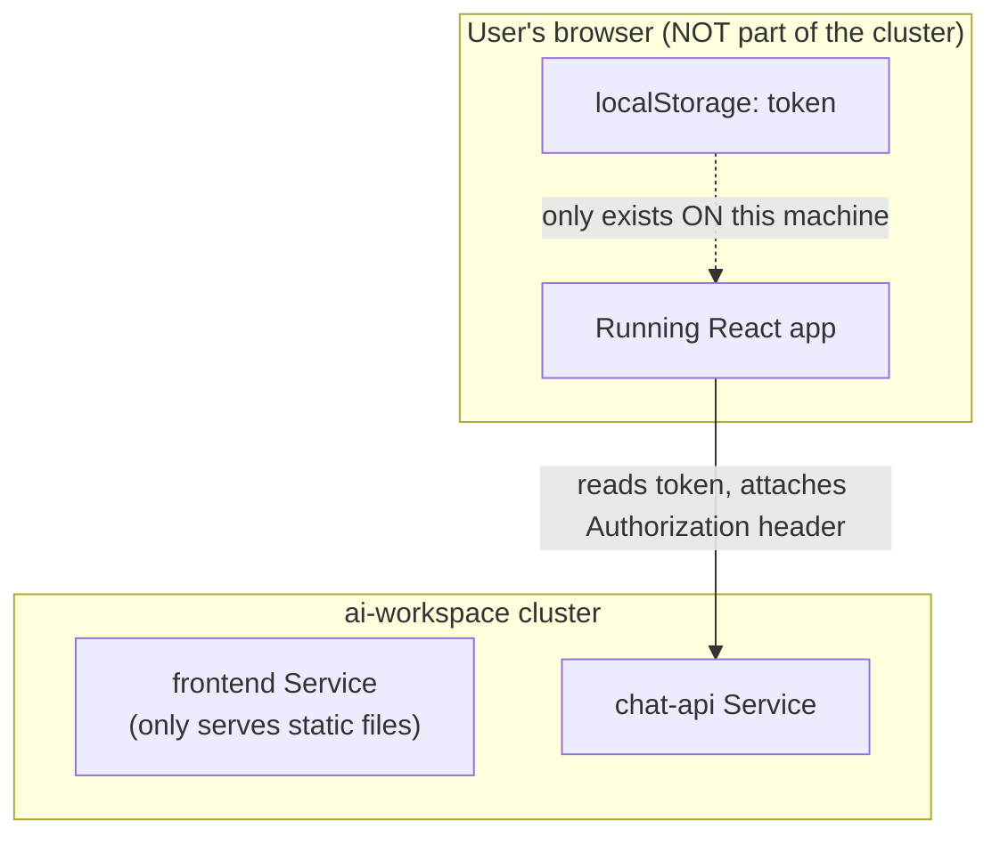
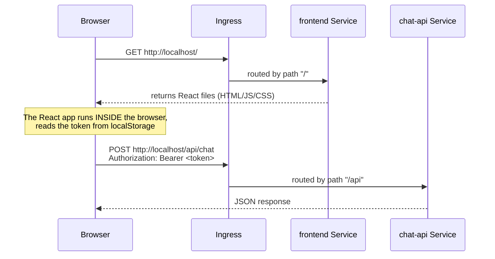
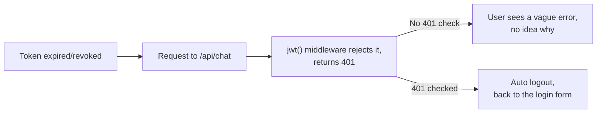

# Chapter 22 — No More curl: Knowledge Notes

> Read the story first: [Chapter 22 — No More curl](../../handbook/en/part-02-first-cluster/ch22-no-more-curl.md)

This chapter is almost entirely frontend — no new Kubernetes objects, no new YAML files. Short notes, focused on exactly one thing: where state actually lives, and validating the full request path one last time.

---

## 1. Overview diagram: `localStorage` doesn't live anywhere in the cluster

**Worth remembering:** `localStorage` is the browser's own memory, not the server's — the `frontend` Pod's only job is returning static JS/HTML files **once**, after which it has no role left in keeping anyone logged in. Delete every `frontend` Pod, recreate as many times as you want, none of it affects whether a user is already logged in — because that state never lived in the cluster to begin with.

---

## 2. The full path of a request, confirmed one last time

Two requests to the SAME `http://localhost/`, but routed through two different Ingress rules (`/` and `/api`) — the user never knows, and never needs to know, how many layers are handling it behind the scenes.

---

## 3. Why checking for `401` in the frontend is a reasonable step, not optional

`chat-api` rejects it correctly, exactly as designed back in Chapter 17 — but if the frontend doesn't interpret a `401` into a concrete action (logging out), the user just sees a failed request with no clear reason. The backend returns the right status code; the frontend has to actively read and react to it — both sides need to do their part correctly.

---

## 4. Practice

**Concept questions:**

1. Open two different browsers (or one incognito window), log into two different accounts at the same time — is there any conflict? Why or why not?
2. If `localStorage` gets cleared by hand (DevTools → Application → Local Storage) while actively using the app — what happens on the next API call?
3. `frontend` currently runs `replicas: 2` — loading the page, the first GET request could land on either of the two Pods. Does that affect the login experience at all? Why (hint: connect it back to question 1)?

**Hands-on:**

4. Open DevTools (F12) → Network tab, log in from scratch — confirm `POST /api/auth/login` has NO `Authorization` header (no token exists yet at that point), while the `POST /api/chat` right after DOES.
5. Manually delete the token from `localStorage`, reload the page — confirm it goes back to the login form correctly, no crash, no blank screen.
6. Deploy a `chat-api` build with a different `JWT_SECRET` (change the value in `chat-api-secret.yaml`) while the browser still holds an old token — try a request, confirm it gets `401` and logs out automatically.
