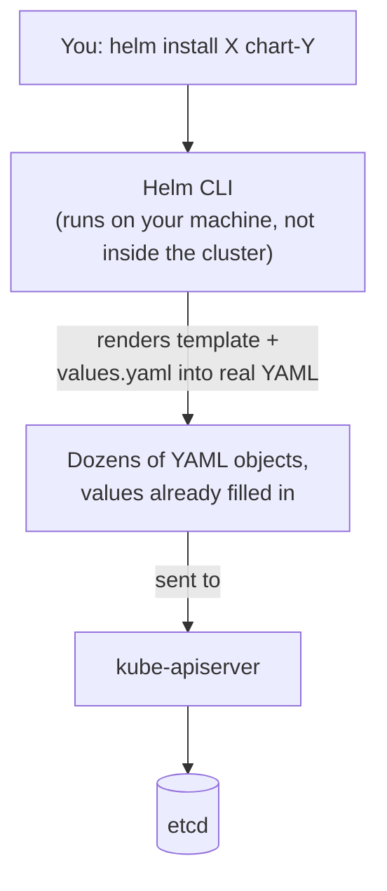
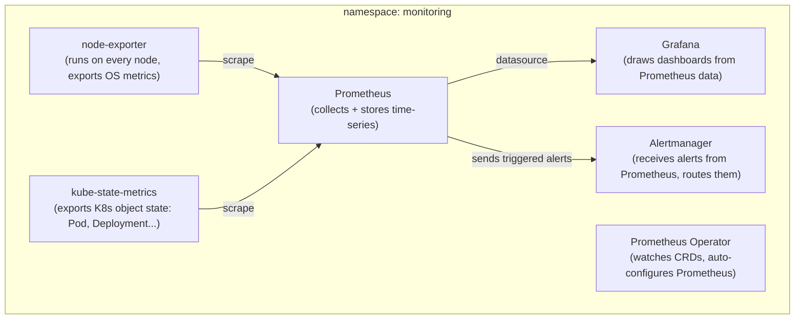

# Chapter 24 — No Longer Just a Snapshot: Knowledge Notes

> Read the story first: [Chapter 24 — No Longer Just a Snapshot](../../handbook/en/part-03-observability/ch24-no-longer-just-a-snapshot.md)

The first chapter to introduce `Helm` — something completely different from everything used so far (all plain `kubectl apply -f`). Notes focus on what Helm actually is, and what pieces the just-installed Prometheus/Grafana stack is made of.

---

## 1. Overview diagram: where Helm sits

**The most important point:** Helm isn't a new Kubernetes API, doesn't run as some special privileged Pod — it's just a CLI running on your machine (or CI), **generating YAML** from a template + configuration values, then sending it exactly like one giant `kubectl apply`. Everything Helm creates is still an ordinary Deployment, Service, ConfigMap... — `kubectl get all -n monitoring` still sees them, editing/deleting with plain `kubectl` still works (though shouldn't, since Helm would lose track).

---

## 2. `helm repo` — like npm's registry, not a Docker registry

| Concept | npm | Helm |
|---|---|---|
| Where packages/charts live | npm registry | Helm chart repository |
| Command to add a source | (one default registry) | `helm repo add <name> <url>` |
| Install command | `npm install <package>` | `helm install <release-name> <repo>/<chart>` |
| Config file | `package.json` | `values.yaml` |
| Record of what's installed | `package-lock.json` | `helm list`, `helm history <release>` |

> **Note:** a "Helm chart repository" is just a static HTTP address holding an index file — not a Docker registry, nothing to do with where container images live. `prometheus-community/kube-prometheus-stack` is a chart name, not an image name.

---

## 3. What `kube-prometheus-stack` actually installs

| Component | Role |
|---|---|
| Prometheus server | Periodically "scrapes" (pulls) metrics from sources, stores them as time-series, has its own query language (PromQL) |
| `node-exporter` | Runs on every node (DaemonSet), exports hardware/OS metrics (CPU, RAM, disk) |
| `kube-state-metrics` | Exports the state of Kubernetes objects themselves (how many Pods are Pending, which Deployment is short on replicas...) — different from `node-exporter` in that this is metrics **about Kubernetes**, not about the physical machine |
| Grafana | Only draws charts — collects nothing on its own, always needs a datasource (here, Prometheus) |
| Alertmanager | Receives alerts Prometheus has already decided are "firing" (based on a rule), decides where to send them (email, Slack...) — not configured in this chapter yet |
| Prometheus Operator | A special controller watching CRDs (`ServiceMonitor`, `PrometheusRule`) and rewriting Prometheus's config automatically — the reason adding a new monitoring target doesn't mean hand-editing Prometheus's config |

---

## 4. Versus `metrics-server` (Chapter 15) — not a replacement, an addition

| | `metrics-server` | Prometheus |
|---|---|---|
| Keeps history? | No, current numbers only | Yes, full time-series |
| Used for | `kubectl top`, and as the source for HPA (autoscaling) | Dashboards, alerts, trend analysis |
| Removable once Prometheus exists? | Not really — HPA still needs `metrics-server` (or the `metrics.k8s.io` API specifically), Prometheus doesn't automatically substitute for that API | — |

> **Note:** the two systems run side by side, not in competition. `metrics-server` serves exactly one standard API (`metrics.k8s.io`) that `kubectl top`/HPA need; Prometheus serves a much broader observability ecosystem, without replacing that other role.

---

## 5. Practice

**Concept questions:**

1. `helm uninstall kube-prometheus-stack -n monitoring` — what happens to the CRDs (`ServiceMonitor`, `PrometheusRule`) that got created? (hint: Helm has a specific policy for CRDs, different from ordinary resources).
2. If `kubectl edit deployment kube-prometheus-stack-grafana -n monitoring` gets used by hand to change something, does the next `helm upgrade` keep that change?
3. Why does Grafana need a "datasource" before it can draw anything, while `kubectl top` doesn't have any concept of a datasource at all?

**Hands-on:**

4. Run `helm list -n monitoring` — check the `REVISION` column, try `helm upgrade` with `--set grafana.adminPassword=<new-password>`, confirm `REVISION` climbs to 2.
5. Run `kubectl get crd | grep monitoring.coreos.com` — count how many new CRDs the Prometheus Operator registered on the cluster.
6. In Grafana, find the "Kubernetes / Compute Resources / Pod" dashboard, select the `postgres` Pod in the `ai-workspace` namespace — compare the `Memory` line against the `resources.limits.memory` set back in Chapter 14, see if it's ever come close.
