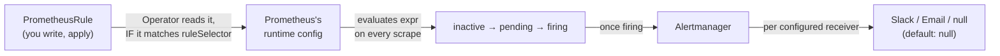
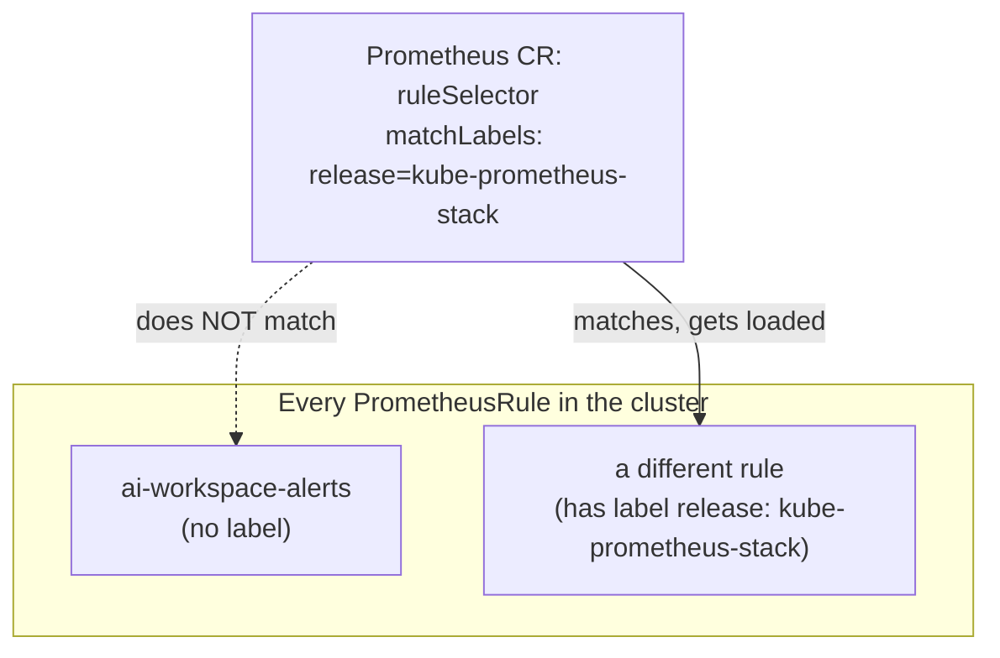

# Chapter 25 — Finally, Someone Tells You: Knowledge Notes

> Read the story first: [Chapter 25 — Finally, Someone Tells You](../../handbook/en/part-03-observability/ch25-finally-someone-tells-you.md)

---

## 1. Overview diagram: from a rule to a real alert, through several layers



**Four states an alert passes through:** `inactive` (condition not true) → `pending` (condition just became true, waiting out the `for:` duration) → `firing` (true long enough, treated as real) → `resolved` (condition stopped being true). No step gets skipped — even if the condition becomes true instantly, it still has to wait out `for:` before moving from `pending` to `firing`.

---

## 2. `ruleSelector` — why a rule "disappears" even when created correctly



This is the exact same `matchLabels` mechanism seen since Chapter 7 (ReplicaSet picking Pods) and Chapter 8 (Service picking Pods) — showing up again, in a completely different place: Prometheus (via the Operator) picks `PrometheusRule` objects the same way, not "any CRD of the right kind gets loaded automatically." The `release: kube-prometheus-stack` label isn't a general Kubernetes convention — it's specific to how the `kube-prometheus-stack` chart sets itself up, readable via `kubectl get prometheus -n monitoring -o yaml`, looking for the `spec.ruleSelector` field.

> **Note:** this is exactly why it's worth checking a Prometheus CR's `ruleSelector`/`serviceMonitorSelector` whenever a rule/target "disappears" for no clear reason — it's almost always a label issue, not broken YAML syntax.

---

## 3. `for:` — why an alert doesn't fire the instant the condition is true

```yaml
expr: increase(...) > 3
for: 1m
```

`for: 1m` means: the `expr` condition must stay true continuously for at least 1 minute before moving to `firing`. Without `for:`, an alert would jump straight `inactive → firing` the moment the condition is true even once — an easy way to get "false alarms" from a brief spike that resolves on its own. `for: 1m` in this chapter is for fast testing; real production setups usually use `for: 5m` or longer, trading off early detection against noisy interruptions.

---

## 4. Alertmanager with a `null` receiver — still worth something, even sending nowhere

| State | What it's good for |
|---|---|
| Alert firing, `null` receiver | Visible in the Alertmanager UI, confirms the pipeline actually works — still useful for testing |
| Alert firing, a real Slack/email receiver | Getting proactively told, no need to keep a dashboard open to check |

> **Note:** missing a real webhook/credentials doesn't make this step pointless — separating "does the alert fire correctly" (verified with a deliberate CrashLoopBackOff) from "does it reach the right channel" (unverified, needs external infrastructure) makes it clear exactly what's confirmed versus what still depends on something not set up yet.

---

## 5. Practice

**Concept questions:**

1. If `for: 1m` gets changed to `for: 0m` (or `for:` gets removed entirely), does the alert become more or less sensitive to short-lived noise? What's the tradeoff?
2. The rule filters on `namespace="ai-workspace"` — if a Pod in `kube-system` starts crash looping, would this alert catch it? Why or why not?
3. Delete the `PrometheusRule` object while an alert is `firing` — does it automatically flip to `resolved` on Alertmanager, or just vanish outright?

**Hands-on:**

4. Run `kubectl get prometheus -n monitoring -o yaml | grep -A5 ruleSelector` — confirm the exact `release` label your cluster's Prometheus CR is requiring.
5. Write a second `PrometheusRule`, alerting when a Pod's memory crosses 80% of `limits.memory` (hint: use the `container_memory_working_set_bytes` metric divided by `kube_pod_container_resource_limits`), remembering the `release` label.
6. In the Alertmanager UI, find the "Status" section — look at the full current receiver/route configuration, confirm the default route really does point at `null`.
