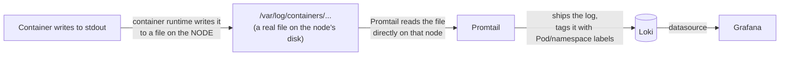
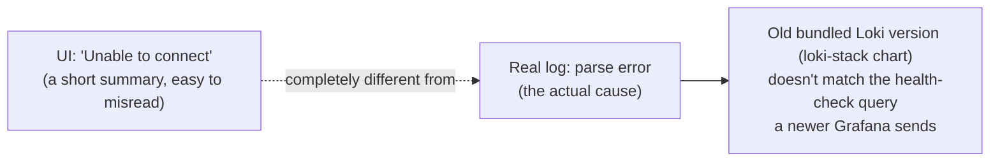

# Chapter 26 — The Log Outlives the Pod: Knowledge Notes

> Read the story first: [Chapter 26 — The Log Outlives the Pod](../../handbook/en/part-03-observability/ch26-the-log-outlives-the-pod.md)

---

## 1. Overview diagram: the path a log takes from container to Grafana



**The difference from `kubectl logs`:** `kubectl logs` goes through the API server, asking the kubelet on whichever node is currently running that Pod for its **current** log. `Promtail` skips the API server entirely — it reads the log file directly off the node's disk, exactly why it has to run as a `DaemonSet` (one copy per node) instead of a single instance.

---

## 2. `DaemonSet` — a fourth tier in the "managing Pods" family, after Pod/ReplicaSet/Deployment

| | Bare Pod | ReplicaSet/Deployment | DaemonSet |
|---|---|---|---|
| Count | 1, nothing guarantees it exists | Exactly N, declared via `replicas` | Exactly 1 per **node**, no count declared |
| New node added | Irrelevant | Doesn't add a Pod on its own | Automatically gets a new Pod on that node |
| Example already seen | `chat-api-pod.yaml` (Chapter 6) | `chat-api` (Chapter 7) | `kube-proxy`, `node-exporter`, `promtail` |
| When to use | Almost never (always better to have a ReplicaSet behind it) | A regular app needing horizontal scale | Needing exactly one agent running on EVERY machine — logging, networking, hardware monitoring |

> **Note:** a `DaemonSet` has no `replicas` field in its `spec` at all — because that number isn't something the YAML author decides, it's exactly however many nodes the cluster has at any given moment.

---

## 3. LogQL isn't PromQL, even though it looks familiar

```
{namespace="ai-workspace", app="chat-api"} |= "error"
```

| Part | Meaning |
|---|---|
| `{namespace="ai-workspace", app="chat-api"}` | Selects which log **stream** (by label, exactly like PromQL selects a metric) — no content filtering yet |
| `\|= "error"` | Then filters by the **log line's actual content**, a text-search style filter (a log filter, not a label matcher) |

The core difference from PromQL: Prometheus stores **numbers**; LogQL first picks the right log lines by label (fast, indexed), then filters by text content (slower, has to read line by line) — so narrowing by label first, text search second is always the right order, never the reverse.

---

## 4. Why `helm install ... --set grafana.enabled=false`

The `loki-stack` chart installs its own separate Grafana by default, independent of the one already installed in Chapter 24. Without turning that flag off, there'd be two different Grafana Deployments in the same `monitoring` namespace, no way to tell which one is "the real one." `--set` overrides a default value in the chart's `values.yaml` directly on the command line, no need to download and hand-edit a `values.yaml` file.

> **Note — the cost of turning off `grafana.enabled`:** this chart's "auto-add the Loki datasource" mechanism only works for the exact Grafana sub-chart it installs alongside itself — disable that Grafana, and the provisioning that comes with it turns off too, with nothing automatically wiring into a Grafana installed from a different Helm release (even in the same namespace). Two Helm releases are two completely independent units — Helm has no built-in awareness that one release should talk to another. To share one Grafana, the datasource has to be added by hand (or declared through the **actual Grafana in use**'s own `values.yaml`, e.g. `grafana.additionalDataSources` on the `kube-prometheus-stack` chart, rather than expecting the `loki-stack` chart to do it automatically).

---

## 5. A UI error message isn't always the real cause

`Unable to connect with Loki. Please check the server logs for more details.` sounds like a network/connectivity failure — but the one thing that banner gets right is its own suggestion (`check the server logs`), which is where the real story is. Grafana's actual logs show something completely different: `parse error at line 1, col 1: syntax error: unexpected IDENTIFIER` — Loki received the request just fine, it only rejected the specific internal query Grafana uses to self-test (`checkHealth`), not a connection error at all.



> **Note:** this is exactly the principle learned back in Chapter 6 — `describe`/`logs` first, don't take a short UI error message literally. Curling Loki directly (`/loki/api/v1/labels`), skipping the Grafana layer entirely, confirms Loki is completely healthy — separating layers this way pins down exactly where a failure actually lives instead of vaguely assuming "Loki must be broken."

---

## 6. Practice

**Concept questions:**

1. If a node gets `kubectl cordon`ed (marked to not accept new Pods) but not deleted — does the `promtail` Pod on that node get affected at all? Why (hint: `cordon` only blocks NEW Pods, doesn't touch ones already running)?
2. Loki stores logs completely detached from the Pod that produced them — so if the entire `ai-workspace` namespace gets deleted, do the old logs in Loki disappear too?
3. Why does `Promtail` need to run on every node, while `Loki` (the actual storage) only needs one instance?

**Hands-on:**

4. Run `kubectl get daemonset -n monitoring` and `kubectl get daemonset -n kube-system` — list every DaemonSet on your cluster, confirm each one's Pod count matches the node count exactly.
5. In Grafana Explore, try the LogQL `{namespace="ai-workspace"} | json` (if logs are JSON-formatted) or `{namespace="ai-workspace"} != "health"` (excludes lines containing "health") — compare the results against a label-only query.
6. Find the `retention_period` field in Loki's config (`helm get values loki -n monitoring`) — confirm what the default actually is, answering the question left open at the end of the chapter.
