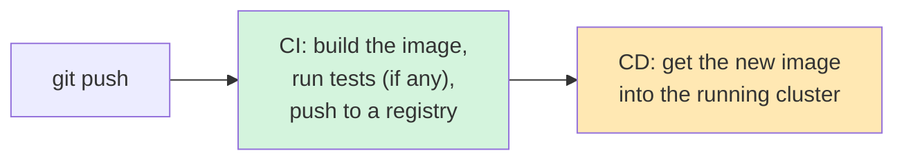
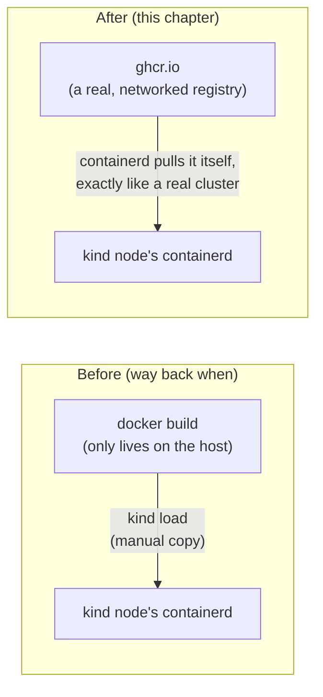

# Chapter 27 — The Cloud Can't Reach This Laptop: Knowledge Notes

> Read the story first: [Chapter 27 — The Cloud Can't Reach This Laptop](../../handbook/en/part-04-cicd/ch27-the-cloud-cant-reach-this-laptop.md)

---

## 1. Overview diagram: where CI stops, where CD starts



**The important boundary:** CI (Continuous Integration) only needs a machine with Docker and internet access — runs anywhere, even a throwaway GitHub-hosted VM. CD (Continuous Deployment) needs something much bigger: a **real network path** to the exact cluster being deployed to. The two sound like one continuous pipeline, but demand completely different infrastructure.

---

## 2. GitHub-hosted runner vs. self-hosted runner

| | GitHub-hosted | Self-hosted |
|---|---|---|
| Runs where | A throwaway GitHub VM, destroyed after each job | A machine you manage yourself, running continuously |
| Comes with | Clean Ubuntu/macOS/Windows, set up fresh each time | Exactly what your machine already has — `kubectl`, `kind`, everything already configured |
| Can reach | Only the public internet | Anything that machine can reach, including internal networks/localhost |
| Good for | Building, testing, pushing images — anything that doesn't need special infrastructure access | Deploying to a private/local cluster, or any resource without a public address |

> **Note:** a self-hosted runner isn't a "hack" or a workaround — it's the official way GitHub Actions supports exactly this situation, "a job needs to run somewhere with special access the cloud doesn't have." Very common in real practice for on-premise/private clusters, not unique to `kind`.

---

## 3. `kubectl set image` — updates one field, not a full `apply`

```bash
kubectl set image deployment/chat-api chat-api=ghcr.io/OWNER/REPO/chat-api:SHA -n ai-workspace
```

This command edits exactly **one specific field** (the `image` of the container named `chat-api`, inside the `chat-api` Deployment) directly on the cluster — no YAML file needed, not a `kubectl apply -f`. Equivalent to a shorthand `kubectl patch`.

> **Note — the cost of this:** after this command, `kubectl get deployment chat-api -o yaml` shows the new `image`, but the `chat-api-deployment.yaml` file in Git does **not** update to match automatically. The cluster and the file describing it start drifting apart — next time someone `kubectl apply -f chat-api-deployment.yaml` (say, to change `resources` or add an env var), the image gets overwritten right back to the old value in the file. This is a real limit of this "imperative" deploy style — tools like ArgoCD/Flux (GitOps) solve exactly this problem by making Git the single source of truth and automatically syncing the cluster to match Git, instead of letting a CI job edit the cluster on its own.

---

## 4. Why `kind load docker-image` is no longer needed



`kind load` only ever existed to solve "the image only lives on the host machine, no registry for the node's containerd to pull it from." Once an image lives on a real registry (GHCR, Docker Hub, anywhere networked), a `kind` node can just `pull` it like a real cluster would, no manual copy step needed anymore.

---

## 5. Practice

**Concept questions:**

1. If the laptop running the self-hosted runner gets shut down, then code gets pushed to GitHub — what happens to the `deploy` job? Does it run automatically once the machine turns back on?
2. `GITHUB_TOKEN` is used to log into GHCR in the `build-and-push` job — what permissions does this token have, when is it generated, how long does it live?
3. Why split `build-and-push` and `deploy` into two separate jobs (`needs: build-and-push`) instead of one combined job — what does that mean specifically for runners?

**Hands-on:**

4. Register a real self-hosted runner (use a throwaway test repo, not necessarily this book's repo), confirm `Listening for Jobs` shows up correctly in the terminal.
5. Push a commit that does NOT change anything in `project/chat-api/` (e.g. edit `README.md`) — confirm the workflow doesn't run, thanks to the `paths` field declared under `on.push`.
6. Run `kubectl rollout history deployment/chat-api -n ai-workspace` after a few `kubectl set image` runs — check the revision history, try `kubectl rollout undo` back to a previous one.
