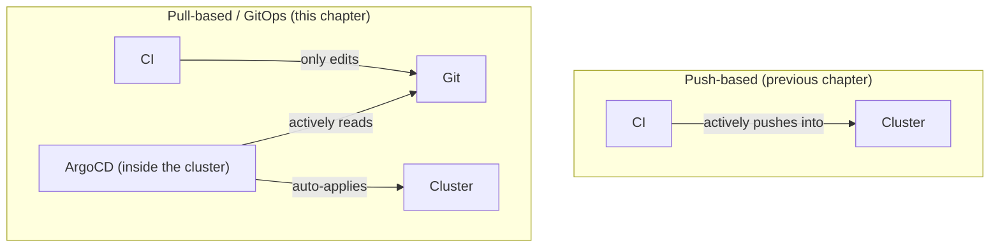
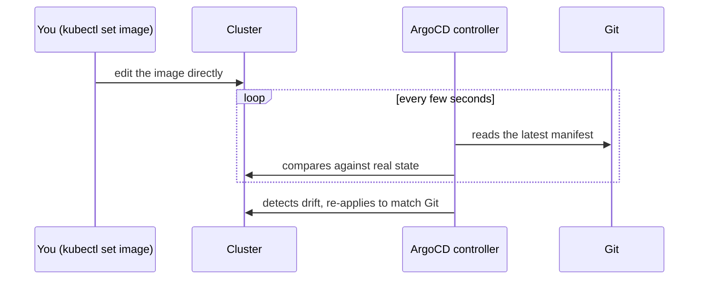

# Chapter 28 — Counting the YAML Too: Knowledge Notes

> Read the story first: [Chapter 28 — Counting the YAML Too](../../handbook/en/part-04-cicd/ch28-counting-the-yaml-too.md)

---

## 1. Overview diagram: GitOps flips CD's direction



**The core difference:** in the push model, the cluster is the **passive** side, accepting commands from anyone — CI, someone typing `kubectl` by hand, anyone with permission. In the pull model (GitOps), an agent sits inside the cluster, **actively** reading Git — nobody "sends a command" into the cluster anymore, every change has to go through exactly one door: a commit to Git.

---

## 2. `Application` (ArgoCD) — not Kubernetes core, an ArgoCD CRD

```yaml
apiVersion: argoproj.io/v1alpha1
kind: Application
```

`argoproj.io` — its own API group, not part of core Kubernetes, the exact same way `monitoring.coreos.com/PrometheusRule` (a few chapters back) isn't core Kubernetes either, defined instead by the Prometheus Operator. Installing ArgoCD means installing a new CRD plus a controller that reads it — the same pattern seen several times now: an Operator/Controller watching one kind of CRD, acting on whatever's declared inside it.

| Field | Meaning |
|---|---|
| `source.repoURL` / `path` | Which Git repo, which folder holds the manifests to track |
| `destination` | Which cluster, which namespace to apply into (can be different from the cluster running ArgoCD itself) |
| `syncPolicy.automated` | Auto-sync on Git drift, or wait for a manual click |
| `syncPolicy.automated.selfHeal` | Auto-correct when SOMEONE edits the cluster directly by hand |

> **Note:** `automated` (auto-sync when Git changes) and `selfHeal` (auto-correct when the cluster changes) are **two different mechanisms**, often mistaken for one. Enable only `automated` without `selfHeal`, and someone's `kubectl edit` by hand can still "win" temporarily, until the next time Git changes.

---

## 3. Why the `deploy` job no longer needs a self-hosted runner

Compared to the previous chapter, the `deploy` job's `runs-on` changes from `self-hosted` back to plain `ubuntu-latest`. Why: what the job needs to do has completely changed — from "call `kubectl` against the exact cluster" (needs a private network path, needs self-hosted) to "edit a text file, `git push`" (just needs the public internet, GitHub-hosted is fine). The cluster no longer takes direct commands from CI at all — it only takes them from one place: ArgoCD, already running inside it.

---

## 4. How `selfHeal` actually works — not magic



`ArgoCD` doesn't "block" a `kubectl set image` command — that command still runs successfully, the cluster really does change for that brief moment. `selfHeal` is simply a polling loop (a few seconds by default) that detects the discrepancy and re-applies — the exact same reconcile-loop principle learned from `kube-controller-manager`, just a different cycle and a different thing being compared.

---

## 5. Practice

**Concept questions:**

1. If Git becomes temporarily unreachable (GitHub goes down) while ArgoCD's reconcile loop is running — is the current cluster state affected at all?
2. Does `selfHeal: true` mean nobody's allowed to `kubectl edit` the cluster by hand anymore? Or is it still allowed, just that the change won't last long?
3. If the `Application` object on ArgoCD gets deleted — do the resources it was managing (Deployment, Service...) get deleted too? (hint: look up the `syncPolicy` field related to deletion behavior).

**Hands-on:**

4. Install ArgoCD on a test cluster, create an `Application` pointing at any public repo with a few simple YAML files — watch the status flip from `OutOfSync` to `Synced`.
5. Try turning off `selfHeal` (`selfHeal: false`), manually edit a resource with `kubectl edit` — confirm ArgoCD only reports `OutOfSync`, doesn't auto-correct, needing a manual "Sync" click to get back in line with Git.
6. Check `kubectl logs -n argocd deployment/argocd-application-controller --tail 50` — find the log line confirming the actual polling cycle running (usually a few minutes for a full sweep by default, seconds for webhook-detected changes).
