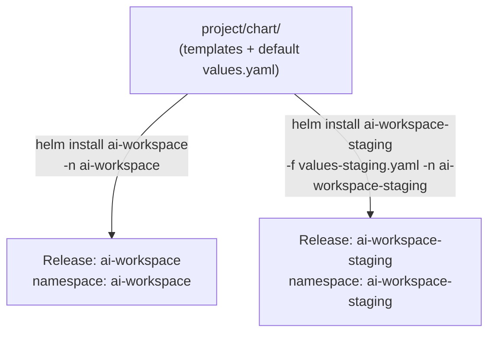
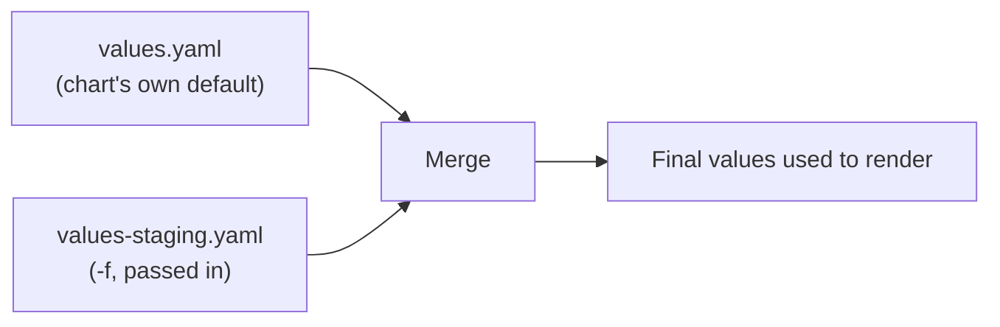

# Chapter 29 — One Chart, Two Environments: Knowledge Notes

> Read the story first: [Chapter 29 — One Chart, Two Environments](../../handbook/en/part-04-cicd/ch29-one-chart-two-environments.md)

---

## 1. Overview diagram: one chart, installed multiple times, without colliding



**The key point:** a chart isn't a cluster, a namespace, or one fixed "install" — it's a **mold**. Each `helm install` with a different release name and different values produces a completely independent copy, nothing restricting it to being installed only once.

---

## 2. Merge order across multiple `values` files

```bash
helm install X ./chart -f values-staging.yaml
```



A file passed via `-f` **overrides** the matching value in the default `values.yaml`, only for the fields present in that file — anything not mentioned keeps its default value. This is why `values-staging.yaml` only needs a few lines, not a full copy of everything.

> **Note:** multiple `-f` flags can be passed at once, later files always win over earlier ones. `--set key=value` (used in a previous chapter to turn off `grafana.enabled`) beats every `-f` file, since it's applied last.

---

## 3. `helm template` — preview the rendered YAML without applying anything

```bash
helm template ai-workspace ./project/chart -f project/chart/values-staging.yaml
```

This just prints the rendered YAML, sends nothing to the cluster at all — a safe way to check the template's syntax and whether values land in the right spots, before actually running `install`/`upgrade`. Equivalent to the `kubectl apply -f ... --dry-run=client -o yaml` habit picked up a while back, just at the Helm layer instead of the kubectl layer.

---

## 4. `helm upgrade` and `helm rollback` — not used yet in this chapter, but connects directly

| Command | What it does |
|---|---|
| `helm install` | Creates a new release, fails if the name already exists |
| `helm upgrade` | Updates an existing release to match new `values` |
| `helm rollback <release> <revision>` | Reverts to exactly a previous rendered state, no need to know exactly what changed |

> **Note:** every `helm upgrade` bumps the `REVISION` number (already seen a few chapters back) — this is exactly the mechanism that makes `rollback` possible, similar to a Deployment's `kubectl rollout undo`, just one level higher: rollback reverts an entire manifest set, not just one `image` field.

---

## 5. Why Secrets still stay static in a template, not moved into `values.yaml`

`values.yaml` usually gets committed straight to Git, readable in the open — putting a real Secret value in there (even base64) would repeat the exact mistake already fixed a few chapters back, just moving the exposure from the Deployment to `values.yaml` instead. The more correct approach (not implemented in this chapter, to keep scope tight): use `helm secrets` (a plugin encrypting values with SOPS/age) or let an external system (Vault, External Secrets Operator) inject Secrets at runtime, kept entirely separate from the chart.

---

## 6. Practice

**Concept questions:**

1. `helm install ai-workspace ./chart` (no `-f`, no `--set`) uses which values? Where do they come from?
2. If `values-staging.yaml` declares `chatApi.replicas: 1` but does NOT declare `chatApi.resources` — what `resources` does the staging copy end up with?
3. Two releases from the same chart but different namespaces — does `helm list` (without `-A` or `-n`) show both? Why or why not?

**Hands-on:**

4. Run `helm template ai-workspace ./project/chart -f project/chart/values-staging.yaml | grep replicas` — confirm `replicas: 1` renders, not `3`.
5. Edit the default `values.yaml`, bump `chatApi.replicas` to `5`, run `helm upgrade ai-workspace ./project/chart -n ai-workspace` — confirm the `ai-workspace-staging` copy is NOT affected at all.
6. Run `helm history ai-workspace -n ai-workspace` after a few `upgrade`s — check the revision list, try `helm rollback ai-workspace 1 -n ai-workspace` to go back to the very first one.
