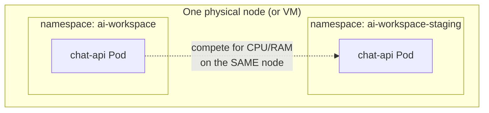
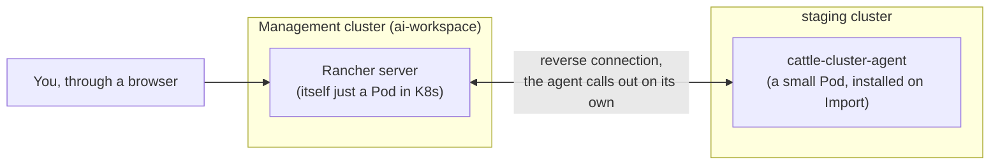

# Chapter 30 — Two Clusters, One Place to Look: Knowledge Notes

> Read the story first: [Chapter 30 — Two Clusters, One Place to Look](../../handbook/en/part-04-cicd/ch30-two-clusters-one-place-to-look.md)

---

## 1. Overview diagram: what a namespace isolates, what it doesn't



This is exactly what was learned a while back (a namespace is a "drawer," not physical isolation) — now seeing the real consequence: two namespaces don't separate a node's CPU/RAM at all, only names. Real resource isolation within the SAME cluster needs a `ResourceQuota` (capping the total resources one namespace can use) — hasn't shown up in the book yet. Real infrastructure-level isolation (one node failing doesn't touch the other cluster) needs a genuinely different cluster — exactly the direction this chapter takes.

---

## 2. `kubectl config` — many clusters, one file, one context at a time

```bash
kubectl config get-contexts
kubectl config use-context kind-ai-workspace
kubectl config current-context
```

`~/.kube/config` can hold information for multiple clusters at once (`clusters`), multiple login identities (`users`), and multiple cluster+user+default-namespace combinations called a `context`. At any moment, exactly ONE context is marked `current` — every `kubectl` command without an explicit `--context` applies to that exact one.

> **Note:** this is exactly the risk Rancher solves — not that `kubectl` is "wrong," but that people easily forget which context is active, especially when working across multiple clusters throughout the day.

---

## 3. How Rancher actually works — doesn't replace Kubernetes, sits alongside it



Rancher server itself is just an application running inside Kubernetes (installed via Helm, exactly like everything else). An "Imported" cluster doesn't get taken over by Rancher — it just gets a small extra agent, connecting back to the Rancher server on its own to report status and receive commands. Delete Rancher, and the `staging` cluster keeps working fine, just loses the ability to be viewed/controlled from Rancher's UI.

> **Note:** the agent connects **outbound** from the cluster back to Rancher, not the other way around — this is exactly why Rancher can manage a cluster sitting behind NAT/a firewall, as long as that cluster can call out, with no need for Rancher to have a way in.

---

## 4. Practice

**Concept questions:**

1. If `cattle-cluster-agent` gets deleted from the `staging` cluster (without deleting anything on Rancher) — what would the Rancher UI show for that cluster?
2. Does the "management" cluster (running Rancher server) and the "managed" cluster necessarily have to be different, or can one cluster run Rancher while also managing itself?
3. How does `ResourceQuota` (mentioned in section 1) differ from `resources.limits` (learned a while back) — one caps a container, what does the other cap?

**Hands-on:**

4. Run `kubectl config get-contexts` on your machine, confirm the `CURRENT` column (`*` mark) matches the cluster you think you're operating on.
5. Try `kubectl --context <a-different-context-name> get pods -n ai-workspace` — confirm the `--context` flag lets you operate on a different cluster without changing the default context.
6. In the Rancher UI, find where `cattle-cluster-agent` shows up for the Imported cluster — check its logs (`kubectl logs -n cattle-system deployment/cattle-cluster-agent`), find the line confirming a successful connection back to the Rancher server.
