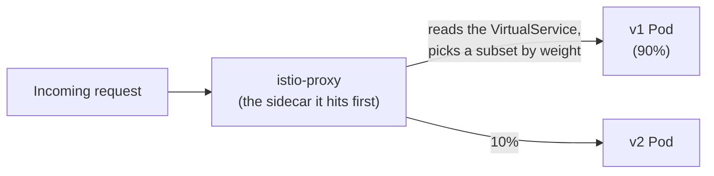
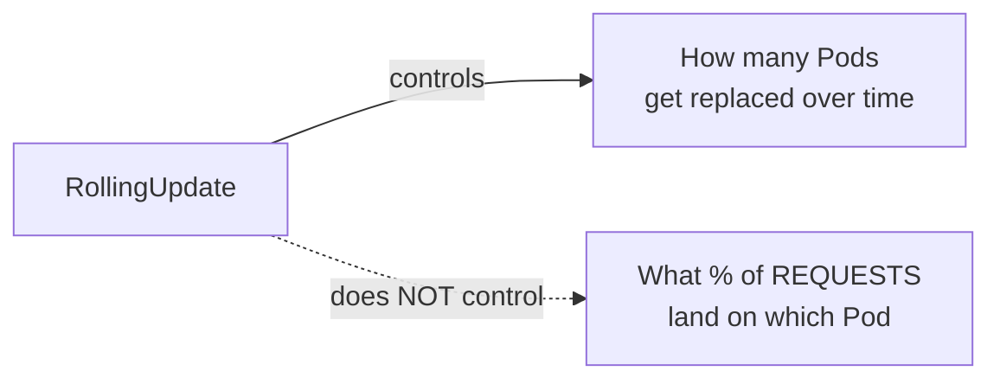

# Chapter 31 — Only 10% Get It First: Knowledge Notes

> Read the story first: [Chapter 31 — Only 10% Get It First](../../handbook/en/part-04-cicd/ch31-only-10-percent-get-it-first.md)

---

## 1. Overview diagram: traffic passes through one more layer, the Service doesn't change



**The important point:** the `chat-api` Service has no idea `v1`/`v2` even exist — it still just filters by `app: chat-api`, same as always. The percentage split happens at the Envoy (sidecar) layer, a tier sitting BEFORE the request ever reaches the Service/real Pod, completely invisible to `kubectl get svc`.

---

## 2. Sidecar injection — automatic, no Deployment edits

```bash
kubectl label namespace ai-workspace istio-injection=enabled
```

This is just a **label on the namespace**, not per-Deployment configuration. A webhook (`MutatingAdmissionWebhook` — a mechanism glimpsed briefly a while back when discussing admission validation, now used differently: not just validating, but actually **mutating** the object before it's saved) intercepts every new Pod creation request in that namespace, automatically inserting an `istio-proxy` container into `spec.containers`, with nobody hand-editing the original YAML.

> **Note:** since injection only applies at Pod CREATION time, existing Pods (created before the label was set) don't automatically get a sidecar — a `kubectl rollout restart` is needed to force new Pods to be created, exactly the step taken in this chapter.

---

## 3. `DestinationRule` vs. `VirtualService` — two halves of one routing rule

| | Answers what question | Example in this chapter |
|---|---|---|
| `DestinationRule` | "Among Service X's Pods, what groups do they split into?" | `subsets: v1 (version=v1), v2 (version=v2)` |
| `VirtualService` | "Which group should a request to Service X land in, at what ratio?" | `v1: 90%, v2: 10%` |

A `VirtualService` always needs a matching `DestinationRule` to already exist — can't route to a `subset` that hasn't been declared anywhere.

---

## 4. Why `RollingUpdate` can't do this job



During a rolling update, `kube-proxy` routes requests round-robin/randomly across ALL Pods that are `Ready` at that moment — no distinction between old/new Pods in the sense of a real "10% of traffic" guarantee. Precise request-percentage control needs an L7 routing layer that actually understands HTTP (like Envoy), not just the L4 load balancing a Service provides by default.

---

## 5. Practice

**Concept questions:**

1. If the `VirtualService` gets deleted but both `v1`/`v2` Deployments stay — how would requests to `chat-api` get split?
2. Do `weight: 90` and `weight: 10` have to add up to exactly 100? Guess how Istio handles it if the total is something else.
3. Does the `istio-proxy` container use extra CPU/RAM? How does that affect the `resources.limits` already sized for the `chat-api` container earlier?

**Hands-on:**

4. Run `kubectl get pod <chat-api-pod-name> -n ai-workspace -o jsonpath='{.spec.containers[*].name}'` — confirm both `chat-api` and `istio-proxy` show up.
5. Change the `VirtualService`'s `weight` to `50/50`, reapply, rerun the 50-request `curl` loop — confirm the ratio changes as expected.
6. Try removing the `istio-injection=enabled` label from the namespace, create a new Pod — confirm it does NOT get a sidecar, proving injection only applies to Pods created after the namespace was labeled.
