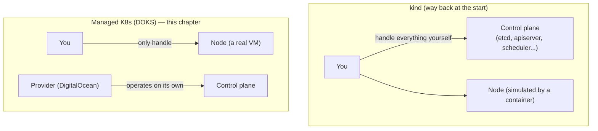
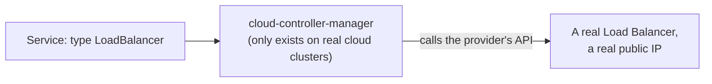

# Chapter 32 — No Longer Just Localhost: Knowledge Notes

> Read the story first: [Chapter 32 — No Longer Just Localhost](../../handbook/en/part-04-cicd/ch32-no-longer-just-localhost.md)

This chapter touches real cloud infrastructure (DigitalOcean) — can't be tried for free by hand the way `kind` could. These notes focus on the **concepts** behind the commands, so the substance still lands even without a cloud account to test on directly.

---

## 1. Overview diagram: what managed Kubernetes takes off your plate

**The core difference:** `kind` simulates the ENTIRE cluster (both control plane and nodes) as containers on one machine. Managed Kubernetes (DOKS, EKS, GKE, AKS...) only hands you the node side (real VMs, billed hourly), while the control plane is operated, patched, and backed up (`etcd` included) by the provider — exactly the heaviest piece of work learned way back at the start, no longer your job at all.

---

## 2. Why a `LoadBalancer`-type `Service` only "really works" on the cloud

`type: LoadBalancer` has existed as a concept for a while (mentioned in passing when comparing `Service` types) — but Kubernetes itself can't conjure a public IP out of nothing, it's just a **request**. On `kind`, nothing listens for that request, the Service just sits at `<pending>` forever. On a real cloud, a component called `cloud-controller-manager` (already running in the cluster, installed by the provider) listens for exactly this request, calls DigitalOcean's/AWS's/GCP's own API to create a real Load Balancer, then writes that IP back into the Service's `status.loadBalancer.ingress`.

> **Note:** this is exactly why an earlier chapter had to work around it with `NodePort` + manual `extraPortMappings` on `kind` — not because that approach was "more correct," just because `kind` has no `cloud-controller-manager` to automate that step.

---

## 3. `kubeconfig` with multiple clusters — nothing technically special

`doctl kubernetes cluster kubeconfig save` does exactly one thing: adds a new `cluster` + `user` + `context` entry to `~/.kube/config`, the exact same structure already learned when `kind-ai-workspace` and `kind-ai-workspace-staging` existed side by side. A real cluster or a simulated `kind` one, to `kubectl`, is just an entry in the same config file — no API distinguishing "a real cluster" from "a fake one" at all.

---

## 4. Practice

**Concept questions:**

1. Delete the `kind-ai-workspace` cluster on this machine — is `do-sgp1-ai-workspace-prod` affected at all? Why or why not?
2. The Helm chart used to deploy onto `kind` and onto DOKS is exactly identical — what does that say about how the chart was written from the start?
3. Is a `LoadBalancer` Service's `EXTERNAL-IP` the address of a Node, a Pod, or something else entirely (a Load Balancer the cloud created on its own)?

**Hands-on (needs a real cloud account, will incur real cost):**

4. With a DigitalOcean account (or any cloud offering managed Kubernetes), try creating the smallest possible cluster, deploy a simple Deployment/`LoadBalancer` Service, watch how long `EXTERNAL-IP` takes to go from `<pending>` to a real IP.
5. Run `kubectl get pods -n kube-system` on that cloud cluster — compare the Pod list against `kind`'s `kube-system` from way back — what's the same, what only exists on the cloud (e.g. `cloud-controller-manager`, the provider's own CNI plugin).
6. Remember to **delete the cluster** once done testing (`doctl kubernetes cluster delete`) — a managed cluster bills hourly, doesn't just stop the way closing the laptop does with `kind`.
