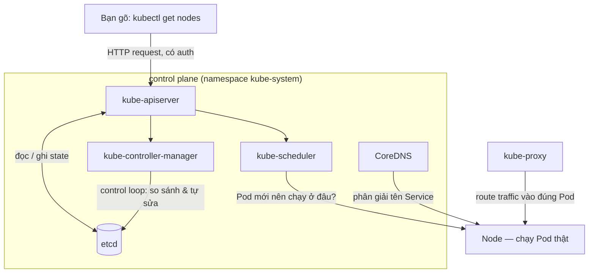
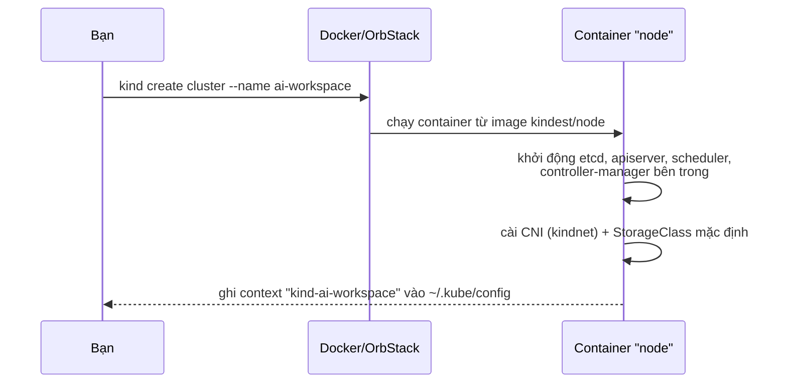

# Chương 4 — Không còn là khái niệm nữa: Ghi chú kiến thức

> Đọc truyện trước: [Chương 4 — Không còn là khái niệm nữa](../../handbook/vi/part-02-first-cluster/ch04-not-just-a-concept-anymore.md)

Tài liệu này không thay thế câu chuyện — chỉ đào sâu phần kỹ thuật mà mạch truyện không có chỗ dừng lại giải thích hết, kèm sơ đồ và bài tập để luyện lại.

---

## 1. Sơ đồ tổng quan: một request `kubectl` đi đâu



**Cách đọc sơ đồ:** mọi thứ bạn gõ qua `kubectl` đều chỉ nói chuyện với đúng một cửa — `kube-apiserver`. Không có lệnh nào "đi tắt" thẳng vào `etcd` hay thẳng vào Node. Ngay cả `kube-scheduler` và `kube-controller-manager` cũng không đọc/ghi `etcd` trực tiếp — chúng vẫn phải đi qua `kube-apiserver`, chỉ là sơ đồ trên vẽ gọn cho dễ hình dung. Đây là điểm quan trọng nhất của cả chương: **control plane không phải một khối mờ ảo, mà là 5-6 process cụ thể, mỗi cái một việc riêng, và tất cả đều xoay quanh một cửa ngõ duy nhất.**

---

## 2. `kind create cluster` — chuyện gì thật sự xảy ra

`kind` (Kubernetes IN Docker) dựng một cluster Kubernetes **thật** — cùng bộ binary API server/scheduler/controller-manager/kubelet như production — nhưng mỗi "node" là một container Docker, không phải máy vật lý/VM riêng.



Bóc tách từng dòng log thật đã thấy trong truyện:

| Dòng log | Ý nghĩa |
|---|---|
| `Ensuring node image (kindest/node:vX.Y.Z)` | Kéo (hoặc dùng cache local) image `kindest/node` — một image Docker đóng gói sẵn toàn bộ binary Kubernetes bên trong, kể cả `containerd` làm container runtime nội bộ của "node" đó. |
| `Preparing nodes` | Khởi động container(s) đóng vai trò node — với single-node cluster thì chỉ một container duy nhất, vừa là control-plane vừa là nơi Pod chạy. |
| `Writing configuration` | Sinh file cấu hình kubeadm bên trong container, dùng để bootstrap control plane. |
| `Starting control-plane` | Chạy `etcd`, `kube-apiserver`, `kube-scheduler`, `kube-controller-manager` như static Pod bên trong container node. |
| `Installing CNI` | Cài plugin mạng (mặc định `kindnet`) — không có bước này thì Pod không có IP, không gọi nhau được. |
| `Installing StorageClass` | Cài sẵn StorageClass tên `standard`, dùng provisioner `rancher.io/local-path` — im lìm không ai đụng tới cho tới tận Chương 11 khi cần PersistentVolumeClaim. |

> **Note — vì sao `ErrImagePull` xảy ra ở Chương 6:** `kind` có container runtime **riêng biệt** (`containerd` bên trong container node), tách khỏi Docker Desktop/OrbStack đang chạy trên máy host. Build image bằng `docker build` xong không có nghĩa là node của `kind` tự thấy nó — hai container runtime không tự động chia sẻ image store với nhau. Phải `kind load docker-image` để copy thủ công image vào bên trong.

**Không dùng cho production** — `kind` chỉ để phát triển/học tập/CI (test một manifest trước khi apply lên cluster thật là use-case rất phổ biến). Production dùng cluster nhiều node thật, mỗi node một máy/VM riêng (cloud managed như EKS/GKE/AKS, hoặc tự vận hành bằng kubeadm).

---

## 3. Các thành phần control plane, chi tiết từng cái

| Thành phần | Vai trò | Cách tự kiểm tra | Nếu nó chết thì sao |
|---|---|---|---|
| `etcd` | Key-value database, lưu **toàn bộ desired state** — mọi Pod/Deployment/Service đều là một bản ghi ở đây, dạng key-value phân cấp (`/registry/pods/ai-workspace/chat-api-...`). Nguồn sự thật duy nhất, mọi component khác chỉ là "người đọc/ghi" vào đây thông qua apiserver. | `kubectl get pods -n kube-system -l component=etcd` | Cluster mất trí nhớ — apiserver không đọc/ghi được state nữa, mọi lệnh `kubectl` bắt đầu timeout. Đây là lý do backup `etcd` định kỳ cực kỳ quan trọng trong production — mất `etcd` gần như mất cả cluster. |
| `kube-apiserver` | Cửa ngõ **duy nhất** vào cluster. Mọi `kubectl` là một HTTP request REST tới đây (`GET /api/v1/nodes` chẳng hạn), được authentication + authorization (RBAC) + admission control (validate, có thể sửa request) trước khi chạm vào `etcd`. Đây cũng chính là nơi lệnh `kubectl apply` bị chặn lại nếu `requests > limits` (gặp ở Chương 14). | `kubectl get --raw /healthz` | Không ai điều khiển được cluster qua `kubectl` nữa, dù Pod đang chạy vẫn tiếp tục chạy bình thường trên node (kubelet không phụ thuộc apiserver để giữ container sống, chỉ không nhận lệnh mới được). |
| `kube-scheduler` | Quyết định Pod mới chạy ở node nào — hai bước: **lọc** (node nào đủ tài nguyên theo `resources.requests`, gặp lại ở Chương 14) rồi **chấm điểm** (node nào "hợp" nhất trong số còn lại). Trên cluster 1 node như `kind`, bước chấm điểm gần như vô nghĩa — chỉ có một lựa chọn. | `kubectl get events -n ai-workspace --field-selector reason=Scheduled` | Pod mới tạo sẽ kẹt ở `Pending` mãi, không có gì gán chúng vào node cả — `kubectl describe pod` sẽ không có event `Scheduled`. |
| `kube-controller-manager` | Một process nhưng chạy hàng chục **control loop** bên trong (ReplicaSet controller, Deployment controller, Node controller...) — mỗi loop liên tục so sánh state thật với `etcd`, tự sửa nếu lệch. ReplicaSet controller là cái đã thấy hoạt động ở Chương 7. | `kubectl logs -n kube-system <pod-controller-manager>` | Pod chết sẽ không tự được thay thế nữa — mất đúng khả năng "tự chữa lành" đã học ở Chương 6-7, dù Deployment/ReplicaSet object vẫn còn nằm trong `etcd` như cũ. |
| `kube-proxy` | Chạy trên **mỗi** node (DaemonSet), thiết lập rule mạng (`iptables` hoặc `ipvs`, tuỳ chế độ) để traffic gửi tới ClusterIP của một Service được chuyển đúng tới một trong các Pod backend đang khớp `selector` (Chương 8). | `kubectl get pods -n kube-system -l k8s-app=kube-proxy` | Service ngừng route được traffic dù `Endpoints` vẫn đúng, dù Pod backend vẫn `Running` bình thường — vì rule mạng không còn được cập nhật. |
| `CoreDNS` | DNS nội bộ — chạy như Deployment (thường 2 replica) trong `kube-system`. Cho phép Pod gọi nhau bằng tên Service (`postgres`) thay vì phải nhớ ClusterIP (Chương 8). Mỗi Pod có `/etc/resolv.conf` trỏ về ClusterIP của CoreDNS. | `kubectl get pods -n kube-system -l k8s-app=kube-dns` | Tên như `postgres` không phân giải được nữa — `ENOTFOUND`, y hệt lỗi gặp ở Chương 6 khi Service `postgres` chưa từng tồn tại. |

> **Note:** một node `kind` chỉ có 1 máy nhưng mang cả hai vai trò `control-plane` lẫn nơi chạy Pod thật. Cột `ROLES` trong `kubectl get nodes` chỉ ghi `control-plane` — không có `worker` riêng như production thường thấy, vì taint mặc định chặn Pod thường không chạy trên node `control-plane` đã bị gỡ bỏ trong cấu hình mặc định của `kind`.

### Đọc output `kubectl get nodes`

```
NAME                         STATUS   ROLES           AGE   VERSION
ai-workspace-control-plane   Ready    control-plane   52s   v1.31.0
```

| Cột | Ý nghĩa |
|---|---|
| `STATUS` | `Ready` = kubelet trên node đó đã báo cáo về apiserver và đủ điều kiện nhận Pod mới. `NotReady` thường do kubelet mất kết nối, hoặc CNI chưa cài xong. |
| `ROLES` | Vai trò gán qua label `node-role.kubernetes.io/*`. Trống nghĩa là node "worker" thuần, không có vai trò đặc biệt. |
| `AGE` | Thời gian từ lúc node được đăng ký vào cluster — **không phải** thời gian máy đã bật. |
| `VERSION` | Version của `kubelet` trên node đó — cần khớp (hoặc gần khớp, lệch tối đa vài minor version) với version của control plane. |

---

## 4. `kubectl logs --tail` — quen mà không hẳn giống Docker

```bash
docker logs --tail 5 <container>       # Docker
kubectl logs --tail 5 <pod> -n <ns>    # Kubernetes
```

Cú pháp giống có chủ đích — thiết kế để quen tay với người từng dùng Docker CLI. Khác biệt cần nhớ:

- `kubectl logs` **cần** `-n <namespace>` nếu Pod không nằm trong `default`.
- Một Pod có thể chứa **nhiều container** (ví dụ có thêm sidecar) — khi đó `kubectl logs <pod>` sẽ báo lỗi đòi chỉ rõ, cần thêm `-c <container-name>`.
- `-f` để theo dõi real-time (giống `docker logs -f`), Ctrl+C để thoát, không dừng Pod.
- `--previous` (hoặc `-p`) — xem log của lần chạy **trước**, cực hữu ích khi debug `CrashLoopBackOff` (Chương 6): container hiện tại có thể chưa kịp log gì trước khi chết, nhưng lần chạy trước thì có.
- `--since 10m` — chỉ lấy log 10 phút gần nhất, hữu ích khi log quá dài.
- Có thể áp dụng `kubectl logs` cho một Deployment thay vì gõ đúng tên Pod: `kubectl logs deployment/chat-api` — Kubernetes tự chọn một Pod bất kỳ đang khớp Deployment đó.

---

## 5. `-n` / `--namespace` / `-A` — và resource nào không cần chúng

Hầu hết lệnh `kubectl` chỉ thao tác trên **một** namespace tại một thời điểm — mặc định `default` nếu không chỉ định.

| Muốn gì | Gõ gì |
|---|---|
| Xem trong 1 namespace cụ thể | `-n <tên>` hoặc `--namespace <tên>` |
| Xem ở **mọi** namespace cùng lúc | `-A` hoặc `--all-namespaces` |
| Không gõ gì cả | Ngầm định là `default` |

**Chi tiết dễ bỏ sót:** không phải resource nào cũng "thuộc về" một namespace. Kubernetes có hai loại:

- **Namespaced** — Pod, Deployment, Service, Secret... — bắt buộc thuộc về đúng một namespace, `-n` có tác dụng.
- **Cluster-scoped** — Node, Namespace (chính nó), PersistentVolume, StorageClass... — tồn tại độc lập, không thuộc namespace nào cả. Gõ `-n` vào mấy resource này sẽ bị bỏ qua hoặc báo lỗi.

Kiểm tra loại nào thuộc nhóm nào bằng:

```bash
kubectl api-resources --namespaced=true    # danh sách resource cần -n
kubectl api-resources --namespaced=false   # danh sách resource cluster-scoped
```

---

## 6. Bài tập tự luyện

**Câu hỏi khái niệm** (trả lời không cần mở terminal):

1. Nếu bạn xoá Pod `kube-apiserver` bằng tay, các Pod ứng dụng khác (`chat-api`, `postgres`) có bị ảnh hưởng ngay lập tức không? Vì sao?
2. `etcd` và `kube-controller-manager` khác nhau ở vai trò gì — cái nào "nhớ", cái nào "sửa"?
3. Vì sao một node `kind` vẫn ghi `ROLES: control-plane` dù nó cũng đang chạy Pod ứng dụng của bạn?
4. `Node` có phải resource namespaced không? Thử đoán trước rồi kiểm tra lại bằng `kubectl api-resources`.

**Thực hành** (mở terminal, dùng đúng cluster đang có):

5. Chạy `kubectl get pods -n kube-system -o wide`, xác định cột `NODE` — tất cả Pod control plane có cùng nằm trên một node không? Cluster của bạn có mấy node?
6. Chạy `kubectl logs -n kube-system <tên-pod-kube-apiserver> --tail 10` — thử đọc xem log đó đang ghi lại loại request nào.
7. Xoá thử namespace test bằng `kubectl create namespace scratch-test` rồi `kubectl delete namespace scratch-test` — quan sát `kubectl get namespaces` trong lúc namespace đang ở trạng thái `Terminating`. Theo bạn, thành phần nào trong bảng ở mục 3 đang xử lý việc xoá này?
8. Chạy `kubectl get --raw /healthz` — kết quả trả về là gì? Thử tắt Wi-Fi/mạng một giây rồi chạy lại, quan sát khác biệt.

> Gợi ý: nếu bí, quay lại đọc mục 3 — mỗi câu hỏi thực hành đều ánh xạ trực tiếp tới một hàng trong bảng.
