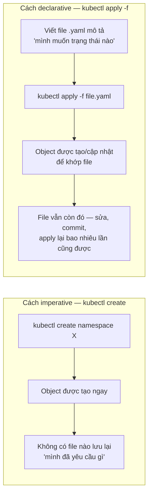
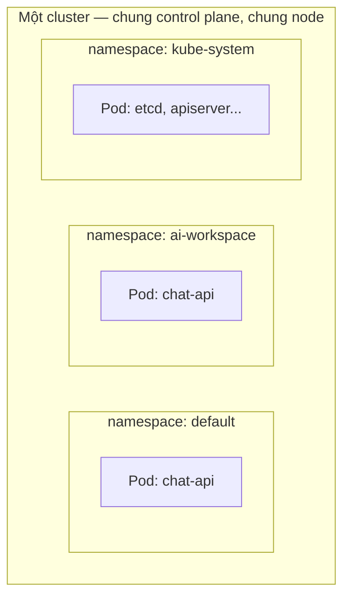
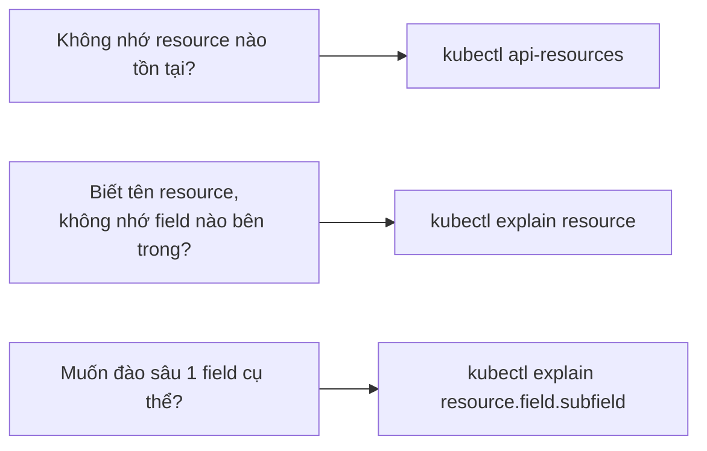

# Chương 5 — Trước khi vứt cả đống lên đó: Ghi chú kiến thức

> Đọc truyện trước: [Chương 5 — Trước khi vứt cả đống lên đó](../../handbook/vi/part-02-first-cluster/ch05-kubectl.md)

---

## 1. Sơ đồ tổng quan: declarative vs imperative

**Cách đọc sơ đồ:** cả hai cách đều tạo ra đúng một object giống hệt nhau trên cluster — khác biệt duy nhất nằm ở việc có **một bản mô tả sống sót sau lệnh** hay không. `kubectl create` xong là xong; `kubectl apply -f` để lại một file bạn có thể mở lại, sửa, đưa vào Git.

---

## 2. Namespace — "ngăn kéo" chứ không phải cluster riêng

`kubectl create namespace ai-workspace` không tạo ra một cluster mới hay tách rời tài nguyên vật lý nào cả — chỉ là gắn thêm một nhãn phân vùng để các object không đụng tên nhau.

Hai Pod cùng tên `chat-api` ở hai namespace khác nhau là **hai object hoàn toàn độc lập** — không xung đột, không "ghi đè" lẫn nhau. Namespace chỉ là một cách tổ chức tên, không phải một lớp cách ly về CPU/RAM/network (muốn cách ly thật sự về network cần `NetworkPolicy`, về tài nguyên cần `ResourceQuota` — cả hai đều chưa xuất hiện trong câu chuyện tính tới chương này).

> **Note:** không phải mọi resource đều thuộc về namespace — xem lại mục 5 trong ghi chú Chương 4 (cluster-scoped vs namespaced).

---

## 3. `kubectl api-resources` và `kubectl explain` — hai lệnh tự tra cứu

| Lệnh | Trả lời câu hỏi gì |
|---|---|
| `kubectl api-resources` | "Kubernetes biết tạo ra những **loại** object nào?" — liệt kê tên resource (`pods`, `deployments`, `services`...), tên viết tắt (`po`, `deploy`, `svc`), có thuộc namespace hay không, thuộc API group nào. |
| `kubectl explain <resource>` | "Object loại này có những **field** nào, nghĩa là gì?" — tài liệu chính thức, lấy trực tiếp từ OpenAPI schema của **đúng phiên bản cluster đang chạy**, không phải một trang doc tĩnh có thể lỗi thời. |
| `kubectl explain <resource>.<field>` | Đào sâu thêm một cấp — ví dụ `kubectl explain pod.spec.containers` để xem field con của `containers`. |

> **Note:** `kubectl explain` là công cụ tra cứu nhanh nhất khi quên một field tên gì — nhanh hơn hẳn việc mở trình duyệt tìm docs, và luôn đúng với version cluster đang chạy (docs online có thể đang mô tả version khác).

---

## 4. `Pod` là gì, theo đúng định nghĩa chính thức

Từ `kubectl explain pod`: **"Pod is a collection of containers that can run on a host."**

Ba điểm quan trọng rút ra từ định nghĩa ngắn gọn này:

1. **"collection"** — số nhiều. Một Pod có thể chứa nhiều container, dù phần lớn trường hợp thực tế (kể cả `chat-api` trong câu chuyện) chỉ có đúng một.
2. **"that can run on a host"** — các container trong CÙNG một Pod luôn chạy trên CÙNG một node, chia sẻ network namespace (cùng một IP), có thể chia sẻ volume với nhau.
3. Pod là đơn vị **triển khai** nhỏ nhất trong Kubernetes — không thể tạo ra "nửa Pod" hay scale từng container riêng lẻ bên trong một Pod. Muốn scale, phải scale cả Pod (qua ReplicaSet/Deployment — Chương 7).

---

## 5. Đối chiếu nhanh với `docker-compose.yml`

| Docker Compose | Kubernetes | Ghi chú |
|---|---|---|
| `services.chat-api.image` | `pod.spec.containers[].image` | Giống hệt ý nghĩa |
| `services.chat-api.ports` | `pod.spec.containers[].ports` | Compose expose port ra host trực tiếp; Pod chỉ khai báo port container lắng nghe, việc "lộ ra ngoài" là chuyện của Service (Chương 8) |
| `services.chat-api.environment` | `pod.spec.containers[].env` | Giống hệt ý nghĩa |
| `docker-compose up` | `kubectl apply -f file.yaml` | Cả hai đều đọc file mô tả rồi tạo/cập nhật cho khớp — Compose không có khái niệm reconcile liên tục như Kubernetes |

---

## 6. Bài tập tự luyện

**Câu hỏi khái niệm:**

1. Tạo hai Pod cùng tên `worker` ở hai namespace khác nhau có hợp lệ không? Tạo hai Pod cùng tên `worker` trong CÙNG một namespace thì sao?
2. `kubectl create namespace test` và viết một file `namespace.yaml` rồi `kubectl apply -f namespace.yaml` — cả hai đều tạo ra namespace giống hệt nhau trên cluster. Vậy khác biệt thực sự nằm ở đâu?
3. Một Pod có 2 container bên trong — chúng có thể có 2 địa chỉ IP khác nhau không? Vì sao?

**Thực hành:**

4. Chạy `kubectl api-resources | grep -i secret` — resource `secrets` có thuộc namespace không?
5. Chạy `kubectl explain deployment.spec.replicas` — kiểu dữ liệu của field này là gì? So sánh với `kubectl explain deployment.spec.template`.
6. Tạo một namespace bằng `kubectl create namespace scratch`, sau đó `kubectl get namespace scratch -o yaml` — tìm field `metadata.creationTimestamp`. Giờ tự viết một file YAML mô tả đúng namespace này rồi `kubectl apply -f` — có báo lỗi hay `unchanged` không? Vì sao?
