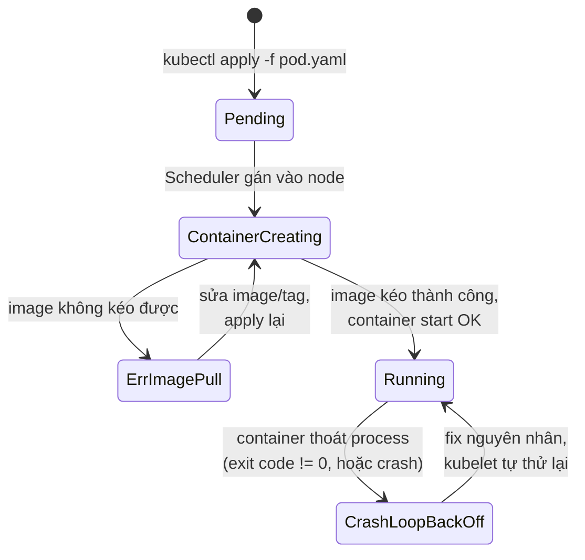
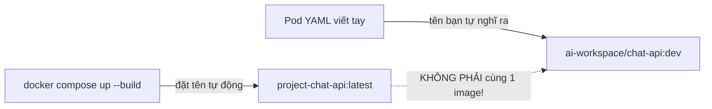
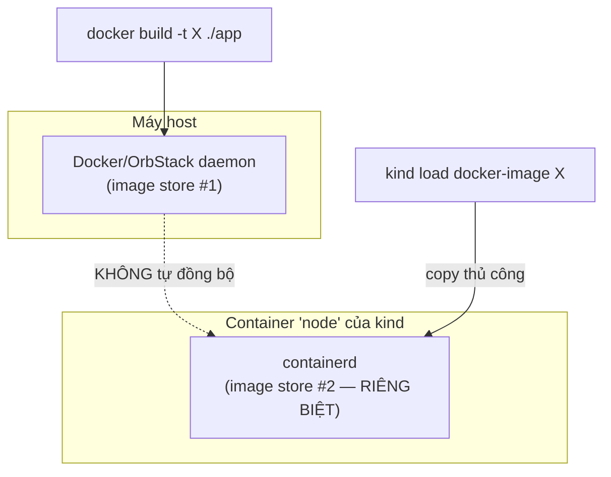
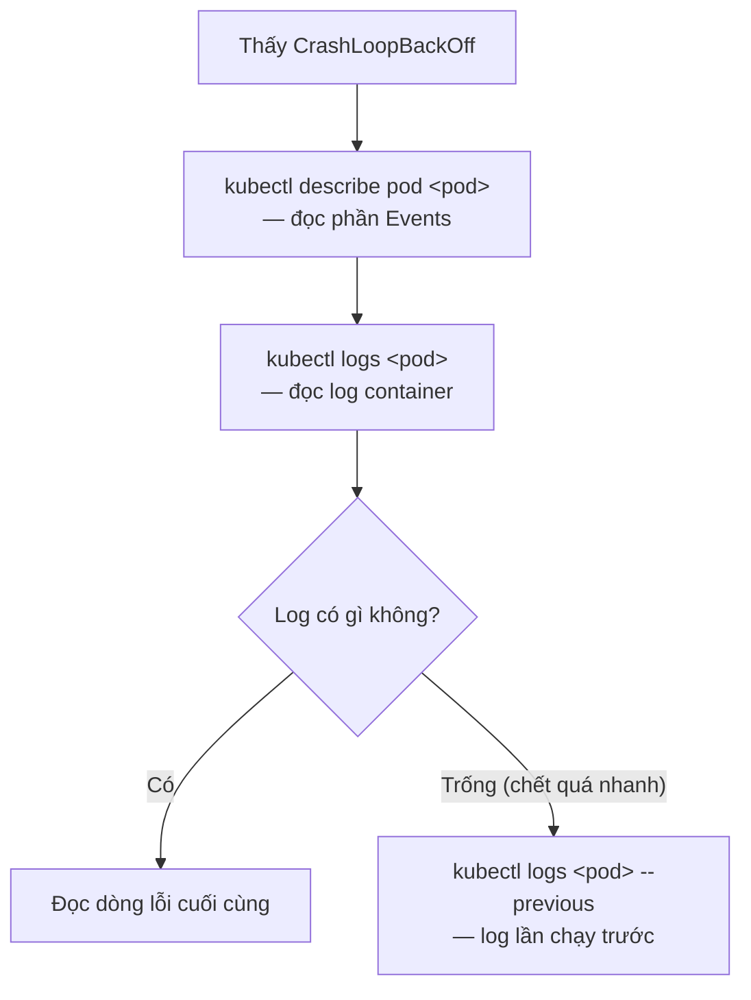
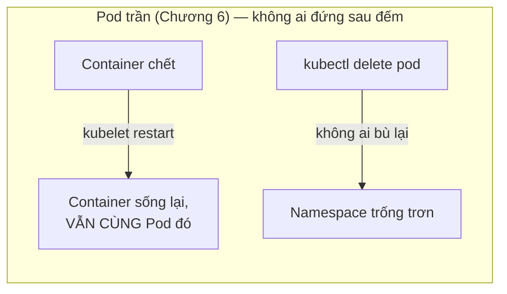

# Chương 6 — Chạy được 12 giây: Ghi chú kiến thức

> Đọc truyện trước: [Chương 6 — Chạy được 12 giây](../../handbook/vi/part-02-first-cluster/ch06-first-pod.md)

---

## 1. Sơ đồ tổng quan: hành trình một Pod từ `apply` tới `Running`



**Cách đọc sơ đồ:** cả `ErrImagePull` và `CrashLoopBackOff` đều KHÔNG phải trạng thái "chết hẳn" — chúng là trạng thái tạm, kubelet vẫn đang tự động thử lại phía sau. Vấn đề là thử lại với đúng nguyên nhân cũ thì mãi mãi thất bại y hệt, cho tới khi có người sửa.

---

## 2. `ErrImagePull` — image "đúng tên" nhưng không phải image bạn nghĩ

Nguyên nhân gốc trong câu chuyện: Docker Compose tự đặt tên image theo công thức `<tên-thư-mục-dự-án>-<tên-service>` khi build bằng `docker compose up --build`, **không liên quan** tới tên bạn gõ trong `image:` của Pod YAML.



| Lệnh kiểm tra | Trả lời gì |
|---|---|
| `docker images \| grep chat-api` | Image thật đang có tên gì trên máy host |
| `kubectl describe pod <pod>` → phần `Events` | kubelet đang cố kéo image tên gì, lỗi cụ thể ra sao |

**Quy trình đúng để tránh lệch tên** (đã áp dụng từ chương này về sau):

```bash
docker build -t ai-workspace/chat-api:dev ./chat-api   # 1. đặt tên rõ ràng, không để Compose tự đặt
kind load docker-image ai-workspace/chat-api:dev --name ai-workspace   # 2. đưa vào node kind
```

> **Note:** `docker.io` xuất hiện trong thông báo lỗi (`failed to resolve reference: docker.io/ai-workspace/chat-api:dev`) vì Docker/Kubernetes ngầm định mọi image không ghi rõ registry là đang nằm trên Docker Hub (`docker.io`). Không có registry nào tên `ai-workspace` cả — kubelet đang tìm nhầm chỗ.

---

## 3. Vì sao `kind` không tự thấy image build bằng `docker build`



`kind` chạy container runtime riêng (`containerd`) bên trong container đóng vai trò node — hoàn toàn tách biệt khỏi Docker daemon đang chạy trên máy host, dù cả hai đều là "Docker" theo một nghĩa nào đó. `docker compose up` thấy được image vì Compose nói chuyện thẳng với Docker daemon; `kind`/`kubectl` thì không.

---

## 4. `CrashLoopBackOff` — quy trình debug chuẩn



Trong câu chuyện: log cho thấy `Error: getaddrinfo ENOTFOUND postgres` — không phải lỗi code, mà là DNS chưa phân giải được tên `postgres` (vì Service `postgres` chưa hề tồn tại lúc đó — sẽ giải quyết ở Chương 8).

> **Note — `ENOTFOUND` khác `ECONNREFUSED` như thế nào:**
> - `ENOTFOUND` — DNS không tìm ra được **tên** này trỏ đi đâu cả. Không có gì đang lắng nghe ở "chỗ nào đó" vì "chỗ nào đó" còn chưa được định nghĩa.
> - `ECONNREFUSED` — DNS phân giải được tên thành một IP, kết nối tới đúng IP đó, nhưng bị từ chối (không có gì lắng nghe ở đúng port đó, hoặc bị tường lửa chặn).
>
> Phân biệt hai lỗi này giúp khoanh vùng vấn đề rất nhanh: `ENOTFOUND` → kiểm tra DNS/Service; `ECONNREFUSED` → kiểm tra process đích có đang chạy đúng port không.

---

## 5. kubelet restart container ≠ ai đó tạo lại Pod

Đây là điểm dễ nhầm nhất của cả chương — hai cơ chế nghe giống nhau nhưng khác hẳn phạm vi:

| | kubelet | ReplicaSet/Deployment |
|---|---|---|
| Theo dõi gì | Container **bên trong** một Pod cụ thể | Toàn bộ Pod, đếm số lượng |
| Hành động khi có sự cố | Restart lại **đúng container đó**, bên trong **đúng Pod đó** | Nếu Pod biến mất, **tạo Pod mới hoàn toàn** để bù |
| Phạm vi | Chạy trên từng node, chỉ quan tâm Pod được giao cho node đó | Chạy trong control plane, không quan tâm Pod nằm ở node nào |
| Nếu xoá cả Pod (không chỉ container) | Bó tay — không có gì để restart nữa | Phát hiện thiếu, tạo Pod thay thế (nhưng chỉ khi có ReplicaSet/Deployment đứng phía sau — Pod trần thì không) |



Thử nghiệm đã làm trong truyện — xoá thẳng Pod bằng `kubectl delete pod` rồi thấy namespace trống trơn — chính là bằng chứng trực tiếp: Pod trần không có ai đứng sau đảm bảo **sự tồn tại**, chỉ có kubelet đảm bảo container bên trong luôn được restart **nếu Pod đó vẫn còn**. Hai lớp bảo vệ khác nhau, không thể suy ra lớp này từ lớp kia.

---

## 6. Bài tập tự luyện

**Câu hỏi khái niệm:**

1. Image tên `myapp:latest` build xong bằng `docker build`, chạy `docker run myapp:latest` thành công trên máy host. Áp `myapp:latest` vào một Pod YAML trên cluster `kind` thì có chắc chạy được không? Vì sao?
2. `ENOTFOUND postgres` và `ECONNREFUSED` khác nhau ở chỗ nào — cách debug hai lỗi này có giống nhau không?
3. Một Pod trần (không Deployment/ReplicaSet) có container bị `OOMKilled` (hết bộ nhớ). Chuyện gì xảy ra tiếp theo?

**Thực hành:**

4. Build một image bất kỳ bằng `docker build -t test:local .`, sau đó thử `kubectl run test --image=test:local` trên cluster `kind` của bạn (không `kind load` trước) — quan sát lỗi, rồi tự sửa bằng `kind load docker-image`.
5. Tạo một Pod trần chạy image `busybox` với command gây lỗi ngay lập tức (ví dụ `command: ["false"]`). Quan sát `RESTARTS` tăng dần theo thời gian — khoảng cách giữa các lần restart có cố định không, hay giãn ra dần?
6. Với Pod ở bài 5, chạy `kubectl logs <pod> --previous` — có log gì không? Thử giải thích vì sao có/không.
