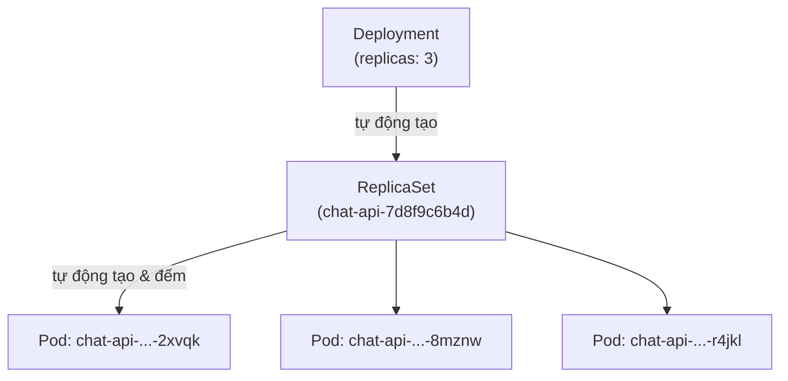
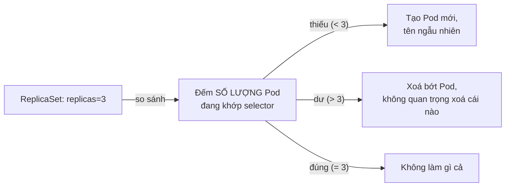

# Chương 7 — Cuối cùng cũng có người đếm: Ghi chú kiến thức

> Đọc truyện trước: [Chương 7 — Cuối cùng cũng có người đếm](../../handbook/vi/part-02-first-cluster/ch07-someone-finally-counting.md)

---

## 1. Sơ đồ tổng quan: ba tầng object, ai tạo ai



Bạn chỉ viết **một** file YAML (`kind: Deployment`), `apply` **một** lần — Kubernetes tự sinh ra cả ba tầng, từ trên xuống. Không ai viết tay ReplicaSet cả.

**Vì sao có tận 3 tầng thay vì gộp chung một object:** mỗi tầng chỉ lo đúng một việc.

| Tầng | Lo việc gì |
|---|---|
| Deployment | Quản lý **version** — rolling update, rollback, giữ lịch sử các bản ReplicaSet cũ khi update image |
| ReplicaSet | Quản lý **số lượng** — đảm bảo đúng N Pod đang tồn tại, không quan tâm version |
| Pod | Đơn vị chạy thật — một hoặc nhiều container |

---

## 2. ReplicaSet đếm gì, không đếm gì



Bằng chứng trực tiếp trong truyện: xoá một Pod cụ thể (`...-2xvqk`), ReplicaSet tạo Pod thay thế với **tên hoàn toàn khác** (`...-x9wtp`) — không "hồi sinh" đúng Pod cũ. `kubectl describe replicaset | grep -A2 "Pods Status"` chỉ in ra một con số, không có danh sách tên Pod cụ thể nào trong phần trạng thái đó.

> **Note:** đây là lý do không nên bao giờ đặt logic phụ thuộc vào **tên Pod cụ thể** (ví dụ hardcode tên Pod trong script) — tên đó có thể đổi bất cứ lúc nào ReplicaSet cần tạo lại.

---

## 3. `matchLabels` — cơ chế khớp duy nhất, dùng lại ở khắp nơi

```yaml
spec:
  replicas: 3
  selector:
    matchLabels:
      app: chat-api          # (1) ReplicaSet tìm Pod theo nhãn này
  template:
    metadata:
      labels:
        app: chat-api        # (2) Pod sinh ra mang đúng nhãn này
```

`(1)` và `(2)` **phải khớp nhau** — đây không phải Kubernetes tự suy luận, mà là người viết YAML tự đảm bảo hai chỗ đó nói cùng một điều. Nếu chúng lệch nhau: ReplicaSet coi như có 0 Pod đang khớp, sẽ tiếp tục tạo Pod mới vô hạn cho tới khi giới hạn nào đó chặn lại, trong khi Pod cũ (label sai) bị bỏ rơi, không ai quản lý.

> **Note:** cơ chế `matchLabels` y hệt sẽ gặp lại ở Service (Chương 8) — Service cũng khớp Pod qua nhãn, không hề biết gì về Deployment/ReplicaSet đứng phía sau. Đây là nguyên lý xuyên suốt: **Kubernetes không có tham chiếu trực tiếp bằng tên/ID giữa các object — mọi liên kết đều qua nhãn khớp nhau.**

---

## 4. Cú pháp liệt kê nhiều resource cùng lúc

```bash
kubectl get deployments,replicasets,pods -n ai-workspace
```

Dấu phẩy, không dấu cách — liệt kê nhiều loại resource trong một lệnh, mỗi loại in thành một bảng riêng. Hữu ích khi muốn thấy tất cả các tầng (Deployment → ReplicaSet → Pod) trong cùng một lần nhìn, thay vì gõ ba lệnh riêng.

---

## 5. Bảng tổng kết: `replicas` ảnh hưởng gì

| replicas | Điều gì xảy ra |
|---|---|
| `1` | Giống hệt Pod trần về mặt "chỉ có 1 bản chạy", nhưng khác ở chỗ **có ReplicaSet đứng sau** — Pod chết vẫn được tạo lại. |
| `3` (như `chat-api`) | Ba Pod độc lập, cùng image, cùng cấu hình — nhưng nếu là workload có trạng thái riêng (như Postgres), ba bản sẽ có ba dữ liệu khác nhau, không đồng bộ (lý do `postgres` giữ `replicas: 1` — xem Chương 11). |
| `0` | Deployment vẫn tồn tại, nhưng không có Pod nào cả — cách "tắt tạm" một workload mà không xoá hẳn cấu hình. |

---

## 6. Bài tập tự luyện

**Câu hỏi khái niệm:**

1. Xoá thẳng object `ReplicaSet` (không xoá Deployment) — điều gì xảy ra với các Pod nó đang quản lý? Với Deployment đứng trên nó?
2. Nếu sửa `matchLabels` trong Deployment đã tồn tại thành một giá trị khác, nhưng KHÔNG sửa `template.metadata.labels`, hậu quả là gì?
3. `replicas: 3` nghĩa là "chính xác 3 Pod luôn tồn tại" hay "tối đa 3 Pod"? Có sự khác biệt nào giữa hai cách hiểu này trong lúc Pod đang được tạo/xoá không?

**Thực hành:**

4. Tạo một Deployment với `replicas: 2`, sau đó xoá CẢ HAI Pod cùng lúc bằng `kubectl delete pod -l app=<tên>`. Quan sát `kubectl get pods -w` — hai Pod mới xuất hiện cùng lúc hay lần lượt?
5. Sửa `replicas` từ 3 xuống 1 bằng `kubectl scale deployment <tên> --replicas=1`, xem `kubectl get replicaset` — ReplicaSet cũ có bị xoá không, hay chỉ đổi số Pod nó quản lý?
6. Chạy `kubectl describe replicaset <tên>`, tìm dòng `Selector` — so sánh với `matchLabels` trong file YAML gốc, xác nhận chúng khớp nhau.
