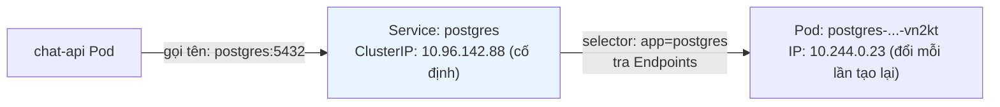
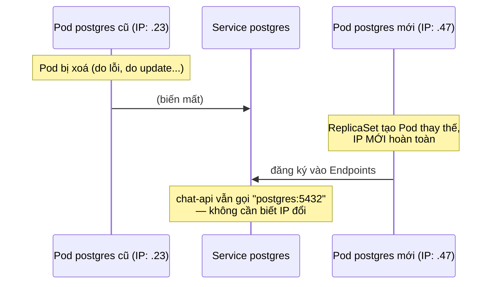
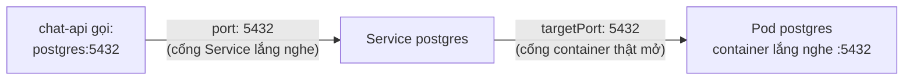

# Chương 8 — Một cái tên không đổi: Ghi chú kiến thức

> Đọc truyện trước: [Chương 8 — Một cái tên không đổi](../../handbook/vi/part-02-first-cluster/ch08-a-name-that-doesnt-change.md)

---

## 1. Sơ đồ tổng quan: Service đứng giữa, không ai gọi thẳng Pod



**Cách đọc sơ đồ:** `chat-api` không bao giờ biết IP thật của Pod `postgres` — nó chỉ biết một cái tên cố định. Service đứng giữa, tự cập nhật xem tên đó hiện đang trỏ tới Pod nào.

---

## 2. Vì sao cần Service — vấn đề nó giải quyết



Không có Service: mỗi lần Pod `postgres` chết/tái tạo, IP đổi, mọi client đang hardcode IP cũ đều gãy. Có Service: client chỉ cần nhớ **một cái tên**, không bao giờ đổi.

---

## 3. `kubectl explain service` — định nghĩa chính thức

> "Service is a **named abstraction** of software service ... consisting of local port ... that the proxy listens on, and the **selector** that determines which pods will answer requests."

Hai từ khoá quan trọng nhất trong định nghĩa:

- **named abstraction** — một cái tên đứng thay mặt cho cả một nhóm Pod, không phải một Pod cụ thể.
- **selector** — cơ chế xác định "nhóm Pod" đó là ai, y hệt `matchLabels` đã gặp ở ReplicaSet (Chương 7).

---

## 4. `port` vs `targetPort` — hai khái niệm dễ tưởng nhầm là một



| Field | Ý nghĩa | Ai dùng số này |
|---|---|---|
| `port` | Cổng chính Service lắng nghe/expose | Client gọi vào (`postgres:5432`) |
| `targetPort` | Cổng thật container bên trong Pod đang mở | Service dùng để forward request tới Pod |

Hai số **có thể khác nhau hoàn toàn** — ví dụ `port: 80` nhưng `targetPort: 8080` nếu muốn client gọi cổng 80 "chuẩn" trong khi app thật chạy port 8080. Trong câu chuyện chúng trùng nhau (5432/5432) chỉ vì tình cờ Postgres nghe đúng port mặc định.

---

## 5. `Endpoints` — nơi Service "nhớ" Pod nào đang thật sự đứng sau

```bash
kubectl describe svc postgres -n ai-workspace
```

```
Selector:    app=postgres
Endpoints:   10.244.0.23:5432
```

`Endpoints` là một object **riêng biệt**, tự động sinh ra và cập nhật liên tục bởi một controller trong control plane — quét toàn bộ namespace tìm Pod khớp `selector`, ghi IP thật của chúng vào đây. Service không "nhớ" gì cả — nó chỉ đọc `Endpoints` mỗi khi có request tới.

> **Note quan trọng — nguyên lý xuyên suốt:** Service **không hề biết** Deployment `postgres` tồn tại. Nó chỉ quét Pod theo nhãn, không quan tâm Pod đó do Deployment, StatefulSet, hay `kubectl apply` một Pod trần tạo ra. Sự khớp giữa Service và Deployment chỉ vì người viết YAML tự đặt trùng nhãn ở cả hai chỗ — Kubernetes không tự suy luận liên kết này. Đây là cách mọi thứ trong Kubernetes liên kết với nhau: **qua nhãn khớp nhau, không qua tham chiếu tên/ID trực tiếp.**

---

## 6. DNS nội bộ — vì sao gõ đúng `postgres` (không phải FQDN) vẫn phân giải được

Mỗi Pod có `/etc/resolv.conf` với danh sách `search domain`, mặc định gồm:

```
<namespace>.svc.cluster.local
svc.cluster.local
cluster.local
```

Gõ `postgres` (tên ngắn), hệ thống resolver tự thử lần lượt từng search domain cho tới khi phân giải được — trong cùng namespace `ai-workspace`, `postgres` sẽ khớp `postgres.ai-workspace.svc.cluster.local` ngay ở lượt thử đầu tiên. Muốn gọi Service ở namespace KHÁC, phải gõ đủ `<tên-service>.<namespace>` hoặc FQDN đầy đủ.

---

## 7. Bài tập tự luyện

**Câu hỏi khái niệm:**

1. Xoá Service `postgres` (không xoá Deployment/Pod) — Pod `postgres` có bị ảnh hưởng gì không? `chat-api` thì sao?
2. Hai Service khác nhau có thể cùng trỏ tới một nhóm Pod (cùng `selector`) không? Điều gì sẽ khác nhau giữa hai Service đó?
3. `ClusterIP` của Service có đổi khi Pod backend bị xoá/tạo lại không? Còn `Endpoints` thì sao?

**Thực hành:**

4. Tạo hai Pod cùng nhãn `app: demo`, rồi tạo một Service `selector: app: demo` — chạy `kubectl get endpoints demo`, xác nhận cả hai IP Pod đều xuất hiện.
5. Xoá một trong hai Pod ở bài 4, quan sát `kubectl get endpoints demo -w` — thời gian để `Endpoints` cập nhật mất khoảng bao lâu?
6. Từ một Pod bất kỳ trong namespace `ai-workspace`, chạy `cat /etc/resolv.conf` — xác nhận danh sách `search` domain đúng như mô tả ở mục 6.
7. Thử gọi Service ở namespace `kube-system` (ví dụ `kube-dns`) từ một Pod trong `ai-workspace` bằng tên ngắn `kube-dns` — có phân giải được không? Thử lại với `kube-dns.kube-system`.
