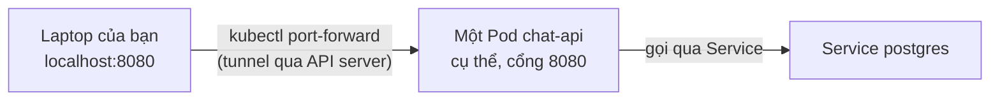

# Chương 9 — Một câu hỏi, một câu trả lời: Ghi chú kiến thức

> Đọc truyện trước: [Chương 9 — Một câu hỏi, một câu trả lời](../../handbook/vi/part-02-first-cluster/ch09-one-question-one-answer.md)

Chương này ngắn về mặt kiến thức mới — chủ yếu là một bài test end-to-end. Ghi chú tập trung vào công cụ chính: `port-forward`.

---

## 1. Sơ đồ: `port-forward` đứng ở đâu trong luồng request



**Điểm khác biệt cốt lõi so với Service:** `port-forward` nối thẳng máy bạn tới **một Pod cụ thể**, đi vòng qua toàn bộ cơ chế Service/Endpoints/load-balancing. Không phải cách dùng cho traffic thật — chỉ để debug/test cá nhân từ bên ngoài cluster.

---

## 2. `port-forward` hoạt động với những loại resource nào

```bash
kubectl port-forward pod/<tên-pod> 8080:8080         # nối thẳng 1 Pod cụ thể
kubectl port-forward deployment/<tên> 8080:8080       # kubectl tự chọn 1 Pod bất kỳ đang khớp Deployment
kubectl port-forward svc/<tên> 8080:8080              # nối qua Service, vẫn chỉ chuyển tới 1 Pod tại 1 thời điểm
```

> **Note:** dù forward qua `deployment/` hay `svc/`, `port-forward` **không** load-balance qua nhiều Pod — nó chọn một Pod tại thời điểm chạy lệnh và giữ nguyên kết nối đó cho tới khi bạn dừng lệnh (Ctrl+C) hoặc Pod đó chết.

---

## 3. Vì sao cần `port-forward` ở đây mà không cần cho `postgres`

| | `postgres` | `chat-api` |
|---|---|---|
| Ai gọi tới nó | Chỉ Pod khác **bên trong** cluster (`chat-api`) | Bạn, **từ bên ngoài** cluster (laptop) |
| Cần Service? | Có — để `chat-api` gọi qua tên | Không cần Service để test bằng `port-forward` (dù production thật sẽ cần Service + Ingress) |
| Cách tiếp cận từ ngoài | Không cần, không nên | `port-forward` (test cá nhân) hoặc Ingress (traffic thật) |

---

## 4. Bài tập tự luyện

**Câu hỏi khái niệm:**

1. Đang chạy `kubectl port-forward deployment/chat-api 8080:8080`, một Pod trong 3 bản `chat-api` bị xoá giữa chừng (không phải Pod đang được forward tới) — kết nối `port-forward` có bị ảnh hưởng không?
2. Nếu Pod ĐANG được forward tới bị xoá, chuyện gì xảy ra với `port-forward` đang chạy?
3. `port-forward` có phải cách production dùng để expose service ra internet không? Nếu không, chương nào trong sách này (nhìn vào Roadmap) khả năng sẽ giới thiệu cách đúng?

**Thực hành:**

4. Mở `port-forward` tới `deployment/chat-api`, dùng `kubectl get pods -o wide -n ai-workspace` để xác định `port-forward` đang thật sự nối tới Pod nào (gợi ý: thử curl `/health` nhiều lần, so log ở từng Pod bằng `kubectl logs`).
5. Thử `kubectl port-forward svc/postgres 5432:5432 -n ai-workspace`, rồi dùng một client Postgres bất kỳ trên máy (`psql`) kết nối vào `localhost:5432` — xác nhận thấy được database `aiworkspace`.
