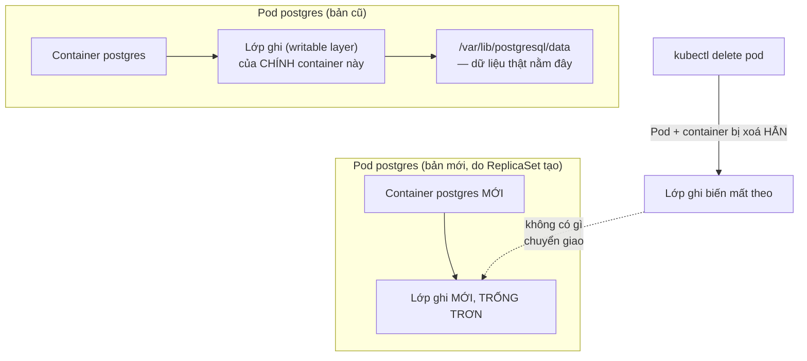
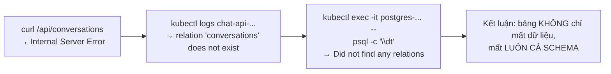

# Chương 10 — Cái mới không nhớ gì cả: Ghi chú kiến thức

> Đọc truyện trước: [Chương 10 — Cái mới không nhớ gì cả](../../handbook/vi/part-02-first-cluster/ch10-the-new-one-remembers-nothing.md)

---

## 1. Sơ đồ tổng quan: dữ liệu nằm ở đâu khi chưa có Volume



**Cách đọc sơ đồ:** khi chưa gắn Volume, thư mục dữ liệu Postgres chỉ là một phần của lớp ghi (writable layer) thuộc về đúng container đó. Container biến mất, lớp ghi biến mất — không có bước "chuyển giao dữ liệu" nào giữa bản cũ và bản mới cả, vì bản mới là một container hoàn toàn khác, khởi tạo lại từ đầu từ image gốc.

---

## 2. ReplicaSet đảm bảo gì, KHÔNG đảm bảo gì — đối lập trực tiếp với Chương 7

| ReplicaSet đảm bảo | ReplicaSet KHÔNG đảm bảo |
|---|---|
| Luôn có đúng N Pod tên `postgres` (hoặc bất kỳ tên nào khớp label) đang `Running` | Nội dung **bên trong** Pod đó là gì |
| Port đã khai báo luôn có Pod nào đó lắng nghe | Dữ liệu đã ghi trước đó có còn hay không |
| Service (nếu có) luôn có Endpoint hợp lệ để trỏ tới | Endpoint đó có "nhớ" gì từ trước hay là hoàn toàn mới tinh |

> **Note — đối lập hai bài học:** Chương 7 dạy "xoá Pod, có Pod khác thay ngay, không sao cả" — đúng với `chat-api` vì nó **không giữ trạng thái gì**. Chương này dạy đúng cách làm tương tự với `postgres` lại gây thảm hoạ, vì `postgres` **là nơi giữ trạng thái**. Cùng một hành động (`kubectl delete pod`), hậu quả khác hẳn nhau tuỳ workload có stateful hay không.

---

## 3. Cách phát hiện sự cố này — chuỗi lệnh debug



`\dt` (viết tắt của "describe tables") là lệnh `psql` liệt kê toàn bộ bảng trong database hiện tại — hữu ích để xác nhận nhanh "có đang nói chuyện với database đúng không, có bảng nào tồn tại không" trước khi đào sâu vào từng dòng dữ liệu.

---

## 4. `kubectl exec` — chuyển thẳng từ thói quen Docker

```bash
docker exec -it <container> psql -U postgres            # Docker
kubectl exec -it <pod> -n <ns> -- psql -U postgres       # Kubernetes
```

Khác biệt cú pháp duy nhất đáng chú ý: `kubectl exec` cần dấu `--` để phân tách "cờ dành cho `kubectl`" và "lệnh sẽ chạy bên trong container" — thiếu dấu `--`, `kubectl` có thể hiểu nhầm cờ của lệnh con (`-U` chẳng hạn) là cờ của chính nó.

---

## 5. Bài tập tự luyện

**Câu hỏi khái niệm:**

1. Nếu `postgres` chạy `replicas: 1` nhưng KHÔNG bị xoá Pod, chỉ đơn giản là container bên trong bị OOMKilled rồi kubelet tự restart — dữ liệu có mất không? So sánh với việc `kubectl delete pod` hẳn.
2. Vì sao bài học "xoá Pod không sao, có Pod khác thay" đúng với `chat-api` nhưng sai với `postgres`? Yếu tố quyết định là gì?
3. `frontend` (React, phục vụ static file) có cần lo về vấn đề y hệt chương này không? Vì sao?

**Thực hành:**

4. Tạo một Pod `postgres` bất kỳ KHÔNG gắn Volume, tạo một bảng test, insert vài dòng, rồi `kubectl delete pod` — xác nhận lại đúng hiện tượng: bảng biến mất hoàn toàn.
5. Chạy `kubectl exec -it <pod-postgres> -- psql -U postgres -d aiworkspace -c "\dt"` trên Pod hiện tại của bạn (nếu đã qua Chương 11, có PVC) — xác nhận bảng vẫn còn.
6. Thử `kubectl exec -it <pod> -- sh` (không có `--` sau `exec`, chỉ có `-it <pod> sh`) — quan sát lỗi xảy ra, giải thích vì sao.
