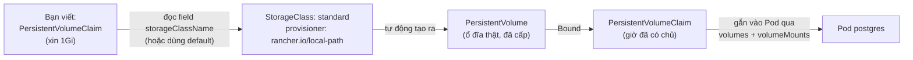
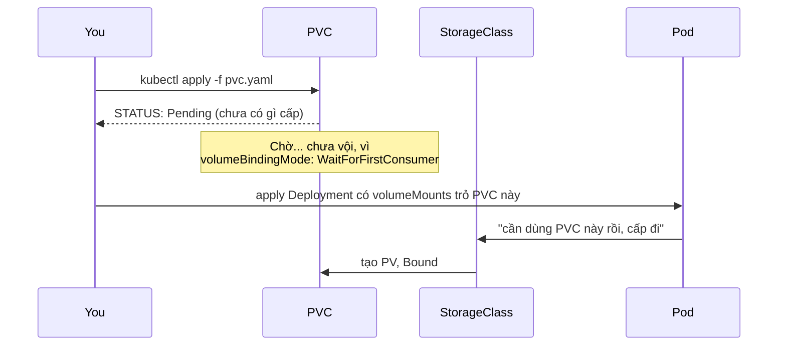

# Chương 11 — Gắn từ bên ngoài vào: Ghi chú kiến thức

> Đọc truyện trước: [Chương 11 — Gắn từ bên ngoài vào](../../handbook/vi/part-02-first-cluster/ch11-attached-from-the-outside.md)

---

## 1. Sơ đồ tổng quan: PVC, PV, StorageClass — ai xin, ai cấp, ai đứng ra



**Ba object, ba vai trò:**

| Object | Vai trò | Ai tạo ra |
|---|---|---|
| `StorageClass` | "Công thức" cấp ổ đĩa — biết dùng provisioner nào, cấu hình ra sao | Cluster admin (với `kind`, có sẵn từ lúc `kind create cluster`) |
| `PersistentVolumeClaim` (PVC) | Một **yêu cầu** xin ổ đĩa — "tôi cần 1Gi, kiểu ReadWriteOnce" | Bạn, người viết YAML ứng dụng |
| `PersistentVolume` (PV) | Ổ đĩa **thật**, đã được cấp phát | Tự động sinh ra bởi provisioner, khớp với PVC |

---

## 2. `WaitForFirstConsumer` — vì sao PVC đứng yên ở `Pending`



Có hai chế độ `volumeBindingMode`:

| Mode | Khi nào cấp ổ đĩa |
|---|---|
| `Immediate` (mặc định của một số StorageClass) | Cấp ngay khi PVC được tạo, bất kể có Pod nào dùng chưa |
| `WaitForFirstConsumer` (mặc định của `local-path` trên `kind`) | Đợi tới khi có Pod **thật sự** cần dùng volume đó mới cấp — vì với storage local (gắn vào đúng 1 node), cần biết Pod sẽ chạy ở node nào trước khi quyết định cấp ổ đĩa ở đâu |

> **Note:** đây không phải lỗi hay PVC bị treo — đọc đúng cột `VOLUMEBINDINGMODE` trong `kubectl get storageclass` để biết hành vi mong đợi trước khi hoảng.

---

## 3. `volumes` + `volumeMounts` — khớp tên, không khớp gì khác

```yaml
spec:
  containers:
    - name: postgres
      volumeMounts:
        - name: postgres-data          # (A)
          mountPath: /var/lib/postgresql/data
  volumes:
    - name: postgres-data              # (A) — PHẢI khớp (A) ở trên
      persistentVolumeClaim:
        claimName: postgres-data       # tên PVC thật, khác namespace field "name"
```

- `volumes[].name` và `volumeMounts[].name` là một cặp **tên nội bộ**, chỉ có ý nghĩa bên trong file YAML này — dùng để nối "khai báo có volume nào" với "gắn volume đó vào đâu trong container."
- `volumes[].persistentVolumeClaim.claimName` mới là tên PVC **thật** trên cluster, phải khớp với `metadata.name` của object PVC đã tạo.
- Dễ nhầm nhất: đổi tên PVC thật (`claimName`) mà quên đổi theo, hoặc gõ nhầm `name` nội bộ giữa hai chỗ — cả hai lỗi đều khiến Pod không mount được volume, thường báo lỗi rõ ràng lúc `apply`/`describe`.

---

## 4. `accessModes` — ai được đọc/ghi cùng lúc

| accessMode | Ý nghĩa |
|---|---|
| `ReadWriteOnce` (RWO) | Chỉ **một node** mount ghi được tại một thời điểm (nhiều Pod trên CÙNG node vẫn mount chung được) |
| `ReadOnlyMany` (ROX) | Nhiều node cùng mount, chỉ đọc |
| `ReadWriteMany` (RWX) | Nhiều node cùng mount, ghi được — cần loại storage hỗ trợ (NFS, cloud file storage...), `local-path` trên `kind` **không** hỗ trợ RWX |

`postgres` dùng `RWO` vì chỉ có 1 replica — nếu sau này thử tăng `replicas` lên 2 mà vẫn dùng chung một PVC kiểu RWO, Pod thứ hai sẽ kẹt `Pending` vì không mount được cùng lúc với Pod thứ nhất.

---

## 5. Bài tập tự luyện

**Câu hỏi khái niệm:**

1. Xoá PVC (không xoá PV) — PV có bị xoá theo không? Phụ thuộc vào field nào?
2. Nếu StorageClass dùng `volumeBindingMode: Immediate` thay vì `WaitForFirstConsumer`, `kubectl get pvc` ngay sau khi tạo sẽ hiện gì?
3. `postgres` đang RWO, 1 replica. Muốn scale lên 3 replica mà vẫn muốn cả 3 cùng ghi vào một chỗ lưu trữ chung, cần đổi gì?

**Thực hành:**

4. Chạy `kubectl get storageclass` — xác nhận `PROVISIONER` và `VOLUMEBINDINGMODE` trên cluster của bạn khớp với mô tả ở mục 2.
5. Tạo một PVC mới, KHÔNG gắn vào Pod nào — `kubectl get pvc` để xem trạng thái treo ở `Pending` bao lâu tuỳ ý (đúng hành vi `WaitForFirstConsumer`).
6. Chạy `kubectl get pv` — tìm đúng PV được tạo cho PVC `postgres-data`, xem field `RECLAIM POLICY` là gì (gợi ý liên quan: nếu xoá PVC, giá trị này quyết định PV bị xoá theo hay giữ lại).
