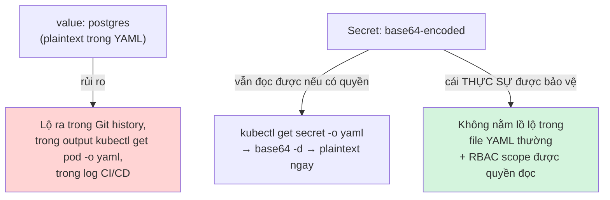
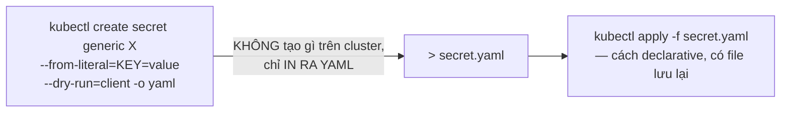

# Chương 12 — Bí mật không hẳn là bí mật: Ghi chú kiến thức

> Đọc truyện trước: [Chương 12 — Bí mật không hẳn là bí mật](../../handbook/vi/part-02-first-cluster/ch12-not-much-of-a-secret.md)

---

## 1. Sơ đồ tổng quan: Secret thật sự "bảo vệ" cái gì



**Kết luận cốt lõi:** Secret không mã hoá dữ liệu. Thứ nó thực sự thay đổi là **nơi dữ liệu nằm** (một object riêng, không lẫn vào manifest thường) và **ai kiểm soát quyền đọc** (qua RBAC) — không phải việc dữ liệu có bị khoá lại hay không.

---

## 2. base64 là gì — và tại sao không phải mã hoá

| | base64 (encoding) | Mã hoá thật (encryption) |
|---|---|---|
| Cần khoá để đọc? | Không — ai cũng decode được, chỉ cần 1 lệnh | Có — cần đúng key mới đọc được |
| Mục đích | Chuyển dữ liệu nhị phân/bất kỳ thành dạng text an toàn để nhét vào YAML/JSON | Giấu nội dung khỏi người không có quyền |
| Đảo ngược | `base64 -d` — tức thì | Cần key + thuật toán giải mã |

```bash
echo "cG9zdGdyZXM=" | base64 -d
# postgres
```

> **Note:** để Secret thật sự "an toàn hơn" theo đúng nghĩa mã hoá, cluster cần bật **encryption at rest** cho `etcd` (một cấu hình riêng ở tầng API server, không tự động có) — `kind` mặc định KHÔNG bật tính năng này.

---

## 3. `kubectl create secret generic --dry-run=client -o yaml` — kỹ thuật viết file từ lệnh imperative



`--dry-run=client` mô phỏng lệnh ở phía client, không gửi request thật lên API server — kết hợp `-o yaml` để lấy ra định dạng YAML tương ứng, thay vì phải tự tay gõ cấu trúc `data`/`type` từ đầu (và tự base64-encode bằng tay).

---

## 4. `secretKeyRef` — trỏ vào một key cụ thể bên trong Secret

```yaml
env:
  - name: POSTGRES_PASSWORD
    valueFrom:
      secretKeyRef:
        name: postgres-secret     # tên Secret object
        key: POSTGRES_PASSWORD    # tên key BÊN TRONG Secret đó
```

Một Secret có thể chứa **nhiều key** (`data:` là một map) — `secretKeyRef` luôn cần cả hai: tên Secret VÀ tên key cụ thể bên trong nó. Khác với `configMapKeyRef` (dùng cho ConfigMap) chỉ ở tên field, cơ chế hoàn toàn giống nhau.

> **Giới hạn quan trọng đã học trong chương:** `secretKeyRef` thay được **toàn bộ giá trị** của một biến môi trường, không thay được một đoạn nằm giữa chuỗi (như password nằm giữa `DATABASE_URL`). Muốn dùng Secret cho một phần của chuỗi, phải tách chuỗi đó thành nhiều biến riêng — hệ quả trực tiếp là code ứng dụng phải đổi theo (`chat-api/src/db.js`), không chỉ YAML.

---

## 5. Bài tập tự luyện

**Câu hỏi khái niệm:**

1. Một Secret và một ConfigMap chứa CÙNG một giá trị (ví dụ `ENV=production`) — về mặt bảo mật, hai cách này khác nhau ở điểm nào, hay thực chất giống hệt nhau?
2. `kubectl get secret postgres-secret -o jsonpath='{.data.POSTGRES_PASSWORD}'` in ra một chuỗi base64 — cần thêm bước gì để có được password thật?
3. Nếu quên `--dry-run=client` khi chạy `kubectl create secret generic`, chuyện gì xảy ra khác đi?

**Thực hành:**

4. Tạo một Secret chứa 2 key khác nhau trong cùng một lệnh (`--from-literal=A=1 --from-literal=B=2`), xem `kubectl get secret <tên> -o yaml` — xác nhận cả hai key đều được base64-encode riêng.
5. Thử `kubectl describe secret <tên>` (không phải `-o yaml`) — giá trị thật có hiện ra không? So sánh khác biệt giữa `describe` và `get -o yaml` khi áp dụng cho Secret.
6. Viết một Deployment dùng `envFrom.secretRef` (thay vì `env[].valueFrom.secretKeyRef` cho từng biến một) — tìm hiểu field này trong `kubectl explain deployment.spec.template.spec.containers.envFrom`, thử áp dụng để nạp TOÀN BỘ key trong Secret thành biến môi trường cùng lúc.
