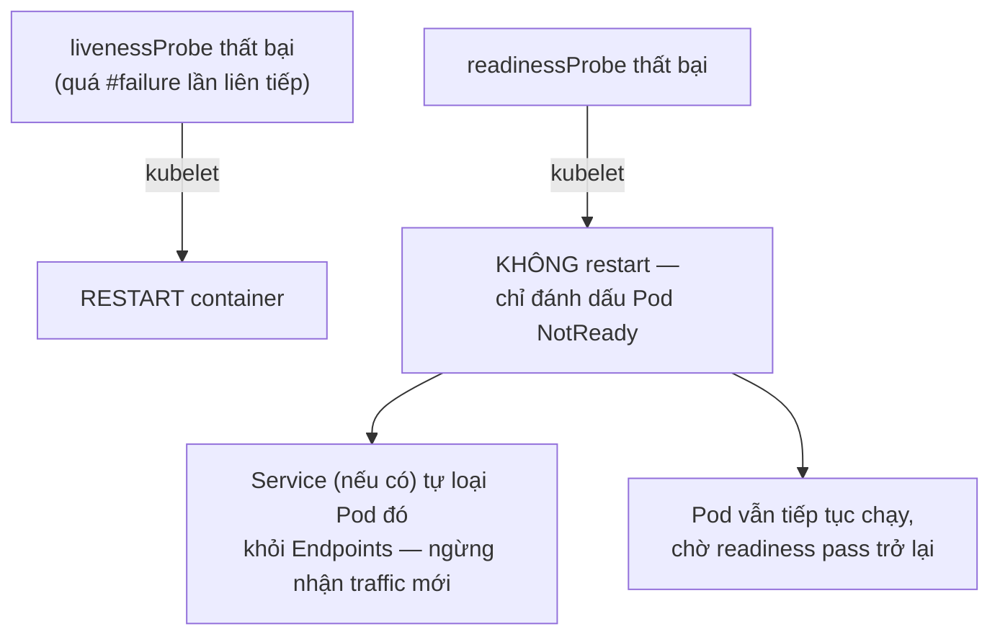
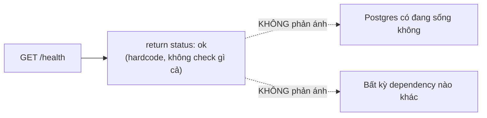

# Chương 13 — Chạy không có nghĩa là ổn: Ghi chú kiến thức

> Đọc truyện trước: [Chương 13 — Chạy không có nghĩa là ổn](../../handbook/vi/part-02-first-cluster/ch13-running-doesnt-mean-fine.md)

---

## 1. Sơ đồ tổng quan: hai loại probe, hai hệ quả khác hẳn nhau



**Khác biệt cốt lõi:** `liveness` trả lời "container này có cần khởi động lại không" — hành động là **restart**, một việc nặng, chỉ nên làm khi thật sự cần. `readiness` trả lời "Pod này có nên nhận traffic mới ngay bây giờ không" — hành động là **tạm ẩn khỏi Service**, nhẹ nhàng hơn nhiều, không đụng tới process đang chạy.

---

## 2. Ba kiểu probe — không chỉ có `httpGet`

| Kiểu | Cách kiểm tra | Khi nào dùng |
|---|---|---|
| `httpGet` | Gọi HTTP GET vào path + port, coi 2xx/3xx là thành công | App có sẵn HTTP server (như `chat-api`) |
| `exec` | Chạy một lệnh bên trong container, exit code 0 = thành công | App không có HTTP server, hoặc cần check sâu hơn (ví dụ `pg_isready` cho Postgres) |
| `tcpSocket` | Chỉ thử mở kết nối TCP tới port, không quan tâm nội dung trả về | App chỉ cần biết "có đang lắng nghe port đó không", không có endpoint HTTP riêng cho health check |

> **Note:** `postgres` trong câu chuyện chưa có probe nào cả — nếu thêm, kiểu phù hợp nhất là `exec` chạy `pg_isready`, không phải `httpGet` (Postgres không nói HTTP).

---

## 3. Các field thời gian — đọc đúng ý nghĩa

```yaml
livenessProbe:
  httpGet:
    path: /health
    port: 8080
  initialDelaySeconds: 5   # (1)
  periodSeconds: 10        # (2)
```

Từ output `kubectl describe pod`:
```
Liveness: http-get http://:8080/health delay=5s timeout=1s period=10s #success=1 #failure=3
```

| Field | Ý nghĩa | Giá trị mặc định nếu không khai báo |
|---|---|---|
| `initialDelaySeconds` | Đợi bao lâu sau khi container start mới bắt đầu probe lần đầu | `0` |
| `periodSeconds` | Khoảng cách giữa các lần probe | `10` |
| `timeoutSeconds` | Mỗi lần probe đợi phản hồi tối đa bao lâu trước khi tính là thất bại | `1` |
| `failureThreshold` (`#failure`) | Phải thất bại LIÊN TIẾP bao nhiêu lần mới coi là thật sự hỏng | `3` |
| `successThreshold` (`#success`) | Phải thành công liên tiếp bao nhiêu lần mới coi là khoẻ lại (chỉ áp dụng có ý nghĩa cho readiness) | `1` |

---

## 4. Giới hạn thật của health check nông (shallow) — bài học chính của chương



Health check "nông" (chỉ trả lời process có đang chạy, có nghe HTTP không) và health check "sâu" (tự query thử database, gọi thử dependency) là hai triết lý khác nhau, mỗi cái có rủi ro riêng:

| | Ưu điểm | Rủi ro |
|---|---|---|
| Nông (đã dùng trong chương) | Đơn giản, không tạo thêm tải lên dependency, không gây hiệu ứng dây chuyền | Không phát hiện được app "sống nhưng vô dụng" (dependency chết mà process vẫn chạy) |
| Sâu (tự check DB bên trong `/health`) | Phát hiện sớm hơn khi dependency thật sự có vấn đề | Nếu dependency chỉ chậm (không chết hẳn), TẤT CẢ Pod có thể đồng loạt bị đánh rớt/restart cùng lúc — biến một sự cố nhỏ thành sự cố lớn |

---

## 5. Bài tập tự luyện

**Câu hỏi khái niệm:**

1. Một Pod có `readinessProbe` thất bại nhưng `livenessProbe` vẫn pass — Pod đó có bị restart không? Có còn `Running` không? `READY` trong `kubectl get pods` hiện gì?
2. Nếu KHÔNG khai báo `readinessProbe` mà chỉ có `livenessProbe`, Kubernetes coi Pod là "ready" từ khi nào?
3. Vì sao `initialDelaySeconds` quan trọng với app cần thời gian khởi động lâu (ví dụ phải load model AI nặng)? Điều gì xảy ra nếu để `initialDelaySeconds: 0` cho một app như vậy?

**Thực hành:**

4. Sửa route `/health` tạm thời để luôn trả về lỗi (status 500), `apply` lại Deployment, quan sát `kubectl get pods -w` — `READY` đổi thành gì? Có `RESTARTS` tăng không?
5. Đổi tạm route trong `livenessProbe` thành một path không tồn tại (`/does-not-exist`), quan sát `kubectl describe pod` sau vài phút — tìm dòng Events báo lỗi liveness, đếm xem sau đúng bao nhiêu lần thất bại thì container bị restart.
6. Thử thêm một `startupProbe` (một loại probe thứ ba, khác `liveness`/`readiness`) — tra `kubectl explain deployment.spec.template.spec.containers.startupProbe`, tìm hiểu nó giải quyết vấn đề gì mà `initialDelaySeconds` một mình không giải quyết trọn vẹn.
