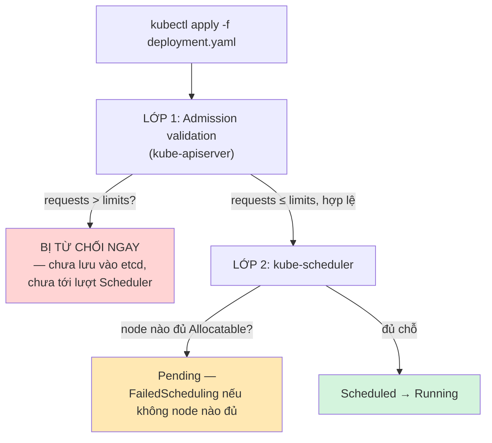
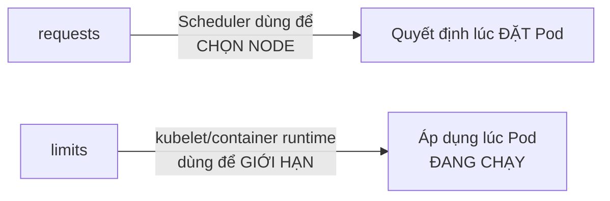

# Chương 14 — Không đủ chỗ: Ghi chú kiến thức

> Đọc truyện trước: [Chương 14 — Không đủ chỗ](../../handbook/vi/part-02-first-cluster/ch14-not-enough-room.md)

---

## 1. Sơ đồ tổng quan: hai lớp kiểm tra khác nhau cho `requests`/`limits`



**Bài học quan trọng nhất của chương:** hai lớp kiểm tra này **độc lập nhau**, xảy ra ở hai nơi khác nhau, với hai loại lỗi khác nhau:
- Lớp 1 (validation): so `requests` với `limits` của **cùng một container** — lỗi ngay lập tức, dạng `kubectl apply` bị từ chối thẳng, object không hề được tạo/sửa.
- Lớp 2 (scheduling): so `requests` với **Allocatable của node** — không phải lỗi, Pod vẫn được tạo, chỉ là kẹt ở `Pending` chờ có node đủ chỗ.

---

## 2. `requests` vs `limits` — nhắc lại rõ ràng



| | `requests` | `limits` |
|---|---|---|
| Dùng để làm gì | Scheduler dựa vào đây để tìm node đủ chỗ | Trần container không được vượt qua khi chạy |
| Vi phạm thì sao (CPU) | — | Container bị **throttle** (chậm lại), không bị kill |
| Vi phạm thì sao (Memory) | — | Container bị **OOMKilled** ngay lập tức |
| Ràng buộc giữa hai giá trị | `requests ≤ limits` — bắt buộc, validate ngay lúc `apply` | — |

> **Note — khác biệt CPU vs Memory khi vượt limit:** CPU là tài nguyên "nén được" (compressible) — vượt quá chỉ bị throttle, chạy chậm lại chứ không chết. Memory là tài nguyên "không nén được" (incompressible) — không thể "chạy chậm" việc dùng RAM, nên vượt quá đồng nghĩa bị kill ngay (`OOMKilled`), khác hẳn hành vi CPU.

---

## 3. Đọc `Allocatable` trên Node đúng cách

```bash
kubectl describe node <tên-node> | grep -A6 "Allocatable:"
```

```
Allocatable:
  cpu:                6
  ephemeral-storage:  253725Mi
  memory:             7841234Ki
  pods:               110
```

> **Note:** `Allocatable` KHÔNG bằng `Capacity` (tổng tài nguyên vật lý của node) — `Allocatable` đã trừ đi phần dành riêng cho `kubelet`/hệ điều hành (`kube-reserved`, `system-reserved`). Khi Scheduler tính "node còn đủ chỗ không", nó luôn so với `Allocatable`, không phải `Capacity`.

`pods: 110` — giới hạn **số lượng Pod tối đa** trên node đó, độc lập với CPU/memory còn trống. Đủ tài nguyên nhưng đã đạt 110 Pod thì Pod thứ 111 vẫn `Pending`.

---

## 4. Đọc event `FailedScheduling`

```
Warning  FailedScheduling  10s  default-scheduler  0/1 nodes are
available: 1 Insufficient memory. preemption: 0/1 nodes are
available: 1 No preemption victims found for incoming pod.
```

| Phần | Ý nghĩa |
|---|---|
| `0/1 nodes are available` | 0 trên tổng số 1 node đủ điều kiện — con số đầu tiên tăng dần nếu cluster có nhiều node và một số node đủ chỗ |
| `1 Insufficient memory` | Lý do cụ thể bị loại — có thể là `Insufficient cpu`, `Insufficient memory`, `node(s) had taint...`, tuỳ tình huống |
| `preemption: ... No preemption victims found` | Kubernetes có cơ chế "preemption" — đá bớt Pod ưu tiên thấp hơn để nhường chỗ cho Pod ưu tiên cao (`PriorityClass`, chưa xuất hiện trong câu chuyện) — ở đây không có Pod nào đủ điều kiện bị đá để nhường chỗ |

---

## 5. Bài tập tự luyện

**Câu hỏi khái niệm:**

1. Một container vượt `limits.cpu` thì bị throttle; vượt `limits.memory` thì bị `OOMKilled`. Vì sao Kubernetes xử lý hai loại tài nguyên này khác nhau đến vậy?
2. `requests.memory: 200Mi` và `limits.memory: 100Mi` (requests LỚN hơn limits) — `kubectl apply` sẽ phản ứng ra sao?
3. Node có `Allocatable.pods: 110`, hiện đang chạy đúng 110 Pod nhỏ (mỗi Pod dùng rất ít CPU/RAM). Pod thứ 111 xin `requests` cực nhỏ — có được Schedule không? Vì sao?

**Thực hành:**

4. Chạy `kubectl top nodes` (đã cài `metrics-server` — xem Chương 15) song song với `kubectl describe node | grep -A6 Allocatable` — so sánh mức dùng thật với mức đã được `request` bởi các Pod hiện có.
5. Tạo một Pod xin `limits.memory: 50Mi` nhưng chạy một process cố tình ăn nhiều hơn 50Mi (ví dụ `stress --vm 1 --vm-bytes 100M`) — quan sát `kubectl get pods`, tìm trạng thái `OOMKilled` trong `kubectl describe pod`.
6. Thử tạo hai Pod cùng xin `requests.cpu: 4` trên một node chỉ có `Allocatable.cpu: 6` — Pod thứ hai có được Schedule không? Giải thích bằng đúng cơ chế đã học ở mục 1.
