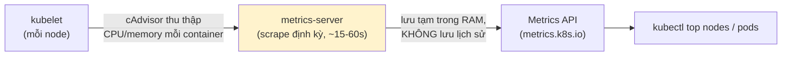
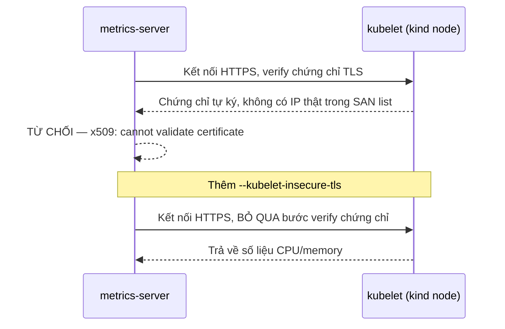
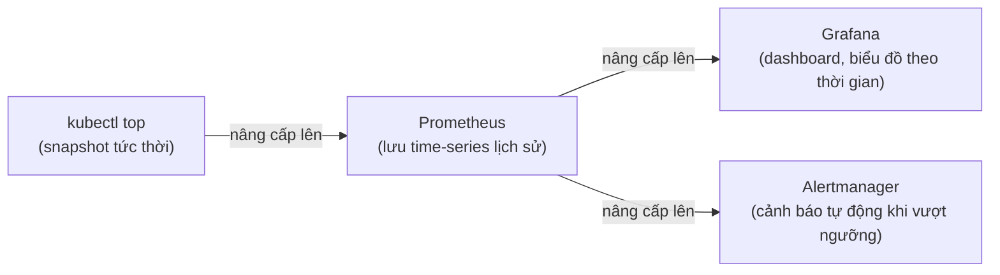

# Chương 15 — Không phải đoán nữa: Ghi chú kiến thức

> Đọc truyện trước: [Chương 15 — Không phải đoán nữa](../../handbook/vi/part-02-first-cluster/ch15-no-more-guessing.md)

---

## 1. Sơ đồ tổng quan: `kubectl top` lấy số liệu từ đâu



**Điểm quan trọng nhất:** `metrics-server` không phải một phần bắt buộc của Kubernetes — là một **add-on riêng**, phải tự cài. Và nó chỉ giữ số liệu **hiện tại**, không lưu lịch sử — tắt `metrics-server` đi là mất sạch, không có gì để truy vấn lại "10 phút trước dùng bao nhiêu RAM."

---

## 2. Vì sao cần `--kubelet-insecure-tls` trên `kind`



`kind` tự sinh chứng chỉ TLS cho kubelet, không có IP thật của container trong danh sách SAN (Subject Alternative Name) hợp lệ — bình thường trên cloud/production, kubelet có chứng chỉ được cấp đúng chuẩn bởi CA của cluster. `--kubelet-insecure-tls` bỏ qua bước xác thực này — **chấp nhận được trên cluster local để học/test, không phải cấu hình nên mang lên production** (production nên sửa đúng chứng chỉ, không tắt xác thực).

---

## 3. Đọc output `kubectl top` đúng cách

```
NAME                         CPU(cores)   CPU%   MEMORY(bytes)   MEMORY%
ai-workspace-control-plane   324m         4%     1051Mi          13%
```

| Cột | Ý nghĩa | Tính từ đâu |
|---|---|---|
| `CPU(cores)` | Số lõi CPU đang dùng, đơn vị `m` (millicores) — `324m` = 0.324 lõi | Số đo thực tế tại thời điểm scrape |
| `CPU%` | Phần trăm so với `Allocatable.cpu` của node đó | `used / Allocatable * 100` |
| `MEMORY(bytes)` | RAM thực tế đang dùng | Số đo thực tế tại thời điểm scrape |
| `MEMORY%` | Phần trăm so với `Allocatable.memory` | `used / Allocatable * 100` |

> **Note:** hai cột `%` không phải số liệu độc lập — chúng chính là phép chia đã học ở Chương 14 (`Allocatable`), chỉ trình bày dưới dạng khác. Hiểu một cột là hiểu được cột kia.

---

## 4. `kubectl top` chỉ là bước đầu — bức tranh lớn hơn



| Công cụ | Giải quyết gì mà công cụ trước không có |
|---|---|
| `metrics-server` | Số liệu **hiện tại**, dùng nội bộ cho `kubectl top` và cho HPA (Horizontal Pod Autoscaler — chưa xuất hiện trong câu chuyện) tự động scale |
| Prometheus | Lưu **lịch sử** theo thời gian (time-series database), truy vấn được "1 giờ trước dùng bao nhiêu" |
| Grafana | **Trực quan hoá** dữ liệu Prometheus thành biểu đồ, dashboard |
| Alertmanager | **Chủ động báo** khi một ngưỡng bị vượt, thay vì phải tự mở dashboard lên xem |

---

## 5. Bài tập tự luyện

**Câu hỏi khái niệm:**

1. Xoá Pod `metrics-server` — `kubectl get pods`/`kubectl get deployments` có bị ảnh hưởng gì không? Chỉ riêng lệnh nào bị ảnh hưởng?
2. `kubectl top pods` hiện số liệu của Pod đã bị xoá 5 phút trước không? Vì sao?
3. Vì sao `--kubelet-insecure-tls` chấp nhận được trên `kind` nhưng không nên dùng trên cluster production thật?

**Thực hành:**

4. Chạy `kubectl get apiservice v1beta1.metrics.k8s.io` — cột `AVAILABLE` hiện `True` hay `False`? Nếu `False`, xem cột `MESSAGE` để biết lý do.
5. So `kubectl top pods -n ai-workspace` với `resources.requests` đã khai báo trong Chương 14 cho từng Pod — Pod nào đang dùng gần sát mức `requests` nhất?
6. Tắt hẳn `metrics-server` (`kubectl delete deployment metrics-server -n kube-system`), thử `kubectl top nodes` — đọc kỹ thông báo lỗi, so sánh với thông báo lỗi ban đầu trước khi cài `metrics-server`, xem có giống nhau không.
