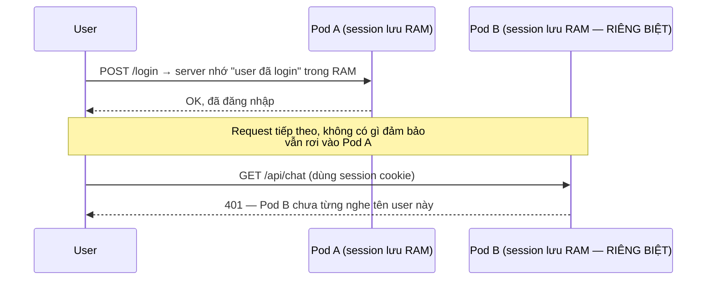
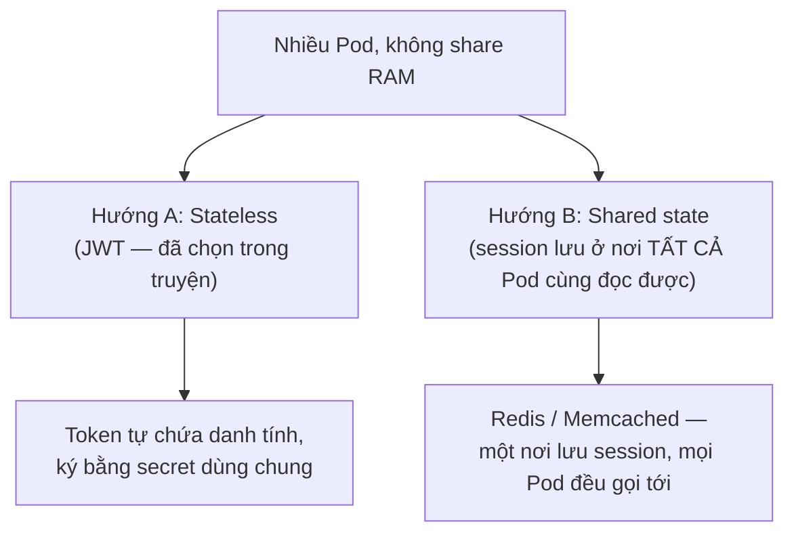
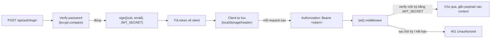
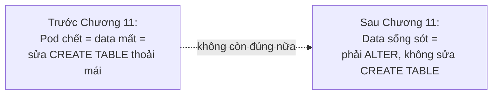

# Chương 17 — Không Pod nào nhớ ai: Ghi chú kiến thức

> Đọc truyện trước: [Chương 17 — Không Pod nào nhớ ai](../../handbook/vi/part-02-first-cluster/ch17-no-pod-remembers-anyone.md)

Đây là chương đầu tiên vấn đề **không** nằm ở YAML/kubectl, mà ở cách thiết kế ứng dụng để phù hợp với việc chạy nhiều bản sao. Ghi chú tập trung vào phần kiến trúc đó, vì nó áp dụng cho MỌI hệ thống chạy nhiều instance, không riêng gì Kubernetes.

---

## 1. Sơ đồ tổng quan: vì sao session-in-memory gãy khi có nhiều Pod

**Vấn đề cốt lõi:** RAM của một process **không được chia sẻ** với process khác, kể cả khi chúng là 3 bản sao giống hệt nhau của cùng một Deployment. Đây không phải giới hạn của Kubernetes — là giới hạn vật lý của việc chạy nhiều process độc lập trên (có thể) nhiều máy khác nhau.

---

## 2. Hai hướng giải quyết — JWT không phải cách duy nhất

| | JWT (stateless) | Session + Redis (shared state) |
|---|---|---|
| Server cần "nhớ" gì không | Không — chỉ cần verify chữ ký | Có — Redis đóng vai trò "bộ nhớ chung" |
| Logout trước hạn token | Khó — token vẫn hợp lệ tới khi hết hạn, trừ khi có thêm cơ chế blacklist | Dễ — xoá session khỏi Redis là logout ngay |
| Thêm hạ tầng | Không cần thêm gì | Cần thêm Redis (đúng dòng "cache" còn treo trong `notes-next.md`) |
| Token bị lộ | Nguy hiểm tới khi hết hạn (không thu hồi được dễ dàng) | Thu hồi được ngay lập tức |

> **Note:** dòng ghi chú "Nhiều người cùng dùng cùng lúc — có cần giới hạn tốc độ, cache gì không?" trong `notes-next.md` từ Chương 16 rất có thể sẽ dẫn tới Redis ở một chương sau — không phải vì JWT sai, mà vì JWT không giải quyết được bài toán "thu hồi token ngay lập tức" hay "rate-limit theo user."

---

## 3. `hono/jwt` — cách JWT hoạt động, không phụ thuộc framework

Một JWT có 3 phần, phân cách bởi dấu chấm: `header.payload.signature`. Hai phần đầu chỉ là base64 (đọc được, KHÔNG bí mật — đừng nhét thông tin nhạy cảm vào `payload`), phần thứ ba (`signature`) mới là thứ chứng minh token không bị giả mạo, tính từ `header + payload + JWT_SECRET`.

> **Note quan trọng:** ai giữ được `JWT_SECRET` đều tự ký được token hợp lệ cho BẤT KỲ user nào — đây là lý do chương này nhấn mạnh phải sinh secret ngẫu nhiên thật (`openssl rand -hex 32`), không phải gõ đại như Postgres password ở Chương 12.

---

## 4. `ALTER TABLE ... ADD COLUMN IF NOT EXISTS` — vấn đề không phải Kubernetes, nhưng do Kubernetes "gây ra"

Vì `postgres` giờ có PVC thật (Chương 11), dữ liệu **sống sót** giữa các lần deploy — khác hẳn giai đoạn đầu khi mọi lần Pod chết là mất sạch. Hệ quả: không thể coi mỗi lần sửa schema như "database luôn trống, tạo mới từ đầu" — phải viết migration tương thích ngược, dù đơn giản chỉ là một dòng `ALTER TABLE`.

> **Note:** đây là một dạng thu nhỏ của "database migration" — chủ đề lớn hơn nhiều trong hệ thống thật (thường dùng công cụ chuyên dụng như Drizzle Kit, Prisma Migrate, Flyway...), ở đây chỉ minh hoạ bằng một dòng SQL thủ công vì quy mô nhỏ.

---

## 5. Bài tập tự luyện

**Câu hỏi khái niệm:**

1. Nếu `chat-api` chỉ chạy `replicas: 1` (không phải 3), vấn đề "session không share giữa các Pod" còn tồn tại không?
2. Ai đó lấy được một JWT token hợp lệ (không phải `JWT_SECRET`, chỉ là MỘT token của một user) — họ có tự tạo token cho user khác được không? Vì sao?
3. JWT hết hạn sau 1 giờ (giả sử có set `exp`). User bị khoá tài khoản (banned) ngay bây giờ — token cũ của họ còn dùng được tới khi nào?

**Thực hành:**

4. Decode một JWT token thật (không cần secret) bằng cách tách chuỗi theo dấu chấm, base64-decode phần `payload` (phần giữa) — xác nhận thấy được `sub`/`email` dạng plaintext, chứng minh JWT không mã hoá payload.
5. Gọi `/api/chat` với một token đã sửa 1 ký tự bất kỳ trong phần `signature` — xác nhận nhận về `401`, giải thích tại sao dù `payload` vẫn y hệt.
6. Thử tạo 2 user qua `/api/auth/signup`, login cả hai, dùng token của user A gọi `/api/conversations` — xác nhận chỉ thấy đúng conversation của A, không thấy của B (nhờ filter theo `userId` trong query).
