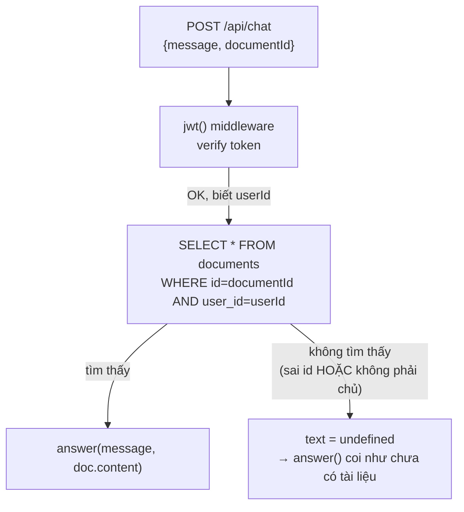
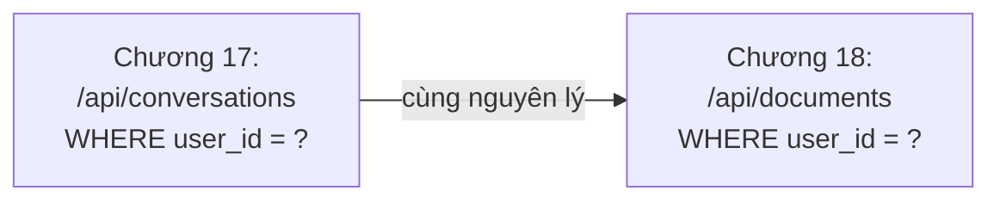
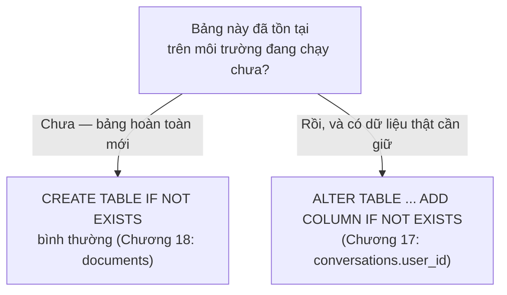

# Chương 18 — Không cần dán tay nữa: Ghi chú kiến thức

> Đọc truyện trước: [Chương 18 — Không cần dán tay nữa](../../handbook/vi/part-02-first-cluster/ch18-no-more-pasting.md)

Chương này gần như thuần code ứng dụng — không có object Kubernetes mới. Ghi chú tập trung vào một nguyên lý bảo mật xuyên suốt (ownership check) và một góc nhìn hạ tầng dễ bị bỏ quên (giới hạn PVC là thật).

---

## 1. Sơ đồ tổng quan: dòng chảy một request `/api/chat` có `documentId`



**Điểm mấu chốt:** câu query luôn có HAI điều kiện — đúng `id` VÀ đúng `userId`. Thiếu điều kiện thứ hai, hệ thống vẫn "chạy được" (không lỗi, không crash) nhưng lộ dữ liệu người khác — loại lỗi nguy hiểm nhất vì im lặng, không ai báo động cho tới khi bị phát hiện hoặc bị khai thác.

---

## 2. Ownership check — nguyên lý áp dụng lặp lại, không phải riêng chương này



| Endpoint | Điều kiện lọc | Hậu quả nếu thiếu |
|---|---|---|
| `GET /api/conversations` | `WHERE user_id = <người gọi>` | Thấy hết conversation của MỌI người dùng |
| `POST/GET /api/documents` | `WHERE user_id = <người gọi>` | Đọc/tạo được tài liệu gắn nhầm chủ, hoặc đoán ID đọc tài liệu người khác |

> **Note:** đây KHÔNG phải khái niệm Kubernetes — là nguyên lý bảo mật ứng dụng cơ bản (đôi khi gọi là "IDOR" — Insecure Direct Object Reference, khi hệ thống cho phép truy cập object qua ID mà không kiểm tra quyền sở hữu). Xuất hiện lặp lại trong chương này vì nó áp dụng cho MỌI bảng có khái niệm "thuộc về ai."

---

## 3. `CREATE TABLE` thường vs cần `ALTER` — biết khi nào dùng cái nào



Sự khác biệt không nằm ở cú pháp SQL khó hay dễ — nằm ở việc **có dữ liệu thật đang tồn tại hay không**. `documents` là bảng mới tinh nên không cần lo; `conversations` đã có dữ liệu sống sót qua PVC từ Chương 11 nên phải cẩn thận hơn.

---

## 4. PVC không phải "vô hạn" — đọc dung lượng thật bên trong Pod

```bash
kubectl exec -it <pod-postgres> -n ai-workspace -- df -h /var/lib/postgresql/data
```

```
Filesystem                Size  Used Avail Use%
/dev/vda1                 1.0G   45M  980M   5%
```

`df -h` là lệnh Linux tiêu chuẩn (không phải lệnh riêng của Kubernetes) — chạy được bên trong bất kỳ container nào có shell, cho biết dung lượng thật của filesystem đang mount tại đúng đường dẫn đó. Với một Pod có PersistentVolumeClaim, con số `Size` ở đây chính là dung lượng đã xin trong `resources.requests.storage` lúc tạo PVC (`1Gi` — Chương 11).

> **Note — vì sao đây là chuyện đáng theo dõi, không phải khẩn cấp:** PVC không tự "phình ra" theo nhu cầu — hết chỗ thì Postgres sẽ báo lỗi ghi (`No space left on device`), ứng dụng phía trên (`chat-api`) sẽ nhận lỗi khi cố ghi dữ liệu mới. Có hai hướng xử lý khi thật sự cần: mở rộng PVC hiện tại (nếu StorageClass hỗ trợ `allowVolumeExpansion: true`) hoặc chuyển sang loại storage khác phù hợp hơn với dữ liệu lớn (object storage như S3/MinIO cho file, thay vì nhét hết vào cột `TEXT` trong Postgres).

---

## 5. Bài tập tự luyện

**Câu hỏi khái niệm:**

1. Nếu bỏ điều kiện `eq(documents.userId, userId)` khỏi query trong `/api/chat`, nhưng vẫn giữ đúng `eq(documents.id, documentId)` — hậu quả cụ thể là gì? Viết một kịch bản tấn công đơn giản.
2. `documents.content` đang là cột `TEXT` không giới hạn độ dài trong Postgres. Nếu một người dùng upload một file 500MB dạng text, chuyện gì xảy ra trước tiên — lỗi ở tầng ứng dụng, ở tầng database, hay ở tầng PVC?
3. StorageClass hiện tại (`standard`, `rancher.io/local-path` trên `kind`) có hỗ trợ mở rộng PVC sau khi đã tạo không? Kiểm tra bằng field nào?

**Thực hành:**

4. Chạy `kubectl exec -it <pod-postgres> -n ai-workspace -- df -h /var/lib/postgresql/data` trên cluster của bạn — so `Used`/`Avail` với con số trong bài, xem đã tăng lên bao nhiêu so với lúc mới gắn PVC.
5. Tạo 2 tài khoản qua `/api/auth/signup`, để tài khoản A upload một document, dùng token của tài khoản B thử `GET` (nếu có route lấy 1 document theo id) hoặc thử truyền `documentId` của A vào `/api/chat` bằng token B — xác nhận bị chặn đúng như mong đợi.
6. Tìm field `allowVolumeExpansion` trong `kubectl get storageclass standard -o yaml` — nếu `false`, thử tưởng tượng (không cần làm thật) các bước cần thiết để "mở rộng" một PVC không hỗ trợ expansion (gợi ý: thường phải tạo PVC mới, tự chép dữ liệu qua).
