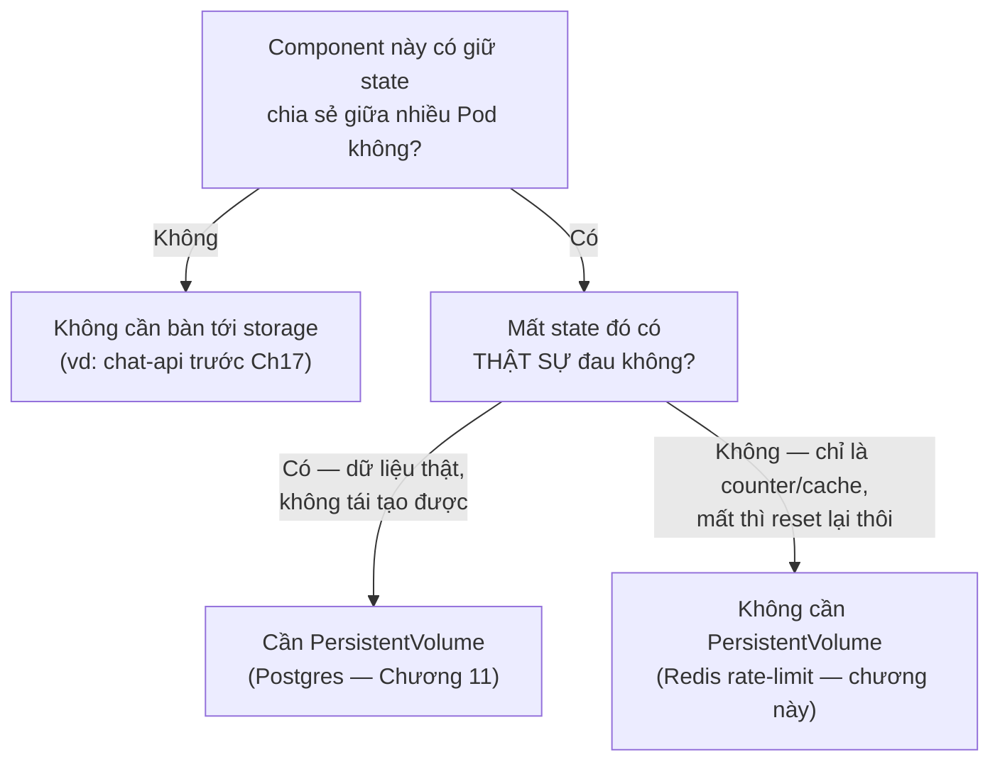
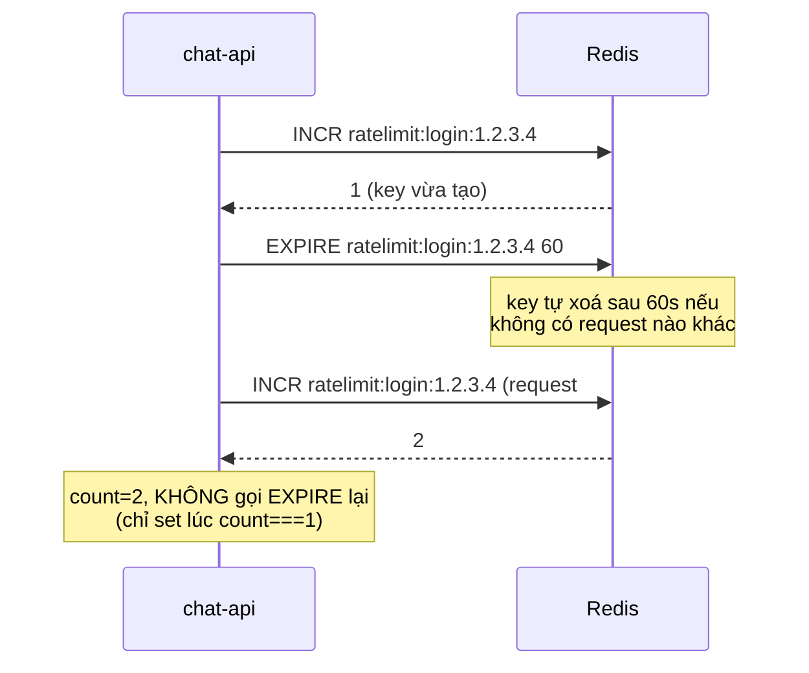

# Chương 19 — Quên cũng không sao: Ghi chú kiến thức

> Đọc truyện trước: [Chương 19 — Quên cũng không sao](../../handbook/vi/part-02-first-cluster/ch19-forgetting-is-fine.md)

---

## 1. Sơ đồ tổng quan: "cần state chung" không tự động nghĩa là "cần PVC"



**Bài học cốt lõi:** hai chương liên tiếp (11 và 19) đều đụng tới "cần lưu state chung", nhưng đi tới hai kết luận storage khác hẳn nhau — vì câu hỏi quyết định không phải "có state hay không", mà là "mất state này thiệt hại tới đâu".

---

## 2. Redis Deployment — không có gì mới về YAML, nhưng thiếu có chủ đích

```yaml
apiVersion: apps/v1
kind: Deployment
metadata:
  name: redis
spec:
  replicas: 1
  template:
    spec:
      containers:
        - name: redis
          image: redis:7-alpine
          # KHÔNG có volumeMounts/volumes — có chủ đích, không phải thiếu sót
```

So với `postgres.yaml` (Chương 11), điểm khác biệt duy nhất đáng nói là **những gì KHÔNG có mặt**: không `PersistentVolumeClaim`, không `volumeMounts`. Đây không phải quên viết — là quyết định có cân nhắc, dựa trên câu hỏi ở mục 1.

---

## 3. Fixed window counter — `INCR` + `EXPIRE`, không phải hai lệnh rời rạc



> **Note — lỗi thường gặp khi tự viết rate limiter:** nếu gọi `EXPIRE` ở MỌI lần request (không chỉ lần đầu), cửa sổ đếm sẽ liên tục bị đẩy xa thêm mỗi lần có request mới — biến "tối đa 5 lần trong 60 giây cố định" thành "tối đa 5 lần, miễn là không dừng gõ quá 60 giây" — hai hành vi rất khác nhau. Đây là kiểu **sliding window** không chủ đích, dễ xảy ra nếu không để ý điều kiện `count === 1`.

---

## 4. Vì sao đếm theo IP, không theo user — và giới hạn của cách đó

| Đếm theo | Ưu điểm | Nhược điểm |
|---|---|---|
| IP (`x-forwarded-for`) | Chặn được cả trước khi biết ai đang login (endpoint `/login` chưa xác thực được ai) | Nhiều người dùng chung NAT/mạng công ty có thể bị đếm chung một IP, dễ bị block oan |
| User ID | Chính xác hơn cho hành vi SAU khi đã có JWT | Không dùng được cho `/login` — lúc đó còn chưa biết `userId` là ai (đó là thứ đang cố xác thực) |

> **Note:** `x-forwarded-for` là header do reverse proxy/load balancer gắn vào — nếu request đi thẳng không qua proxy nào (như khi test bằng `port-forward` trực tiếp), header này có thể trống hoặc dễ giả mạo. Trên production thật, cần đảm bảo chỉ tin header này khi nó được ghi bởi một proxy đáng tin (Ingress Controller — sẽ gặp ở phần Networking sau này), không phải để client tự khai.

---

## 5. Bài tập tự luyện

**Câu hỏi khái niệm:**

1. Xoá Pod `redis` giữa lúc một IP đang bị rate-limit (count đã lên 6/5) — sau khi Pod mới lên, IP đó có bị chặn tiếp không?
2. Nếu `chat-api` có 3 replica nhưng `redis` chỉ có 1 replica — Redis có trở thành "single point of failure" không? Ảnh hưởng gì nếu Redis chết hẳn (không phải restart nhanh)?
3. Tại sao không dùng chính Postgres để lưu bộ đếm rate-limit, mà phải thêm hẳn Redis?

**Thực hành:**

4. Chạy lại đúng script rate-limit trong chương, nhưng đổi limit thành `checkRateLimit(key, 3, 30)` (3 lần / 30 giây) — xác nhận hành vi đổi đúng theo tham số mới.
5. Dùng `kubectl exec -it <pod-redis> -n ai-workspace -- redis-cli` để tự tay chạy `GET ratelimit:login:<ip>` và `TTL ratelimit:login:<ip>` — xác nhận TTL đang đếm ngược đúng như mong đợi.
6. Thử xoá key rate-limit thủ công giữa chừng: `kubectl exec -it <pod-redis> -- redis-cli DEL ratelimit:login:<ip>` — gọi lại API ngay sau đó, xác nhận được phép thử lại từ đầu.
