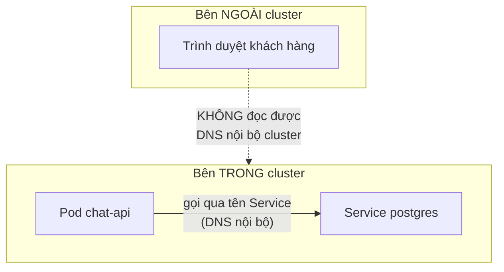
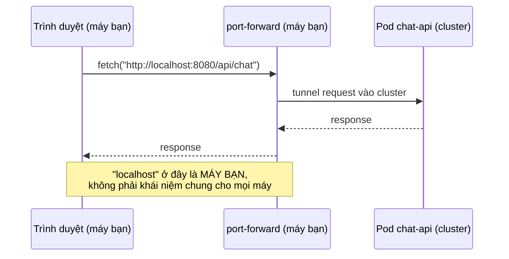

# Chương 20 — Chỉ mình bạn mở được: Ghi chú kiến thức

> Đọc truyện trước: [Chương 20 — Chỉ mình bạn mở được](../../handbook/vi/part-02-first-cluster/ch20-only-you-can-open-it.md)

---

## 1. Sơ đồ tổng quan: hai loại "client" hoàn toàn khác nhau



**Phân biệt cốt lõi:** `chat-api` gọi `postgres` là **Pod gọi Pod**, cả hai cùng sống trong cluster, cùng dùng chung DNS nội bộ (CoreDNS — Chương 8). `frontend` thì khác hẳn — code JavaScript của nó không chạy trong Pod, nó được **tải về và chạy trong trình duyệt của người dùng cuối**, một máy tính hoàn toàn xa lạ với cluster, không có bất kỳ quyền truy cập DNS nội bộ nào.

> **Note:** đây là lý do các bài học từ Chương 8 (Service/DNS nội bộ) không áp dụng được cho vấn đề "expose ra ngoài" — Service chỉ giải quyết bài toán trong-cluster-gọi-trong-cluster, không giải quyết ngoài-cluster-gọi-vào-cluster.

---

## 2. Vì sao `localhost:8080` "chạy được" lại là một cái bẫy



`localhost` (hay `127.0.0.1`) luôn có nghĩa là "chính máy đang chạy tiến trình này" — không có ngoại lệ, không có cấu hình nào thay đổi được ý nghĩa đó. Khi trình duyệt của BẠN gọi `localhost:8080`, nó tìm trên MÁY của bạn, tình cờ tìm thấy vì `port-forward` đang tunnel đúng cổng đó. Trình duyệt của một người dùng khác gọi `localhost:8080` sẽ tìm trên MÁY CỦA HỌ — không có gì ở đó cả, trừ khi họ cũng tự mở `port-forward` (mà họ không có quyền `kubectl` để làm vậy).

---

## 3. `readinessProbe` cho một static file server — vẫn dùng được, ý nghĩa hơi khác

```yaml
readinessProbe:
  httpGet:
    path: /
    port: 3000
```

`frontend` không có route `/health` riêng như `chat-api` — dùng thẳng `/` (route mặc định trả về `index.html`). Với một static file server (nginx phục vụ file build sẵn), việc trả `200` ở `/` gần như đồng nghĩa với "nginx còn sống, file build còn nguyên" — không cần route health check riêng vì bản thân nội dung phục vụ đã đơn giản tới mức trả lời được luôn là đủ bằng chứng "khoẻ".

---

## 4. Vấn đề còn bỏ ngỏ: `App.jsx` chưa hề biết tới JWT

Đáng lưu ý (không phải trọng tâm chương, nhưng là một khoảng hở thật): `frontend` vẫn gọi `/api/chat` và `/api/conversations` không kèm header `Authorization` nào — hai route này đã bị khoá bằng `jwt()` từ Chương 17. Nghĩa là ngay cả khi giải quyết xong bài toán "expose ra ngoài" (Chương 21), giao diện vẫn sẽ nhận `401` ngay khi gọi API, vì chưa có màn hình đăng nhập, chưa có chỗ lưu token.

> **Note:** đây là một bài toán khác hẳn — thuộc về UI/state quản lý phía frontend (lưu token ở đâu, đính kèm vào mọi request ra sao), không phải bài toán Kubernetes. Cố tình không giải quyết trong chương này để giữ đúng trọng tâm — networking, không phải frontend engineering.

---

## 5. Bài tập tự luyện

**Câu hỏi khái niệm:**

1. Nếu đổi `API_URL` trong `App.jsx` từ `http://localhost:8080` thành `http://chat-api:8080` rồi build lại image — trình duyệt của bạn (đang mở qua `port-forward frontend`) có gọi được không? Vì sao?
2. `frontend` có 2 Pod (`replicas: 2`) — điều đó có giúp gì cho vấn đề "người ngoài không mở được" không?
3. Vì sao Service (ClusterIP) của `frontend` không tự động giải quyết được vấn đề expose ra internet, dù nó cũng là một Service giống `postgres`/`redis`?

**Thực hành:**

4. Mở đồng thời `port-forward` cho cả `frontend` (3000) và `chat-api` (8080), xác nhận UI hoạt động — sau đó tắt riêng `port-forward` của `chat-api`, giữ nguyên `frontend`, thử gửi tin nhắn lại — quan sát lỗi trong console trình duyệt (F12).
5. Từ một máy KHÁC trong cùng mạng LAN (nếu có), thử truy cập `http://<IP-máy-bạn>:3000` trong lúc `port-forward` đang chạy — có vào được không? So sánh với việc một khách hàng ở xa hoàn toàn không có kết nối gì tới máy bạn.
6. Kiểm tra `kubectl get svc frontend -n ai-workspace` — cột `TYPE` hiện gì? Tra `kubectl explain service.spec.type` xem còn những giá trị nào khác ngoài `ClusterIP`, ghi lại tên của chúng để chuẩn bị cho chương sau.
